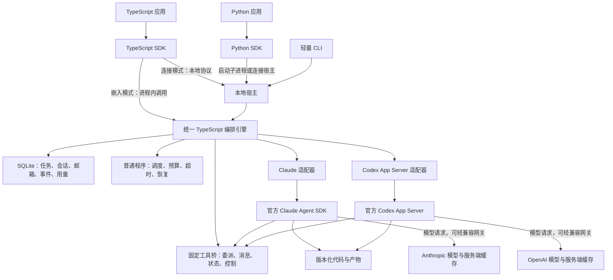

# 多 Agent 编排 SDK 设计文档：TypeScript 与 Python

更新日期：2026-09-20。状态：完整产品设计；基础增量、[SPEC-0003-A 生命周期增量](./docs/specs/0003-a-lifecycle.md) 与 [A2 执行隔离](./docs/specs/0003-a2-execution-isolation.md) 已实现并完成离线 fixture 验证，尚未发布 npm / PyPI 包，未运行付费模型实验。实际支持范围和可运行入口见 [README](./README.md)。

产品形态：**一套编排引擎，TypeScript 与 Python 两种语言 SDK，Claude 与 Codex 两个可选运行时适配器，以及复用同一引擎的轻量 CLI。** 两种语言 SDK 在首个公开版本同时交付；不按厂商分别维护两套编排产品。

设计开始时项目只有文档和流程图。现已新增引擎、双语言客户端、宿主、最小适配器和测试，并已初始化 Git。下文描述完整首版目标，不能将尚未列入本轮 spec 的接口视为已经实现或已发布。

配套操作说明：[SDK 使用说明与详细接线方案](./SDK_USAGE_AND_WIRING.md)，覆盖三种运行模式、连接协议、双语言示例、MCP 回调、模型网关、关闭恢复及分层验收。

2026-09-19 设计复核修订：明确选路责任、逐请求成本估算、费用归属、假设失败分支、存储保留和状态超时。[SPEC-0003](./docs/specs/0003-policy-retention-deadlines.md) 的 A 已实现持久期限、unknown 隔离与所有者人工核对，验证见 [本轮证据](./docs/tdd/0003-a-evidence.md)；B/C 的 GC、选路与费用规则仍为后续契约。文档目标和离线测试不等于真实模型验收。

第二轮评审确定的 N1 已按 [0003-A2](./docs/specs/0003-a2-execution-isolation.md) 实现并通过离线 fixture 验证：执行占用与结果隔离分别计数，引擎/适配器共享新轮次 1800 秒默认总预算。N2 归档切换按 [0003-B 子规格](./docs/specs/0003-b-archive.md) 后续实施，仍未实现。N3 保留双运行时共同首版承诺，允许两家独立开发、验收和记录就绪状态；当前离线结果不等于真实模型验收。

## 1. 我们讨论的问题与设计目标

用户的判断是：当前多 agent 的部分缺陷源于上下文能力不足，框架通过拆分、摘要、传递和恢复上下文来弥补，但这些补偿措施可能引入更多费用和复杂度。并不是认为多 agent 的全部价值都来自上下文不足。

长任务中，既有上下文仍然有用且请求持续命中缓存时，应优先维持连续执行。更大有效上下文的经济价值，也包括推迟因容量不足而被迫进行的压缩、清空和重建。

需要解决的具体问题：

1. 频繁创建子会话，重复加载背景和工具，缓存难以持续复用。
2. agent 来回汇报、询问进度和重复解释，增加输入、输出及等待成本。
3. 管理者无法可靠控制其他会话的暂停、恢复、压缩和重建。
4. 消息地址依赖临时进程或连接，接收方停止后容易失联。
5. 用额外的 LLM 做心跳、唤醒和状态检查，进一步消耗费用。
6. 缺乏统一账本，不能区分新增缓存写入、旧上下文重建与正常缓存读取。

目标：在完成质量不下降的前提下，减少不必要的缓存重建、通信推理和恢复成本；让通信可靠、会话可控，并可用真实任务比较费用与耗时。

目标用户是把 agent 能力嵌入研发工具、自动化脚本、后端服务和桌面应用的开发者。TypeScript SDK 提供进程内接入和连接宿主两种方式；Python SDK 提供符合 Python 异步习惯的接口，由同一引擎执行调度、存储和运行时调用。

第一版范围包括双语言接口、单机持久化、两家运行时适配、会话恢复、可靠消息、受控并行、生命周期控制及可核对用量。不包含浏览器内运行引擎、跨机器集群、公共多租户服务、可视化控制台、跨厂商 KV 共享、任意 shell 副作用严格一次执行，也不预先承诺固定的成本降幅。

首版的基础价值是单会话也能使用的持久化、可靠消息、可核对控制与用量账本；受控并行是有条件启用的扩展。保留双语言和双运行时，是为了覆盖调用方接入及运行时替换需求，不以多 agent 使用率来证明必要性。fork、缓存经济型自动选路及自动压缩优化不阻塞基础模式交付；不能证明安全的适配器则不能以降级名义继续上线。首个公开版本仍要求两家适配器分别通过基础安全与业务验收，范围如需缩减须另作明确产品决策。

连续命中是同等有效输入与工作量下的优先策略，不是所有上下文组织方式的全局最优证明。若后续任务只需很小一部分历史，缩减上下文的长期读取收益仍可覆盖一次性重建成本；第一版不自动做这种推测性优化。

## 2. 关键决策

| 决策 | 本方案选择 |
| --- | --- |
| 对外交付 | TypeScript SDK + Python SDK，同一公共契约、同一版本发布列车 |
| 编排引擎 | 一套 TypeScript / Node.js 实现；任务、邮箱、状态机和账本不在 Python 重写 |
| TypeScript 接入 | 默认嵌入调用者进程；也可连接已有本地宿主 |
| Python 接入 | 默认启动受管理的本地引擎子进程；也可连接已有本地宿主 |
| 首版宿主传输 | 受管理子进程走 stdio；独立宿主走本机 Unix socket；公共网络 API 后续再做 |
| 改造层级 | 新建编排层，封装官方运行时，首先不修改 SDK 源码 |
| Claude 接入 | 常规 TypeScript Agent SDK 的 `query()` 与 streaming input |
| Codex 接入 | 引擎内 TypeScript 适配器连接 App Server JSON-RPC；第一版只维护这一条 Codex 接入路径 |
| 会话生命周期 | 持久逻辑会话 + 可重启执行进程；任务结束不立即删除会话 |
| 消息 | 先写持久邮箱，再由宿主投递；agent 不互相监听临时端口 |
| 调度与心跳 | 普通 TypeScript 程序，不增加常驻管理 LLM |
| 选路责任 | 调用者或已有主会话显式声明意图；宿主只做结构校验、授权、资源约束和确定性选路，不从自然语言判断独立性 |
| 并行 | 默认一个主会话；只有明确独立的工作才增加分支，试点先限制为两个同时工作的模型会话 |
| 上下文策略 | 优先续用，普通通信只追加；保留容量余量；必要时受控压缩 |
| 第一版存储 | 单个引擎所有者 + SQLite WAL + 文件产物目录；嵌入式与独立宿主使用相同实现 |
| 模型可见工具 | 固定的一组委派、发消息、读取状态、会话控制工具，服务端动态路由 |
| CLI 定位 | SDK 的参考消费者和本地宿主入口，不承载第二套业务逻辑 |
| 安装依赖 | 按需安装运行时适配器；Python 本地执行仍需 Node.js、宿主包及选中的适配器 |

官方文档区分了 Codex SDK 的程序化自动化用途，以及 App Server 面向历史、审批和事件等完整客户端的用途。本项目需要细粒度会话控制，选择 App Server，避免首版同时维护多条 Codex 路径。[Codex SDK](https://developers.openai.com/zh-Hans/docs/codex-sdk)

2026-09-19 本地复查为 `codex-cli 0.153.4`；前一版设计已离线生成该版本的 TypeScript 协议。接口存在性检查和完整集成验收分别记录。

方案不依赖未来 500 万 token 窗口。运行时按实际模型容量工作；未来窗口增大时，沿用同一会话与缓存策略即可延长连续执行周期。

## 3. 架构



图中的引擎是同一份实现。一次部署可以选择嵌入式引擎，或由独立宿主承载引擎；不同时启动两份引擎控制同一个状态目录。SDK 到宿主的本地协议，与 Codex App Server 的上游协议分别定义和版本化。Agent 通信通过工具桥、邮箱和调度器完成，不经过模型 API 网关。

这里的“共享”是项目资料、消息和产物共享。Anthropic 与 OpenAI 的服务端 KV 缓存不能跨厂商共享；客户端也不能导出、拼接或强制固定这些 KV。相同厂商内的跨会话复用仍受模型、前缀、账户范围、运行时及服务端路由影响。

本地进程存活、连接存活、会话可恢复和服务端缓存仍有效，是四种不同状态。不得用其中一个代替另一个。

初版在单个信任边界内运行。未来多用户部署时，按租户和工作区分开执行环境、认证及缓存资格范围；逻辑 session ID 和目录不构成沙箱。

### 3.1 三种运行方式与所有权

| 模式 | 启动和持有引擎的主体 | 适用场景 | 客户端退出后的行为 |
| --- | --- | --- | --- |
| TypeScript 嵌入 | 调用 SDK 的 Node.js 进程 | 后端、桌面主进程、自动化程序 | 正常退出先 drain；崩溃后由下次启动核对恢复 |
| Python 本地 | Python SDK 启动 Node.js 宿主子进程，以 stdio 连接 | Python 脚本、Notebook、异步后端 | SDK 关闭时关闭自己启动的宿主；不能保证调用者退出后继续工作 |
| 连接已有宿主 | CLI 启动的前台宿主，由用户或进程管理器维持 | 多客户端访问、任务独立于客户端存活 | 关闭客户端只断开连接；宿主继续执行 |

两种 SDK 都提供 `connect`；Python 另提供 `local`，TypeScript 另提供 `createOrchestrator`。不在普通 SDK 初始化时自动安装后台服务、注册开机启动项或接管已有的用户桌面会话。

一个 `stateDir` 对应一个引擎所有者。启动时先获取宿主锁并核对旧运行实例，重复启动返回 `HOST_ALREADY_RUNNING` 及可核对的实例信息。SQLite WAL 解决数据库读写协调，不代替工作进程所有权；不能仅根据 PID 消失就重新派发结果不明的任务。

生命周期约定：

1. 初始化完成配置、权限和依赖校验，握手成功后才接受新任务。
2. 重启先重放应用事件并核对旧运行时；默认不自动恢复未完成任务，调用者显式选择待恢复的任务。`recovering` 和 `outcome_unknown` 会话不得直接投递。
3. 所有者 `close({ mode: "drain", timeoutMs })` 停止新轮次，等待当前轮次及状态落盘，之后回收自己拥有的运行时连接。未执行的任务保留为 paused，恢复须显式请求。
4. drain 超时返回 `SHUTDOWN_INCOMPLETE`，实例仍处于 stopping，不能谎报已关闭。调用者可延长等待，或显式选择 interrupt；后者仍须核对终态与工具副作用。
5. Python 的 `async with` 退出采用同样的有界 drain；标准输入 EOF / 父进程异常退出触发宿主关闭流程。崩溃可能遗留工具进程，重启核对之前不启动替代轮次。
6. 连接模式的 `close()` 只关闭连接。关闭公共宿主是独立且受权限控制的管理操作。SDK 不擅自安装调用者的全局信号处理器，也不调用进程级 `exit()`。

本地宿主关闭通过 `host.shutdown({ mode, timeoutMs, idempotencyKey })` 建立关闭操作；`operations.get` 查询关闭操作及宿主状态，`host.shutdown.continue({ operationId, mode, timeoutMs, idempotencyKey })` 延长 drain 或升级为 interrupt。受管理子进程的所有者凭握手期间分配的私有所有者身份调用，普通连接客户端不自动取得这项权限。

Python 在 `async with` 正常退出时屏蔽本地协程取消对已开始清理流程的直接打断，但仍遵守关闭时限。若返回 `SHUTDOWN_INCOMPLETE`，抛出的异常保留 orch 句柄及关闭 operationId，协议读取任务和管道仍由该句柄持有，调用者可在事件循环内继续等待或显式 interrupt。不能先销毁句柄再要求调用者重试。如果调用者随后退出、导致管道 EOF，宿主执行有界的紧急中断/资源回收，持久记录未核对的操作为 outcome_unknown；仅对可确认属于本实例的进程进行处理。不能保证终止本机进程能撤回远端副作用。

### 3.2 对外 API 契约

两种语言使用相同的 Task、WorkSession、Message、Operation、Approval、Artifact 与 Usage 语义；TypeScript 使用 camelCase，Python 使用 snake_case。下表描述完整目标 API，部分已实现；具体实现边界以 README 和对应 spec 为准，不能据此启用仍未实现的 open/fork 等能力。

| 能力 | TypeScript | Python | 返回 / 约束 |
| --- | --- | --- | --- |
| 创建任务 | `tasks.create(spec, { idempotencyKey })` | `await tasks.create(spec, idempotency_key=...)` | `TaskHandle`；创建回执只代表持久化 |
| 等待任务 | `task.wait({ timeoutMs })` | `await task.wait(timeout=...)` | completed / failed / cancelled 的 `TaskResult`；completed 须通过验收，超时不取消任务 |
| 读取任务 | `tasks.get(taskId)` | `await tasks.get(task_id)` | 持久化快照，不触发模型 |
| 恢复暂停任务 | `tasks.resume(taskId, options)` | `await tasks.resume(task_id, ...)` | `OperationHandle`；重新验证运行时和预算 |
| 取消任务 | `tasks.cancel(taskId, options)` | `await tasks.cancel(task_id, ...)` | 停止调度并核对活动工作后才进入 cancelled |
| 创建 / fork 会话 | `sessions.open(spec, options)` / `sessions.fork(ref, spec, options)` | `await sessions.open(spec, ...)` / `await sessions.fork(ref, spec, ...)` | 返回异步操作；options 支持幂等键，经调度策略与能力检查 |
| 读取会话 | `sessions.get(sessionId)` | `await sessions.get(session_id)` | 当前代次、状态、活动 dispatch 和能力快照 |
| 发消息 | `messages.send(spec, options)` | `await messages.send(spec, ...)` | 持久化回执及 messageId，不是处理完成 |
| 控制会话 | `sessions.control(target, command, options)` | `await sessions.control(target, command, ...)` | `OperationHandle`，分别记录受理和完成 |
| 人工核对未知结果（已实现） | `sessions.reconcile(target, evidence, options)` | `await sessions.reconcile(target, evidence, idempotency_key=...)` | `OperationHandle`；仅所有者，需 lifecycle v1 协商，不自动 inspection |
| 等待操作 | `operation.wait(options)` | `await operation.wait(...)` | completed / noop / rejected / failed / outcome_unknown |
| 核对操作 | `operations.get(id)` / `operations.lookup(keySpec)` | `await operations.get(id)` / `await operations.lookup(key_spec)` | 按 ID 或完整幂等作用域查回持久化结果 |
| 订阅事件 | `events({ taskId, afterCursor })` | `events(task_id=..., after_cursor=...)` | 异步迭代器，消费应用事件日志 |
| 核对批准请求 | `approvals.get(approvalId)` | `await approvals.get(approval_id)` | 当前 pending/已决定/失效状态及 revision；重放后先核对再提示 |
| 人工批准 | `approvals.decide(approvalId, decision, options)` | `await approvals.decide(approval_id, decision, ...)` | 校验调用者身份、有效期和批准对象 |
| 读取用量 | `usage.get({ taskId })` | `await usage.get(task_id=...)` | 原始范围、归一化值及完整度 |
| 查询能力 | `capabilities({ provider })` | `await capabilities(provider=...)` | 与引擎、适配器和运行时版本绑定 |

引擎从调用者身份和任务授权推导 actor，不信任请求自行填写的所有者或 fencing token。外部控制目标可包含 expectedGeneration、expectedDispatchId、expectedRevision；租约和 fencing token 由引擎内部附加。

会话控制命令统一使用 `action: pause | resume | compact | rotate | stop`，pause 另带 mode。活动轮次的破坏性控制要求精确的目标标识；没有活动轮次时显式声明预期会话状态及空的 activeDispatch。任务取消只针对属于该任务的工作和派发，不能中断同一复用会话中已经开始的另一任务。

配置包括 workspace、stateDir、provider/model、运行时权限、最大活动会话数、任务预算和关闭策略。provider 与 model 是不同字段；选定模型不自动切换运行时。运行时特有配置放在命名空间内，并进行版本及白名单验证，不提供可绕过状态机的任意原始控制转发口。

等待和取消明确分开：取消 Python 协程、触发 TypeScript AbortSignal 或关闭事件迭代器，仅停止本地等待/订阅。若请求已提交但未收到回执，先通过幂等键核对；不能推断任务已取消。取消远端工作必须调用 `tasks.cancel` 或明确的会话控制。

### 3.3 两种语言的等价使用示例

以下仅用于评审接口。包名暂用 `@agent-orch/*`、`agent-orch`，未核对名称可用性，不能据此执行安装。`selectedModel` / `selected_model` 和本地路径由调用者提供；示例请求人工验收，必须另有获授权消费者处理 `approval.requested` 事件。

TypeScript 嵌入方式：

```ts
import { createOrchestrator } from "@agent-orch/sdk";
import { createClaudeAdapter } from "@agent-orch/adapter-claude";

const orch = await createOrchestrator({
  workspace: projectPath,
  stateDir: statePath,
  adapters: [createClaudeAdapter()],
  limits: { maxActiveSessions: 2 },
});

try {
  const task = await orch.tasks.create({
    goal: "修复指定问题并提交测试证据",
    runtime: { provider: "claude", model: selectedModel },
    acceptance: { mode: "human", criteria: ["复现问题已消失", "相关测试通过"] },
  }, { idempotencyKey: "issue-123-attempt-1" });

  const result = await task.wait();
  console.log(result.status, result.artifactRefs);
} finally {
  await orch.close({ mode: "drain", timeoutMs: 30_000 });
}
```

Python 本地方式：

```python
from agent_orch import Orchestrator, TaskSpec, RuntimeSpec, AcceptanceSpec

# 此片段位于调用者现有的 async 函数中；首版不额外提供同步封装。
async with Orchestrator.local(
    engine_command=[engine_executable, "host", "--stdio"],
    workspace=project_path,
    state_dir=state_path,
    providers=["claude"],
    max_active_sessions=2,
    close_timeout=30.0,
) as orch:
    task = await orch.tasks.create(
        TaskSpec(
            goal="修复指定问题并提交测试证据",
            runtime=RuntimeSpec(provider="claude", model=selected_model),
            acceptance=AcceptanceSpec(
                mode="human", criteria=["复现问题已消失", "相关测试通过"]
            ),
        ),
        idempotency_key="issue-123-attempt-1",
    )
    result = await task.wait()
    print(result.status, result.artifact_refs)
```

Claude 和 Codex 都已有官方 Python 接口，但本项目 Python SDK 连接的是统一编排引擎，无需在 Python 再实现厂商适配器或另一套调度器。这是本项目的架构选择，不是上游只支持 TypeScript 的限制。[Claude Agent SDK](https://code.claude.com/docs/en/agent-sdk/overview)、[Codex SDK](https://developers.openai.com/zh-Hans/docs/codex-sdk)

### 3.4 本地协议、事件和错误

采用版本化 JSON-RPC 2.0 应用协议，UTF-8、单行 JSON 帧。stdio 的 stdout 只传协议，日志写 stderr；Unix socket 使用相同分帧。服务端与客户端均限制帧大小和待处理请求数，大产物传引用。这里不是要求上游运行时采用同样的编码细节。

- 握手：`initialize` 交换 `protocolVersion`、`sdkVersion`、`engineVersion`、`schemaVersion`、`instanceId` 和能力表。主版本不兼容直接拒绝；次版本新增能力必须协商，不能无条件忽略未知控制字段。
- 方法：`tasks.create/get/resume/cancel`、`sessions.open/get/fork/control`、`messages.send`、`operations.get/lookup`、`approvals.get/decide`、`events.subscribe/unsubscribe`、`usage.get`、`capabilities.get`，另有仅宿主管理者可调用的 `host.shutdown` / `host.shutdown.continue`。Python 不直接访问 SQLite，也不直接连接 Codex App Server。
- 幂等：每个变更请求携带稳定的 idempotencyKey。引擎先记录 operation 和规范化请求摘要；同身份、作用域、方法及键重试返回原操作，载荷不同则返回 `IDEMPOTENCY_CONFLICT`。传输 request ID 不能替代业务幂等键。
- SDK 可为单次操作生成幂等键，并在同一调用的传输重试中复用；成功回执和传输错误均带回该键，供 operations.lookup 使用。跨进程恢复的业务必须显式提供并保存自己的键。会话打开、fork、控制和批准与任务创建遵循相同规则。
- 回执：先返回 durable operationId / taskId / messageId；适配器受理和实际完成通过事件与 operation 查询确认。拒绝、失败和结果未知分别表示，超时不能自动标成 failed 并重发。
- 事件：持久化事件带 eventId、cursor、taskId、sessionId、operationId、generation、occurredAt、schemaVersion。cursor 是有序的十进制字符串，绑定 storeId；仅保证同一存储实例内的提交顺序。
- 重放：`afterCursor` 为排他游标；订阅在一致的日志位置接入历史与实时事件，至少一次投递，客户端按 eventId 去重。慢消费者使用有界缓冲，超限断开后重放，不阻塞运行时处理。
- 缺口：关键状态、控制、批准、消息和 usage 事件持久化；临时 token 增量标记 `ephemeral`、不承诺重放，最终产物持久化。游标已清理则返回 `CURSOR_EXPIRED`，携带快照获取方式和新基线，不能静默跳过。
- 数据：路径限定在配置范围内；时间统一 UTC；金额使用十进制字符串及币种，缺失字段保留 unknown；不传递 Python 函数对象、TypeScript 闭包或任意可执行序列化对象。

`sessions.reconcile` 已作为 wire 1.0 的兼容扩展提供，通过 `initialize.capabilities.lifecycle={version:1,reconcile:"owner-attestation",durableDeadlines:true}` 协商；新 SDK 对缺失能力的宿主不发送该方法。OperationSnapshot 新增可选 `lifecycle` / `resolution`。4.5 节的 `state.snapshot`、storeId 变更绑定，以及 `OPERATION_HISTORY_EXPIRED`、`SCHEDULING_BLOCKED`、`STORAGE_PRESSURE`、`STORAGE_UNAVAILABLE` 等 B/C 契约仍待实现，不是当前已提供的方法与字段。

稳定错误码至少包括 `VALIDATION_ERROR`、`UNAUTHORIZED`、`UNSUPPORTED_CAPABILITY`、`STALE_TARGET`、`IDEMPOTENCY_CONFLICT`、`HOST_ALREADY_RUNNING`、`ENGINE_NOT_FOUND`、`PROTOCOL_MISMATCH`、`RUNTIME_VERSION_UNSUPPORTED`、`BUDGET_EXCEEDED`、`OUTCOME_UNKNOWN`、`CURSOR_EXPIRED`、`SHUTDOWN_INCOMPLETE`。错误携带 operationId、可安全公开的原因及重试建议；只有明确未执行的失败才允许普通自动重试。

### 3.5 安装、兼容性与调用者权限

首版安装目标为 macOS / Linux，TypeScript 编排引擎计划使用 Node.js 22+，Python SDK 计划支持 Python 3.11+。这些是本项目的拟定最低版本，不是已验证兼容列表；只有通过 CI 和真实运行时契约测试的具体版本/平台才列入发布支持矩阵。Windows 与 Python 同步 API 后续单独验收。

TypeScript 用户安装 SDK 和所选的适配器。Python 用户安装 PyPI SDK，并准备匹配版本的 Node.js 宿主包及所选适配器；宿主可由 `engine_command` 显式指定。使用前做依赖和协议预检，缺失时给出准确错误。`pip install` 和首次 import 不静默执行 npm 安装、下载模型运行时、启动模型请求或修改用户凭据。独立宿主模式允许 Python 虚拟环境只安装客户端，运行时依赖位于同一台机器的宿主环境。

宿主只按配置加载适配器，Claude 用户不必加载 Codex 依赖，反之亦然。应用保留自己的事件循环、日志、信号与退出策略；Python SDK 保留后台协议读取任务，不能因调用者暂时不消费事件而停止读取子进程管道。

首版只面向同一 OS 用户下的可信应用。本地 socket 所在目录和文件限制为当前用户可访问，stdio 管道由启动者私有持有；不给网络端口默认监听。跨用户/远程访问不因复用本地 JSON-RPC 协议而自动获得支持。

凭据按所选运行时的受支持方式配置，不写入任务消息、产物或协议日志。Agent 工具以受限会话身份访问引擎，不能调用人工批准接口。TypeScript 嵌入式权限回调若存在，也只封装相同的批准事件和决定操作；不会产生 Python 无法表达的第二套权限机制。

### 3.6 使用说明补充的接线契约

以下细节纳入首版实现与契约测试，具体参数和例子见配套使用说明：

- 统一 `orchestrator.json` 使用 configVersion、workspace、stateDir、transport、providers、limits、shutdown、verificationRules。这是本项目配置，适配器转换成上游受支持选项。TypeScript 嵌入可传配置对象；Python local 可通过 engine_command 的 `host --stdio --config` 形式启动，不能同时提供冲突的结构化路径配置。
- TS 连接入口为 `connectOrchestrator({ socketPath })`，Python 为 `Orchestrator.connect(socket_path=...)`。连接模式不覆盖宿主 workspace、stateDir 或 provider 认证。
- `approval.requested` 的已知 data 包含 approvalId、purpose、revision、target、summary、evidenceRefs 和 UTC expiresAt。Python 映射为 snake_case；批准请求设置有限有效期。按 taskId 首次订阅时重放保留事件，已决定/失效的批准不重新提示；客户端通过 approvals.get 核对，提交时仍校验 revision。
- `task.paused / task.blocked` 为需要应用处理的持久事件；客户端先核对最新快照，避免把已恢复任务的历史事件误当当前状态。Task wait 的终态规则保持不变。
- 关闭超时异常公开仍有效的 client 及 operationId；所有者再次调用 close 时传 operationId，SDK 映射 host.shutdown.continue。Python 必须在事件循环退出前处理关闭异常，异步批准 UI 不得依赖无法取消的阻塞输入线程。
- 普通本机业务 socket 在同 OS 用户的可信应用边界内运行；宿主关闭另需所有者权限。Codex 的 MCP bridge 使用单独的私有工具入口与会话级身份，不共享业务管理员凭据。
- 首版 Codex 优先按工具身份/权限范围分配独立 App Server worker 和 MCP stdio bridge；后续共享进程必须先验证按线程可靠绑定工具调用者的能力。Claude 使用进程内 MCP server，不能直接把该对象当作 Codex 的 stdio 可执行服务。

## 4. 会话、任务与消息模型

### 4.1 三个对象分开管理

| 对象 | 含义 | 生命周期 |
| --- | --- | --- |
| Task | 一个目标、依赖、交付物和验收标准 | 可跨多个会话执行 |
| WorkSession | 逻辑会话，绑定 provider session/thread ID | 可跨进程重启恢复 |
| Worker | 当前执行会话的 SDK / App Server 进程或连接 | 可以退出、重连和回收 |

会话记录至少包含 `logicalSessionId`、`ownerScope`、`provider`、`providerSessionId`、`generation`、宿主生成的 `activeDispatchId`、可空的 `providerTurnId`、`workspaceRef`、`profileVersion`、`status` 和最后确认的事件位置。用户选择的模型、权限及工具配置也必须持久化。不能要求 Claude 必须提供与 Codex turnId 等价的原生标识。

`generation` 是应用层会话代次：只有发生上下文重置或新建替代会话等语义变化时才推进。普通进程重启不自动增加代次。旧消息不能误投到新代次。

同一 WorkSession 只允许一个活动生成轮次。采用数据库租约和递增 fencing token，使过期 Worker 不能继续提交应用层状态。租约丢失后要停止或确认旧执行进程；仅拒绝数据库写入不能阻止已发出的 shell 命令产生副作用。

### 4.2 消息先持久化

建议消息字段：

```ts
// 设计中的应用协议，不是两家 SDK 的原生参数。
type WorkMessage = {
  id: string;
  taskId: string;
  fromSessionId: string;
  toSessionId: string;
  expectedGeneration: number;
  kind: "assignment" | "finding" | "result" | "question" | "control";
  summary: string;
  artifactRefs: string[];
  correlationId?: string;
  causationId?: string;
  idempotencyKey: string;
  expiresAt?: string;
};
```

消息状态分成 `persisted → dispatching → runtime_accepted → completed`，另设 `failed / expired / outcome_unknown`。这里 completed 表示关联批次已处理，不等于整项任务验收通过。写入邮箱成功只表示消息保存成功，不能报告为对方已经处理。

发消息和创建 outbox 记录在同一事务内完成。接收方按消息 ID 去重，为每个输入批次生成宿主 dispatchId/batchId，并在运行时提供时记录 provider turn ID。应用内支持至少一次投递与去重，不承诺跨任意 SDK、网络和 shell 副作用的绝对 exactly-once。

两家适配器分别定义受理证据。Claude 的 AsyncIterable 入队成功不能直接标成 runtime_accepted；只有获得可归属于该批次的运行时证据才能推进，否则保留 dispatching/未确认。必要时直到对应结果出现才确认，禁止自行合成一个“原生已受理”事件。

如果服务端已接受轮次但客户端未收到响应，先读取可获得的会话状态与历史进行核对；无法确认时标记 `outcome_unknown`。不能盲目重发可能再次编辑文件或执行外部操作的指令。自定义副作用工具另外实现操作级幂等；内置 shell 的任意命令不能靠消息去重保证只执行一次。

### 4.3 投递规则

1. 接收会话正在执行：普通消息排队，到安全边界后合并投递；紧急纠偏仅在适配器明确支持时进行 steer。
2. 接收会话闲置且进程可用：追加必要消息并执行下一轮。
3. 进程已经退出：根据 provider session ID 恢复，然后投递；恢复历史不代表缓存仍有效。
4. 会话正压缩、等待批准或处于未知状态：暂停普通投递，不并发启动第二轮。
5. 大文本、代码差异和日志存产物目录。消息携带明确结论、必要证据及引用，不广播完整历史。
6. 普通状态更新只更新数据库和 UI，不唤醒模型。依赖结果齐备或收到真正需要推理的消息时才启动模型。

消息标记来源为其他 agent，不能伪装成人类批准。控制消息由宿主解析并检查授权，不允许在普通消息里夹带权限提升。

### 4.4 状态分层与最低存储模型

Task 状态为 `queued / running / waiting_dependency / waiting_approval / paused / blocked / verifying / completed / failed / cancelled`。只有交付物及验收记录满足要求才进入 completed；存在结果不明的执行时，任务进入 blocked，原因引用对应 dispatch。

WorkSession 状态为 `idle / running / waiting_dependency / waiting_approval / pausing / paused / compacting / recovering / closing / closed / failed / outcome_unknown`。任务完成后，会话可回到 idle 继续复用；closed 表示执行资源关闭，历史仍可按能力恢复。Worker 的进程状态独立记录，不能用进程退出代表会话或任务完成。

Operation 记录 API 操作的 `persisted / dispatching / runtime_accepted / completed / noop / rejected / failed / outcome_unknown`；需要时附带目标 Task / WorkSession / Message。终态能否重试由执行证据决定，不仅看错误名称。

SQLite 最低表边界：

| 表 | 主要内容与约束 |
| --- | --- |
| tasks / task_dependencies | 目标、预算、验收策略、依赖和结果；创建依赖时拒绝环 |
| sessions / workers | 逻辑 ID、厂商引用、代次、工作目录、能力及进程身份 |
| messages / outbox | 正文或产物引用、目标代次、投递状态；同事务写入 |
| operations / dispatches | 幂等键、请求摘要、控制目标、输入批次、原生受理/终态证据 |
| leases | 会话所有者、到期时间及单调 fencing token；每会话最多一个有效执行者 |
| events | 应用层有序事件；状态变化及对应事件同事务提交 |
| approvals / verification_rules / verifications | 批准目标、身份、截止时间、规则版本、验收依据及决定 |
| artifacts / usage | 内容摘要、工作区版本、原始计量及归一化范围 |

outbox 采用至少一次处理，但重启后不直接把所有 dispatching 行重新投递；先区分未送出、已受理和不明结果。消息去重键与操作幂等键按 4.5 节保留；正文过期不表示允许同键重新执行。

产物先写临时文件再原子提交引用，记录内容摘要和对应工作区版本。数据库事务不能与任意文件修改构成一个原子事务；启动恢复要核对未完成的文件提交。备份采用支持 WAL 一致性的方式，并一并保留产物和运行时会话数据，不直接复制正在写入的主数据库文件充当完整备份。

数据库 schemaVersion 与通信 protocolVersion 独立管理。迁移先检查版本和备份；不兼容迁移要求显式离线执行，较旧引擎遇到较新 schema 拒绝启动，不降级覆盖数据。

### 4.5 存储保留、GC 与磁盘压力

以下为首版拟定默认值，必须进入版本化配置和双语言能力握手；当前第一增量尚无 GC。保留期从记录终结与其所属任务终结两者中的较晚时刻计算；未终结记录没有自动到期日。活动任务、未核对的 dispatch/outcome_unknown、未决定批准、仍需恢复的会话检查点及显式 pin 的证据形成保护引用，优先于下表时间。普通读操作不无限续期。

| 数据 | 默认保留与清理规则 |
| --- | --- |
| 应用事件 | 至少 30 天；只清理连续、未受保护的旧前缀，并原子推进 retentionFloorCursor |
| 已终结操作、消息正文、outbox 详情、批准详情 | 至少 90 天；90 天为完整回执重试窗口，未核对记录不清理 |
| 幂等与投递去重 tombstone | 与 store 同寿命；保留身份/方法/作用域/键、请求摘要、原 operation/message/dispatch ID 及结果类别，不保留大正文 |
| 产物内容 | 所属任务终结至少 90 天且无保护引用后才可回收；跨任务共享引用全部检查，索引保留摘要和 expired 状态 |
| 上游原始 usage 载荷 | 至少 180 天；最小可核算账本（计量、归属、范围、价格版本、完整度）与 store 同寿命 |
| Task/Session 最小快照、最终验收摘要 | 与 store 同寿命；归档后的正文/产物明确标记已过期，不返回伪造的完整历史 |
| 上游运行时会话文件 | 不按文件修改时间自行删除；仅通过已验证的清理入口，或所有者显式归档已关闭且无需恢复的受管会话 |

窗口内同键同载荷返回原操作；详情已回收后返回 `OPERATION_HISTORY_EXPIRED`、原 ID 和可公开的结果类别，同键异载荷仍为 `IDEMPOTENCY_CONFLICT`。不得返回普通 NOT_FOUND 后重做副作用。90 天不是去重失效时间；客户端重试不能用更换幂等键规避核对。所有变更与重放均绑定握手确认的 storeId，SDK 不得把旧 store 的重试透明发送到新 store；更换 store 是显式迁移/重新接入。

从旧备份回滚、复制备份创建独立实例或无法证明日志连续性时，恢复工具必须分配新的 storeId，记录来源 storeId/备份截止位置，并使旧游标和旧变更请求失效；普通原地进程重启不换 storeId。备份之后可能执行过、但不在备份中的操作无法靠恢复出的 tombstone 去重，须用保留的外部执行凭据/日志核对；无法核对则保持未知，禁止 SDK 自动重试。恢复备份不等于撤销了备份后发生的外部副作用。

事件清理与状态快照使用同一事务边界。retentionFloorCursor 是“已清理连续前缀的最后 cursor”（初始为 0），不是第一条保留事件的 cursor；等于此值的 afterCursor 可正常排他续读，低于此值的游标（含旧的 0）返回 `CURSOR_EXPIRED`。调用者通过拟议的 `state.snapshot` 获取当前可见任务、会话、待批准请求、保留范围与一致 cursor，再从该 cursor 排他续传。快照不是已清理事件的替代历史，无法重建的审计内容明确缺失。

快照按固定 snapshotId/cursor 分页，每页遵守协议字节上限，不能把全部历史塞进一帧。快照租期默认 60 秒，分页期间内容视图不变且其续传基线受 GC 保护；超期明确返回 SNAPSHOT_EXPIRED 并释放资源，调用者重新开始，不能拼接两次快照。快照租期不刷新模型缓存，也不阻止超过全局存储背压时拒绝新建快照。

唯一宿主执行 GC，启动恢复完成后及每小时检查一次，不调用模型。每批最多 500 条或 8 MiB 候选数据，事务目标不超过 50 ms；这是工作预算，不是已测吞吐保证。产物先标记候选，重新核对引用并阻止新引用后移入受管隔离区，再删除并登记结果；崩溃时可续办或恢复，不能留下未标记的悬空引用。WAL checkpoint 与逻辑 GC 分开，在线不强制执行全库 VACUUM。

拟定容量配置：stateDir 配额 10 GiB（含数据库、WAL、产物和受管运行时目录），80% 告警、90% 停止受理新增任务/消息与新模型轮次；文件系统可用空间低于 1 GiB 同样进入只读诊断与收尾模式。预留 256 MiB 宿主应急文件供释放后记录终态，不能视为任意大结果都能落盘的保证。最小快照/幂等 tombstone 达 100 万条也停止新增工作，允许所有者提高配额或显式归档迁移，不自动删除防重信息。

这里的“归档迁移”具体采用整库封存与显式新命名空间切换，契约和 AC-B08–B18 见 [0003-B 子规格](./docs/specs/0003-b-archive.md)。切换前必须完成全部任务/批准/outbox/unknown 核对及资源收尾；封存完整旧 store 并保留只读墓碑查询，新 store 使用全新 storeId，不复制原任务为可执行工作。变更请求固定 expectedStoreId，旧请求在新 store 被拒，归档不可读不得解释成未执行。可信控制目录、writerEpoch 和旧库退役标记共同阻止旧写入者复活；逐阶段故障恢复允许暂时无 writer，不能出现两个 writer。达到业务背压线前须预留有限收尾与管理记录额度，否则在阈值处可能连批准和归档也无法落盘。该路线不提供跨 store 的业务语义防重，也不允许靠换 namespace 绕过未决执行。

达到阈值时先运行符合保留规则的 GC；不足则返回 `STORAGE_PRESSURE` 并保持背压，不能靠删除活动/unknown 证据腾空间。SQLITE_FULL、ENOSPC 或 I/O 错误发生在提交前时不返回 durable 回执；运行时可能已执行但结果无法持久化时停止新派发，报告 `STORAGE_UNAVAILABLE` 并保留不确定性。不能假定磁盘满后仍能写下 unknown；重启依据原 dispatch 与上游证据核对，无法证明时 blocked/outcome_unknown。只回收可确认自有的执行资源。配额和保留期的变更由所有者显式操作，保存版本与影响预览，模型工具无权缩短它们。

## 5. 缓存与上下文策略

### 5.1 优先级

明确采用“调用者显式声明；已有主会话可通过 work_delegate 提交同样声明”的方案。语义判断由应用开发者或已经承担任务的主会话完成，不为选路增加一次管理模型请求。宿主不从 goal 文本、token 重叠率或文件路径交集推断“值得并行”。声明是待约束的请求，不是权限或收益证明。

拟议 `TaskSpec.contextPlan` / `work_delegate.contextPlan` 使用相同结构：`requestedMode: continue | parallel_tools | reuse | fork | fresh`、`independent: boolean`、`dependencyTaskIds`、`contextRefs`（版本化产物/检查点）、`candidateSessionId?`、`snapshotRef?`、`fallbackModes`、`maxQueueWaitMs`。contextRefs 只声明所需资料，引用相同不能证明语义相关或服务端缓存命中。预算、权限和写入范围从宿主已登记的任务授权读取，不能由这些参数扩大。根任务首次创建必需的初始会话不算委派；有主会话时省略 contextPlan 默认 continue，不自动生出子会话。

声明方按以下偏好提出候选，宿主按请求和显式允许的 fallbackModes 顺序检查：

1. continue：继续指定主会话；只能在该会话安全边界追加。
2. parallel_tools：由现有运行时执行已授权工具并行；宿主不新增模型会话，也不保证上游一定并行工具。
3. reuse：声明 independent=true 并指定已有候选；宿主校验所有者、工作区、模型/配置/权限兼容、依赖完成、代次及资源可用，不“理解”相关性。
4. fork：除独立性声明外，必须提供已完成 snapshotRef、能力证据和授权；自动经济选路还必须通过 12.1 节的收益闸口。
5. fresh：显式授权的新会话，只加载列出的必要资料，仍受全局预算/并发/工作区写入限制。

默认 fallbackModes 为空；请求不合法或能力不支持则拒绝，不静默多开会话。仅资源暂不可用时有界排队，超期返回 `SCHEDULING_BLOCKED` 或进入调用者事先允许的下一候选，绝不抢占不属于本任务的活动轮次。所有选路保存声明方身份、策略版本、候选、校验结果和 reasonCode；数值节省未知时记录 unknown，不伪造评分。优先级是明确的产品偏好，不是宿主具备语义判断能力的声明。

不能为了提高命中率，把无关项目、不同权限范围或不同用户的任务塞入同一会话；也不能为了共享工具前缀扩大子会话权限。

fork 与精简会话之间不预设赢家。继承整个历史可能减少首次重建，也可能令一个很小的子任务反复读取大量无关历史。选择依赖实际 cache 指标和整个子任务费用。

fork 从已完成且可识别的历史快照建立分支；父会话仍在运行时，不假定能够复制其尚未完成的推理。不同会话可并发请求模型，同一会话普通提交串行。缓存冷启动并发不保证互相命中；如果用首条真实请求建立公共前缀缓存，再放行其他分支，必须先核对上游实际写入点及可读时序。厂商、模型、账户范围、精确前缀和 TTL 都要进入实验记录。[Claude Prompt Caching](https://platform.claude.com/docs/en/build-with-claude/prompt-caching)

### 5.1.1 复用的排队代价

默认只复用同一根任务的会话。跨根任务复用需所有者显式启用并声明允许保留前任务历史，仍禁止跨用户、项目或权限边界；费用按 9.1 节归属。一个输入批次只服务一个计费任务，不合并不同任务的消息来省调用。

首版采用确定性规则：优先已授权且闲置的候选；已占用候选最多等待 maxQueueWaitMs（默认 30 秒，0 表示不等待），排队时间从首次入队起计算，重试不重置。所有到期分支都先在事务内核实尚未提交并撤销旧队列项；有允许的 fallback 才切换候选，无 fallback 则任务 blocked、操作 failed(SCHEDULING_BLOCKED) 并保存事件，不能之后悄悄派发旧项。若竞态中已开始提交，则返回实际 dispatch 的状态或 unknown，不能报告确定未执行的队列超时。已有活动轮次不为另一任务腾位；结果未知的轮次仍占用隔离配额，不能通过超时释放配额不断启动替代进程。

就绪任务在相同优先级内按首次入队时间调度，等待复用会话的项不占全局执行槽，也不阻塞其他可执行会话。分别记录 queueWaitMs、模型/工具运行耗时和总耗时；TTL 邻近不能凌驾于公平性或等待上限。首版不自动把毫秒换算成金额来优化；以后如有 SLO 权重策略，必须版本化并用真实样本验证。

### 5.2 稳定可控的输入

固定模型、系统指令、工具名称/描述/schema/顺序及必要运行参数。动态任务、时间、agent 名称和路由目标优先放在后追加的消息或宿主元数据中，不反复改写历史前缀。

固定工具桥可以让不同收件人共用同一工具定义。与其每创建一个 agent 就增加一个工具，不如让 `work_send` 接受一个目标 ID。

`profileVersion` 与配置指纹用于判断本地可控输入是否变化，仅是诊断线索；它们不是厂商的缓存键。SDK 可能加入客户端不可见内容，因此不能用本地 hash 相等宣称命中。

仅记录并复用各厂商支持的真实缓存选项，不自行添加未经支持的 SDK 参数。OpenAI API 的缓存字段、计费与保留策略随模型而异；API 文档中存在某字段，不等于 Codex App Server 已支持透传。[OpenAI 缓存说明](https://developers.openai.com/api/docs/guides/prompt-caching)

### 5.3 TTL 与任务调度

目标是在真实业务请求间持续复用缓存，而不是让 agent 无意义地相互发送心跳。

- 对已有可执行工作，在任务依赖和公平性允许时优先安排其原会话，减少不必要的长时间搁置。
- 长时间等待工具、人工批准或其他分支时，预测下一次真正模型请求的间隔，再比较可用 TTL 的成本。
- TTL 应尽量按上游请求时间推断。SDK 入队时间、工具结束时间不能当作上游缓存刷新时间；观测不到时明确记录估计值。
- Claude 长驻 `query()` 创建的是由我们管理的顶层 SDK 会话，不能直接按“原生子 agent 的 TTL 桶”配置。按 SDK 自有请求的 TTL 规则验证，运行配置单独注入。[Claude SDK 用量与 TTL](https://code.claude.com/docs/en/agent-sdk/cost-tracking)
- 宿主进程/连接心跳不消耗模型 token，也不会刷新服务端 prompt cache。
- 第一版不自动发送付费空请求保温。以后若加入，必须确认运行时存在受支持的调用方式，并把保温本身的读取、输出、限流占用和全部费用计入实验；不假定存在免费 cache pin。

保温实验的基本判据：预期避免的重建额外成本，大于所有保温请求与执行开销，并留出不确定性余量。没有实际收益证据时使用可用 TTL 和自然任务调度。

### 5.4 压缩与清空

正常状态保持历史追加，不因“历史看起来很长”就压缩。

触发受控压缩的条件：实际容量接近安全边界；任务阶段变化且后续收益足以覆盖重建和恢复；或获得明确的生命周期控制指令。运行时原有自动压缩仍可能先触发，需要记录事件，不能声称编排层完全接管其内部策略。

容量判断使用当前请求上下文估计，而不是整项任务累计 token。预留下一步工具返回、输出及安全余量；不要等到 API 已经超限才处理，也不要把阈值写死为所有模型统一的百分比。

每个会话单独满足 `前缀 + 本会话历史 + 新消息 + 工具/输出余量 ≤ 模型可用窗口`。缓存读取仍占上下文；A 和 B 并发时分别计算窗口，再在宿主层累计并发量、速率与费用预算。A 的结果只以必要消息追加到 B，不把两条历史或 KV 拼在一起。

若未来做经济型自动压缩，应比较相同剩余工作和质量约束下，两条路径的逐请求估算：

```text
inputCost(s, i) = U(s,i) × p_input
                + R(s,i) × p_read
                + Σ_t W(s,i,t) × p_write(t)
C_keep = Σ_i [inputCost(keep,i) + outputCost(keep,i) + toolCost(keep,i)]
C_compact = C_compaction
          + Σ_i [inputCost(compact,i) + outputCost(compact,i) + toolCost(compact,i)]
          + C_recovery_and_rework
```

`s` 表示路径，`i` 是后续真实模型请求（含工具循环中的各次请求），`t` 是厂商支持的写入/TTL 计费类别。U、R、W 是按适配器归一化后互斥的普通输入、缓存读取、缓存写入 token 桶；不能把含 cachedInput 的 input total 再完整加价。没有独立写入收费类别的路径按实际规则映射普通输入，无法拆分时给区间/unknown，不把缺字段填零。p 统一为每 token 单价，价目若按百万 token 列示须先除以 10^6；价格取对应请求的模型、币种及价格版本。

每轮输入历史分别为 H_i（keep）与 K_i（compact），随新增消息、工具返回及后续压缩变化；两条路径可以有不同请求数，求和各用本路径的预测请求序列，不能强行假设压缩后轮数不变。两条路径均按真实请求间隔、可缓存前缀、TTL/淘汰与观测命中率估算 U/R/W；超过 TTL 的旧前缀重写必须进入 W 或 U。compact 首轮也可能保留部分前缀，不能一律视为全量 cache write。C_compaction 包括压缩请求自身的输入/输出/工具费用，只算一次；恢复返工项不再重复包含已列入后续请求的费用。仅在证据支持完全相同时才消去共同输出/工具项。

估算保存剩余请求数、增长量、间隔、命中假设和不确定区间；TTL 只影响命中假设，不是命中保证。至少比较持续命中、跨 TTL 重建、部分命中三种情景；请求数或间隔不可估时不启动经济型自动压缩。只有收益超过配置的不确定性余量且质量/恢复检查通过，才允许自动选择；容量安全触发的压缩另行说明原因，不伪装成成本最优决策。

上下文重置统一暴露为 `sessions.control` 的 `rotate` 操作：先保存原会话引用和关键任务检查点，新建 provider 会话并切换应用映射，保留旧会话。它会失去部分缓存复用，不能当作廉价清理操作。文件系统修改的回滚另行管理；会话重置不回滚代码。

## 6. 生命周期控制与防止无效循环

控制状态遵循 4.4 节的 Task / WorkSession / Operation 分层。暂停只控制调度及可确认的活动轮次，不声称冻结服务器上的推理或任意操作系统进程。

管理 agent 可以通过工具申请控制自己受委派管理的会话。真正的权限判断和执行在 TypeScript 宿主内：

| 控制 | 宿主行为 |
| --- | --- |
| pause(mode=drain) | 默认软暂停；停止新消息派发，让当前轮次结束，再确认 paused |
| pause(mode=interrupt) | 立即请求取消目标活动轮次，等终态并核对工具副作用后确认 paused |
| resume | 恢复原会话并继续已持久化任务 |
| compact | 暂停投递、确认安全边界、保存检查点、发出原生命令、等待实际完成事件 |
| rotate | 新建一代会话，验证必要任务状态已加载后切换映射，保留旧会话 |
| stop | 终止调度与活动请求；核对可能遗留的工具进程及副作用 |

管理者只有应用授予的生命周期权限，不获得目标会话的任意 shell 权限，也不能批准本应由人批准的操作。

所有控制和 submit 共用同一个会话串行锁，执行前原子校验 generation、fencing token、预期 dispatchId 和预期状态。控制请求如果过期必须失败，不能落到新轮次上。Codex 能传 expectedTurnId 的操作同时使用原生校验；Claude 原生中断没有同等目标匹配保证，必须由宿主在锁内核对并执行。

锁只保护校验、状态预留和命令发出的临界区，不在整个模型运行或等待完成事件期间一直持有，否则中断操作无法进入。等待期间依靠持久状态和唯一活动 dispatch 约束阻止第二轮；原生事件也经同一串行状态处理器核对归属，旧事件不能覆盖新一代状态。

恢复从已保存的历史与检查点开始新轮次。硬中断不能保证接上尚未保存的内部推理；中断工具、部分文件修改和远程操作先核对，不自动回滚或原样重放。rotate 之后的旧代次消息不会自动迁移；重新投递须明确目标并产生新的可审计记录。

批准请求包含 approvalId、权限对象、目标代次/轮次、请求来源、有效期和所需批准身份。无消费者时保持 waiting_approval，不默认同意；超时按配置拒绝或暂停。迟到批准不得作用于新轮次。管理 agent 可申请控制，但不能自行决定人工批准。

批准目的用 `purpose: runtime_permission | task_acceptance` 区分。运行时权限批准绑定具体工具操作和轮次；任务验收批准绑定 verificationId、产物摘要和任务 revision，不要求存在一个活动模型轮次。两者通过相同的 `approval.requested` 事件与 `approvals.decide` 入口完成，但授权范围和有效目标分别检查。人工验收等待期间 Task 为 waiting_approval，会话可闲置，不为等待开启模型轮次。

用程序实现租约续期、进程监控、退避重连、消息超时、最大轮数、任务预算和最大消息跳数。对相同工具参数且没有新证据/状态变化的重复调用计数；达到限制后暂停并上报，不自动加一个“检查 agent”。

业务无进展与基础设施无响应采用不同计时。长测试、人工批准和等待依赖不能仅因时间长就当成死循环。无法用程序可靠判定的语义性卡住，由已有主会话按需处理，并受剩余预算约束。

### 6.1 过渡态的期限与逃生路径

SPEC-0003-A 已在待完成控制的 `OperationSnapshot.lifecycle` 中保存 enteredAt、deadlineAt、`policyVersion`（实现字段名，取代草案的 timeoutPolicyVersion）、expectedGeneration、expectedDispatchId、lastEvidence 和 mayHaveBeenSent；dispatch 也保存受理/总期限与目标信息。单调时钟用于计时，处理上游事件及提交终态前也核对到期，定时器仅负责唤醒；重启保留原期限并保守进入 unknown，不自动续时或重发。A2 当前宿主 `timeouts` 的默认值为 acceptanceMs=30000、turnMs=1800000、drainMs=300000、interruptMs=30000、reconcileMs=60000，每项可设为 1..86400000 整数毫秒。TS 嵌入配置和 CLI JSON 使用同一字段；Python 经 engine_command 的 --config 传入 JSON，不新增 local(timeouts)。SDK 本地 wait 超时不能修改执行期限。下表保留完整设计，并区分尚未实现的阶段。

| 过渡状态/阶段 | 默认期限与起点 | 期限内完成证据 | 到期处理 |
| --- | --- | --- | --- |
| dispatch 等待受理（已实现） | 从派发起 30 秒，且受单轮总期限约束 | 与目标相符的原生受理或更强的终态证据 | 明确未发送的适配器失败可为 failed；已发送或不能排除发送则 outcome_unknown，不能重发 |
| pausing / drain | 从关闭该会话派发闸门起 300 秒 | 当前 dispatch 终态已保存且副作用已核对 | 控制和未核对 dispatch 标记 outcome_unknown，Session 同态、Task blocked；不自动升级 interrupt |
| pausing / interrupt | 从中断请求发出起 30 秒 | 匹配目标的停止终态，或已结束轮次与明确的控制 no-op 证据 | 无证据则 outcome_unknown；中断接口回执、进程消失都不足以判成功 |
| compacting（待实现） | 从进入安全边界并持久化控制起 300 秒 | 压缩完成事件，或已核实未执行压缩的 no-op 终态 | 发出后无终态则 outcome_unknown；不能把旧会话当正常 idle，也不自动 rotate |
| recovering / 自动历史核对（待实现） | 从启动只读核对起 60 秒 | 身份、历史及旧 dispatch 结果已核对；不存在遗留活动执行 | 核对失败则 outcome_unknown / Task blocked；不能以新建会话绕过旧副作用 |
| rotate 的准备/切换阶段（待实现） | 从暂停派发并保存检查点起 60 秒 | 新会话初始化和资料装载确认，代次映射原子切换 | 已证明没有切换且无未知请求才安全回到 paused；否则 outcome_unknown，保留两端引用 |
| 人工 reconcile（已实现） | 核对提交处理默认 60 秒 | 所有者声明、精确目标及当前资源/终态证据一致 | 提交前超限拒绝并回滚状态，不自动发起模型轮次 |
| closing / host stopping（已实现） | 每次 close/continue 的等待额度默认 30 秒 | 自有连接/进程回收已核实，状态已持久化 | 返回 SHUTDOWN_INCOMPLETE，记录 lifecycle.expiredAt 与 shutdown.incomplete，保留查询/继续句柄，宿主保持 stopping |

未来 compacting 前若仍有活动轮次，先完成独立的 pause(drain)；不能靠重入 compact 重置等待时间。正常业务运行、工具执行和 waiting_approval 不套用 30 秒受理心跳规则：新轮次总期限默认 1800 秒，从派发开始且包含初始化/受理；所有者可配置其他有限期限，显式较短 provider cap 继续限制有效预算。人工批准使用自身 expiresAt，不因没有 token 输出就判死循环。超限先保留 unknown，不伪造停止。waiting_dependency 仍属于后续依赖调度设计。

超时观察器是宿主程序；任务、会话、操作、dispatch 及受影响消息/outbox 的状态与事件在一次事务内收束。unknown 不表示资源已经停止：停止与清理未证明前持有执行租约；证明完整后只释放执行占用 A，业务隔离 Q 与原 activeDispatchId 保留，避免超时后不断开启替代 Worker。只在明确证明尚未产生外部调用时标 failed/rejected；是否允许重试同时检查证据及同一业务幂等键。

closing 是有意的例外：它可保持 stopping 等所有者处理，但每次等待都有界，超时可观测且停止一切新派发。所有者可以用相同 operationId 继续等候，或显式升级 interrupt；SDK 不因普通 wait 超时擅自中断。当前 stdio 所有者 EOF 触发停止派发和最多 30 秒的紧急关闭；适配器只处理自身持有的资源，无法确认时保留 unknown/SHUTDOWN_INCOMPLETE。Codex 按本次 spawn 句柄执行 TERM/KILL，每阶段默认 1 秒；Claude 按公开 Query.close / iterator.return 契约确认清理。当前没有重启后按持久 PID 回收，也没有共享运行时进程的自动核对；这些未来能力必须另有身份与所有权证据，PID/命令名本身不足以授权 kill。

已实现的 `sessions.reconcile` 接收所有者人工核对声明，不会自动读取上游历史。只有 TS 嵌入所有者或 Python 受管 stdio 所有者可调用，普通 socket 客户端被拒绝。声明分别记录 localResources、remoteExecution、sideEffects、outcome 及说明，completed 还须提供完整 result；保存证据、操作者与原 dispatch 引用。仍有本次执行/清理资源或证据冲突时拒绝“已停止”放行，任一 unknown 保持隔离。completed 保存成果并转 paused，显式 resume 仅重新申请验收；not_executed 转 paused 后才允许显式重排；failed/interrupted 终结原任务为 failed。原 unknown 控制保留状态并追加 resolution，不伪装为按时完成，也不自动将 Task 标为 completed。

证据不足则继续 unknown；未来另建恢复任务的风险接受流程不能把原记录伪装为成功/未执行，也不能伪造“旧进程已退出”或绕过当前隔离。迟到事件按 generation/dispatch/原生身份关联原执行；完整停止与清理证据可释放 A 并唤醒其他满足条件的待派发任务，Q 与原 activeDispatchId 保留，原任务不自动恢复。人工核对的具体字段及示例见 [实现契约](./docs/specs/0003-a-lifecycle.md) 和 [使用说明 11.4](./SDK_USAGE_AND_WIRING.md#114-本轮已实现所有者人工核对)。

### 6.1.1 已实现并完成离线验证的 N1 修订

当前两项仍可能执行的 unknown 会占满两个名额；迟到终态还须本地清理确认才可释放。A2 保留业务隔离，用持久执行租约决定资源名额：A 是正常在途及仍可能执行的 unknown，Q 是全部未解决业务 unknown，R 是尚未隔离、租约仍 held 的在途预留（含待清理）。新派发要求 `A < maxActiveSessions` 且 `Q + R < maxQuarantinedDispatches`；前者仍默认 2，后者默认 32（1..1024 且不小于 maxActiveSessions）。R 在超时时转换成 Q，不会因同时超时突破额度。

完整、匹配的执行停止证据加本地清理确认，或无活动句柄且无冲突的所有者停止声明，才可释放 A；Q 与原 activeDispatchId 仍保留，原 task/session 不自动 resume、重发或批准。只见进程退出、迭代器结束或 unknown 状态不足以释放。清理迟到必须能通知引擎，不能依赖已经结束的观察循环或额外模型心跳。资源证据冲突持久关闭派发闸门，重启不解除，所有者按 conflictId 核对后才恢复。

在正常执行已停止但结果仍待核对时，其他允许执行的工作可以继续；仍可能执行的两项 unknown 或隔离积压达到上限时，停止新派发是必要行为。诊断须给出 A/Q/R、实际额度、阻塞对象与处理入口，不能把停止调度表现成无原因的 queued。已有成果重新申请验收、查询、取消、核对和关闭不受新增业务背压阻断。

新轮次总期限默认 1800 秒，从派发开始计时，受理不续时；引擎与两家适配器共享单调预算，已移除各自隐含的 300 秒限制，保留用户显式更短配置并展示有效值及来源。已有持久期限不刷新，SDK wait、控制和清理预算仍独立。1800 秒与 32 条都需后续真实任务校准，不能作为正常任务耗时或容量保证。具体证据、配置、兼容和 AC-A2-01–12 以 [A2 规格](./docs/specs/0003-a2-execution-isolation.md) 为准。

当前 `scheduler.get/getConflict` 提供只读诊断，`scheduler.resolveConflict` 仅所有者可用；`sessions.reconcile` 的 `executionReleased` 与 `resolved` 分别表示资源与业务核对结果。存储 schema 2 升级前保存并核验 schema 1 备份，wire 仍为 1.0；旧记录保守恢复。自定义适配器须迁移到 executionBudget v2 契约，缺能力时在创建/派发前拒绝。实际 TS/Python 示例见 [使用说明 11.5](./SDK_USAGE_AND_WIRING.md#115-本轮已实现调度查询与资源冲突)。

### 6.2 内容型注入的权限边界

同一 OS 用户下的可信应用不意味着 workspace 文件、工具结果或其他 agent 消息可信。它们可能诱导模型无限委派、控制兄弟任务、泄露资料或请求提升权限；提示词不能充当权限边界。MCP 桥把调用身份固定到受管 session/任务授权，模型提供的 actor/owner/目标 ID 不授予权限。默认只能读取和控制显式授权的任务子树，不能控制父会话或兄弟会话；委派继承或收窄权限、预算和写入范围，不能增加。

work_delegate 消耗宿主登记的子任务数、并发数、轮数和预算额度；work_send 受大小、速率及跳数限制；work_control 除目标代次检查外还需动作级授权。批准、验收规则登记、GC 配置、store 迁移和宿主关闭不暴露给普通模型工具。恶意文档、伪造批准、越权 session ID、委派风暴和 shell 另起模型进程进入专门对抗测试；不能证实工具/执行环境限制有效的 provider/profile 按 12.1 节关闭。这里给出最低威胁模型，完整工具沙箱验证仍是发布闸口。

## 7. 两家运行时的适配边界

### 7.1 Claude

采用 `query({ prompt: AsyncIterable, options })` 保持输入流，顺序提交消息；进程中断后通过明确的 `resume: sessionId` 恢复。多会话环境不使用“最近一个会话”的隐式 continue 来定位目标。[会话](https://code.claude.com/docs/en/agent-sdk/sessions)、[Streaming Input](https://code.claude.com/docs/en/agent-sdk/streaming-vs-single-mode)

| 操作 | 对接方式 | 验证要求 |
| --- | --- | --- |
| 恢复 | `resume: sessionId` | init 中的 ID 与绑定一致，历史任务事实保留 |
| fork | `resume` + `forkSession: true` | 新旧 ID 不同、父会话不变；另外测缓存，不能假定命中 |
| 中断 | streaming Query 的公开 interrupt 能力 | 等真实停止结果，不以控制调用返回代替停止 |
| compact | 向目标既有会话发送 `/compact` | 必须出现 `system/compact_boundary`；仅 success 不充分 |
| 自定义工具 | `tool()`、`createSdkMcpServer()`、固定 MCP 工具目录 | 模型实际调用进入宿主账本 |

SDK `forkSession` 与 Claude Code 原生 `Agent(fork)` 不是同一个入口，不能把后者的缓存说明直接当成前者的保证；两者都不自动隔离文件系统。

主动压缩走公开命令入口，先发现锁定版本的可用命令。历史不足时 `/compact` 可能成功返回而没有执行压缩，必须处理为 no-op。[SDK 命令](https://code.claude.com/docs/en/agent-sdk/slash-commands#compact-history-with-compact)

通过明确的内置工具集合或 `disallowedTools` 限制原生 `Agent`；`allowedTools` 仅是预批准配置，不能当作工具白名单。还要检查锁定版本中的旧名 `Task`、`Workflow`、原生通信与其他派生入口。只禁 Agent 不等于已证明所有子任务都经过编排层。[权限](https://code.claude.com/docs/en/agent-sdk/permissions)

`canUseTool` 不是所有工具调用的必经点；全量调用策略需要核对 `PreToolUse` 等受支持钩子的覆盖范围。压缩 hooks 只用于观测，不能仅凭存在 `PreCompact` / `PostCompact` 就声称有确定可用的主动压缩命令。[Hooks](https://code.claude.com/docs/en/agent-sdk/hooks)

不采用已移除的实验性 TS V2 会话接口。实现时锁定 SDK 与其运行时版本，做启动工具清单和主动委派路径测试。

### 7.2 Codex

使用独立、由应用管理的 App Server 进程，默认通过 stdio JSON-RPC 连接。不接管用户正在使用的 Codex 桌面会话或修改全局配置。每个信任边界配置独立运行环境；子会话通过 ID 路由，不逐个开放网络端口。

本地 `0.153.4` 生成协议中已确认：`thread/start`、`thread/resume`、`thread/fork`、`thread/read`、`turn/start`、`turn/steer`、`turn/interrupt`、`thread/compact/start`。steer 绑定 expectedTurnId；compact 的初始成功响应只代表已受理，完成必须由事件确认。协议类型从实际运行的版本生成，启动先执行能力和版本检查。[App Server](https://developers.openai.com/zh-Hans/docs/app-server)

优先通过固定 MCP 工具桥接入宿主。`dynamicTools` 属于实验性能力，不作为第一版必须依赖。对运行时版本、生成协议和方法支持建立能力表，未知能力返回不支持，不能模拟成功。

原生多 agent 功能在我们启动的进程中显式关闭；本地版本列有 `multi_agent` 和 `multi_agent_v2`。不修改用户全局设置，实际是否关闭以工具暴露和调用测试为准。不能仅靠提示词“请不要派子 agent”。

SDK/CLI 内的 shell 若仍可另起模型进程，也存在绕过统一账本的路径。若目标是强制所有委派都归宿主管理，需要执行环境和工具策略共同限制这类入口；第一阶段必须测清并记录覆盖范围。

### 7.3 应用自己的适配器接口

以下是设计接口，不是官方 SDK 已有类名；不可直接作为可运行代码使用。

```ts
interface RuntimeAdapter {
  capabilities(): Promise<RuntimeCapabilities>;
  open(spec: SessionSpec): Promise<RuntimeHandle>;
  resume(ref: SessionRef): Promise<RuntimeHandle>;
  fork(ref: SessionRef, spec: ForkSpec): Promise<RuntimeHandle>;
  submit(handle: RuntimeHandle, batch: InputBatch): Promise<Acceptance>;
  observe(handle: RuntimeHandle): AsyncIterable<RuntimeEvent>;
  inspect(ref: SessionRef): Promise<RuntimeSnapshot>;
  interrupt(handle: RuntimeHandle, target: ControlTarget): Promise<ControlReceipt>;
  compact(handle: RuntimeHandle, target: ControlTarget): Promise<ControlReceipt>;
  close(handle: RuntimeHandle, target: ControlTarget): Promise<ControlReceipt>;
}
```

能力至少区分 resume、fork、steer、manualCompact、runtimeHistoryInspection、cacheUsage、cacheTtlControl、nativeDelegationControl。能力状态是 supported / experimental / unsupported / unknown，并绑定版本及证据。

`ControlTarget` 是宿主协议，携带 generation、fencingToken、expectedDispatchId 和预期状态；providerTurnId 可空，仅在运行时支持时透传。submit 也必须经过相同的租约、代次及状态检查。

`Acceptance` 和 `ControlReceipt` 区分受理与完成；`observe` 只描述原生实时事件。对应用提供的可重放事件流来自我们自己的数据库，不假定两家运行时都支持相同的事件游标恢复。

一个运行时进程承载多个会话时，关闭会话只释放目标会话的资源；不能为停止 A 而终止仍承载 B 的共享进程。进程级回收由引擎统一核对引用、活动工作和所有权后执行。

## 8. 模型可见的工具与一次工作流

固定工具仅需四类：

- `work_delegate`：申请新任务或把工作分配到相关已有会话，返回 task ID。
- `work_send`：向逻辑会话写入结构化消息，返回持久化回执。
- `work_read`：一次性读取任务、产物或会话状态；避免让模型轮询。
- `work_control`：申请受授权的 pause / resume / compact / rotate / stop 操作。

示例：主会话实现接口，另一个会话检查独立模块。

1. 主会话提交有边界的检查任务、输入版本、验收条件和输出格式。
2. 主会话随 contextPlan 声明独立性、候选资料/会话和允许的回退；宿主按 5.1 节做结构、授权、资源与能力检查，记录确定性选路，不承担语义判断。
3. 两边各自工作，进度事件由 UI 消费，普通进度不互相唤醒。
4. 检查结果进入邮箱，携带结论、文件位置、复现证据和产物版本。
5. 主会话在安全边界一次性接收结果，完成整合与验收。
6. 子会话转 idle，保留可恢复记录；是否保留进程由资源预算决定。

如果主会话只能等待，宿主将其标记 waiting_dependency，待结果齐备再开启下一轮。模型的最后一条回复不等于 Task 已完成；是否完成由任务依赖、交付物和验证结果决定。

并发编辑采取模块所有权或隔离工作目录。fork 会话不是 Git worktree；代码基线、未提交变更和合并结果必须单独记录。隔离目录可能影响 prompt 前缀，缓存复用与写入安全需要一起测试。

### 8.1 任务验收契约

创建任务必须选择验收方式：`human` 由获授权调用者确认，或 `checks` 执行调用者事先登记的验证规则。自然语言 criteria 用于说明，不能被引擎自动当作已通过的布尔条件；缺少可执行检查时使用人工验收。

规则在宿主初始化配置的 `verificationRules` 中由宿主所有者登记；TypeScript 嵌入配置、Python local 启动配置和 CLI 配置文件使用同一可序列化结构。首版不支持 agent 或普通连接客户端临时登记规则，不接受语言回调函数作为跨语言的验收规则。

每条规则包含 `id`、`version`、`argv`、工作目录相对路径、超时、允许的执行权限及成功判据。引擎保存规范化规则及摘要；argv 按参数数组执行，不拼成 shell 字符串。TaskSpec 的 `acceptance: { mode: "checks", ruleRefs: [{ id, version }] }` 引用确定版本；创建任务时校验规则存在并固定摘要，后续宿主配置改变不悄悄替换已有任务的规则。需要变更时显式修订任务并作废受影响的验收结论。

模型提交结果后进入 verifying，形成包含产物引用、工作区基线、检查命令/退出结果和证据位置的验收记录。所有必需依赖、验证和批准均满足，且不存在未核对的副作用时，才提交 completed 及最终事件。失败但仍有预算时可按既定策略安排修复轮次；超预算则 blocked，不能把“已生成回答”作为任务成功。

检查必须由调用者预先授权，不能把模型返回的任意 shell 字符串直接升级为验收命令。验收结论绑定产物版本；后续代码变化后，旧的通过结论不自动沿用。

## 9. 用量账本与成本决策

每个任务、会话、轮次记录：模型和版本、普通输入、缓存读取、缓存写入、输出、工具费用、开始结束时间、重试、压缩、恢复、通信量和数据完整度。每条记录保留原始 usage 与定价版本。

归一化时保留来源的统计范围：

- Claude 的普通 input、cache read、cache creation 分开统计。逐步消息按 message ID 去重；streaming result 中的 usage 与累计 cost/modelUsage 范围不同，累计值不能逐轮相加。[Claude 成本统计](https://code.claude.com/docs/en/agent-sdk/cost-tracking)
- Claude assistant message 的逐步 output_tokens 可能是响应开始时的占位值，去重也不能把它变成最终输出量。逐步记录用于输入/cache；输出取对应范围的完成结果，或经契约验证的最终 streaming usage。崩溃且最终输出量缺失时记为未知。
- 本地 Codex 协议的 TokenUsageBreakdown 含 inputTokens、cachedInputTokens、cacheWriteInputTokens、outputTokens 和 reasoningOutputTokens；ThreadTokenUsage 同时提供 total/last。适配器保存累计快照并求差，处理恢复/重置；不把累计输入当作当前窗口占用。
- Codex 每请求精确计量的某些通知在本地类型中标记 internal-only，第一版不能依赖它们；公开事件不足时标记粒度或金额未知。
- reasoning token 如果已包含在 output 内，不再次加价。厂商字段缺失不得当作零；订阅额度消耗不得直接说成实际美元账单。
- SDK 的估算金额与实际账单分开。模型重路由、地区和平台差异由真实模型及定价记录处理。

主要指标：

| 指标 | 用途 |
| --- | --- |
| 每个成功任务的总费用 | 包括失败尝试、重试、恢复、协调和验证，防止只报告便宜的成功片段 |
| 完成率与返工率 | 防止以损失质量换费用 |
| 完成耗时 p50 / p95 | 判断并行是否真正减少等待 |
| 缓存读取/写入量 | 衡量复用与新增写入；二者不是简单反比 |
| 旧前缀疑似重建量 | 区分正常新增内容与历史重复写入；仅在证据足够时归因 |
| 管理推理与通信占比 | 衡量编排是否制造额外工作 |
| 恢复与消息结果 | 区分保存、受理、完成、未知及重复执行 |

token 命中率作为辅助指标。不能通过反复读取没有价值的大历史来提高命中率，却让总费用变高。

预算在引擎侧统一执行，SDK 客户端不能各算各的。启动新轮次前检查已用量与预留量；并发请求分别占用预留，完成后按真实计量结算。无法精确预测或上游用量延迟时，金额上限属于带误差的调度限制，不能宣传为绝对不超支；仍保留最大轮数、并发数、工具时长等可执行限制。控制、恢复、重试和验收所消耗的模型请求都计入任务总量。

### 9.1 跨任务费用归属与对照实验

采用“请求发起任务承担当次费用”，不按历史贡献 token 追溯分摊。每个 dispatch 在发送前固定唯一 costOwnerTaskId 和 rootTaskId；D 复用 A/B/C 留下的历史时，当次普通输入、缓存读取/重建、输出和工具费用全部归 D，A/B/C 已发生的费用不改写。一个 dispatch 不混装多个计费任务的消息；上游一个轮次内多次模型请求也继承该归属。

为任务做的压缩、恢复、重试归触发任务；父会话委派和汇总的请求归父任务，子任务执行归子任务。rootTaskId 汇总按唯一计费记录 ID 求并集，不能把父汇总再与子汇总相加。无法归属的宿主级维护费用记入独立 host_overhead 桶，不能丢弃或伪装成免费。原始数据粒度不足时保留 session/时间范围及 allocation_unknown，不用均分制造精确任务成本；累积快照跨任务时必须先在可靠边界取差。

同时报告任务直接成本、整棵任务树成本，以及“实验全部费用（含失败任务与公共开销）/ 成功根任务数”。成功数为 0 时结果为不可计算，不能报告 0 元/任务。缺失费用注明覆盖率/未知范围，不以已知部分冒充总费用。

对照实验固定任务顺序、初始会话历史、冷/热缓存分组、排队策略和价格版本，并计入预热/预置背景的建设成本。不同执行顺序的跨任务摊薄效应单列；同时提供不跨根任务复用的基线，防止把 D 借用前序已付历史的优势误算成算法普遍收益。

## 10. 实施阶段与验收

### 阶段 A：协议与运行时能力验证

定义同一份公共 JSON Schema、状态机和错误码，搭建 TypeScript 嵌入入口、宿主 stdio 入口及 Python 异步客户端的最小骨架。先用确定性 fake adapter 验证两种 SDK 的创建、事件、幂等、取消等待、关闭及重启协议。

同时锁定两个运行时版本，完成最小适配器和原始事件采集。用固定任务分别测试持续输入、恢复、fork、工具定义变化、跨 TTL 空闲和压缩。

输出：双语言协议契约、能力矩阵、真实 usage 样本、字段去重规则、缓存实验结果，以及 12.1 节假设登记表的逐项结论。fork 命中与 TTL 控制未证实前，不进入自动选择策略；fake adapter 通过不代表真实运行时通过。可先开发离线基础链路，但不能据此越过真实适配器安全闸口。

### 阶段 B：同一个引擎完成双语言闭环

实现 SQLite 模型、单会话串行执行、持久消息、受理状态、操作查询、批准、任务验收、进程恢复和普通程序心跳，并落实 4.5 节保留/GC、6.1 节 deadline/核对闭环。TypeScript 与 Python 同时接入这些能力，不把 Python 留到未来版本补齐。先串行运行，验证编排层不制造多余模型请求。

### 阶段 C：有边界的并行

加入委派工具、最多两个活动模型会话、任务依赖、结果批量投递、软暂停/硬中断及文件写入所有权。主会话的管理权限通过宿主执行，不开额外检查 agent。两种客户端可连接同一宿主，共同观察同一份状态。

### 阶段 D：首个开源版本

同时打包 npm SDK、Python wheel/sdist、可选适配器和 CLI。验证干净环境安装、单厂商依赖、启动预检、版本不匹配、升级迁移及三种运行模式；补齐两种语言的等价示例和支持矩阵。文档明确需要 Node.js 和官方运行时，不把 Python 包描述为纯 Python 执行引擎。

### 阶段 E：根据数据优化

比较相关会话复用、fork 与精简启动；加入已验证的 TTL 选择和必要压缩。只有实验确认收益后再考虑付费保温、自适应并行和更多 Worker。

### 必须通过的测试

| 场景 | 验收要求 |
| --- | --- |
| 双语言行为一致 | 同一输入 fixture 得到等价状态、错误、回执和账本；差异只限语言命名和异步语法 |
| 三种运行模式 | TS 嵌入、Python 管理子进程、TS/Python 连接同一宿主均走通任务、批准和验收 |
| Python 异步消费 | 不消费业务事件也持续读取协议；慢消费者不堵塞 stdout 或造成无限内存增长 |
| 等待取消 | Python CancelledError / TS AbortSignal 不隐式取消已提交任务；显式取消能核对终态 |
| 丢失客户端回执 | 相同幂等键查回同一操作；不同载荷冲突；不创建第二任务或重发副作用 |
| 事件断线重放 | 游标衔接无静默缺口、重复可去重；过期游标给明确错误和快照基线 |
| 批准事件重放与过期 | 提示前核对当前请求；不重复批准，过期/并发决定不作用于新轮次；UI 等待可取消 |
| 宿主关闭 | drain、超时、interrupt、父进程退出分别验证；连接模式断开不关闭共享宿主 |
| 启动恢复 | 旧任务默认不直接发出模型请求；明确恢复后先核对历史和结果未知状态 |
| 依赖与版本 | 缺少 Node、宿主、适配器或协议不兼容时，在模型调用前报准确错误 |
| 连续长任务 | 使用同一会话；缓存行为按实际 usage 报告；没有多余轮询模型调用 |
| 接收进程关闭 | 消息仍能持久化，恢复后投递到正确会话 |
| 受理后断线 | 不盲目重发；能核对或明确标记 outcome_unknown |
| 两个调度器争抢 | 仅一个有效租约；失效执行者被阻止继续工作或进入人工核对 |
| 重复消息 | 不重复启动模型轮次；副作用工具有独立幂等/未知结果处理 |
| compact | 观察实际压缩事件；no-op 不计作已压缩 |
| 迟到控制请求 | 旧代次或旧轮次的 interrupt/compact/close 被拒绝，不影响新的执行 |
| reset/rotate | 原会话可找回，任务约束保留，旧代次消息不进入新会话 |
| 长工具与人工批准 | 不误判死循环，不用 LLM 做保活 |
| 原生委派绕过 | 核对工具暴露、原生 Workflow/Agent/通信及 shell 再启动路径 |
| 同文件并发 | 阻止冲突写入或使用明确隔离和合并步骤 |
| 跨范围访问 | 不因持有 session ID 就能读取或控制其他所有者的会话 |
| 原始 usage 重复/缺失 | 不重复计费，未知不填零，累计值不混入当前上下文 |
| 真正任务完成 | 模型结果不足以进入 completed；失败验证、未批准或未核对副作用阻止完成 |
| 数据升级与备份 | WAL 一致性、产物和会话文件一起校验；旧引擎拒绝不兼容新 schema |
| 声明与确定性选路 | 相同授权/状态/声明产生相同选择；自然语言变化不自动增开会话；非法回退拒绝 |
| 复用与排队 | 忙会话不会阻塞无关就绪项；超期回退原子撤销旧项；未知资源不误释放配额 |
| 压缩费用公式 | 两条路径均覆盖增长、跨 TTL 重建、部分命中与未知；归一化不重复计费 |
| 跨任务账本 | D 承担 D 的读取费用；父子汇总去重；失败和公共费用进入实验总成本 |
| 保留与去重 | 90 天前后、重启和 GC 并发下同键不重做；受保护引用和 unknown 不回收 |
| 过期游标 | 清理前缀、快照基线及续传一致；不静默跳过被清理的 0/旧 cursor |
| 磁盘与容量故障 | SQLITE_FULL/ENOSPC 不返回虚假 durable 回执；终态写入失败保留未知；背压不删安全证据 |
| 过渡态超时 | 每种状态验证截止、重启、迟到事件、所有者离线及明确未发出/可能已发出分支 |
| 内容型注入 | 文档不能授权委派/控制/批准；越权目标、派生风暴与原生绕过在执行边界阻止 |

首个公开版本的关键端到端矩阵为“两种语言 × 两个运行时”，均覆盖任务创建、流式事件、发消息、暂停恢复、批准、验收和 usage；真实运行时明确不支持的能力必须在两种语言中一致返回 UNSUPPORTED_CAPABILITY，并列入矩阵。TypeScript 嵌入与连接模式另外覆盖传输差异。付费运行测试单独运行并限额，常规 CI 使用协议记录和 fake adapter，不能用录制结果宣称真实缓存收益。

效率实验至少比较：单会话基线、当前原生多 agent、编排层串行复用、编排层受控并行。分别在 Claude 与 Codex 内控制模型、effort、工具、代码基线、任务范围和预算；跨厂商结果单独报告。

任务集覆盖顺序依赖、真正独立并行、大量共享背景、少量背景、长空闲、接近窗口限制和故障恢复。重复运行，记录原始数据；冷启动与热缓存分组，避免上一组预热污染下一组结果。

费用门槛先由基线建立，再确定目标；不在设计阶段承诺固定节省百分比。功能验收与成本验收分别给出结论。若受控并行没有收益，保留会话/邮箱能力，继续用单会话模式。

## 11. 开源仓库与发布边界

```text
schemas/                # 公共 JSON Schema、协议版本和事件定义
packages/
  engine/               # 唯一编排实现，内部子模块不强制各发 npm 包
    src/
      core/             # Task / WorkSession / Operation 状态转换
      store/            # SQLite、outbox、事件日志、租约
      scheduler/        # 依赖、串行规则、资源与预算
      tool-bridge/      # 固定 MCP 工具与授权
      context-policy/   # 稳定前缀、容量余量、TTL/压缩策略
      accounting/       # usage 归一化、去重、预算
      workspace/        # 基线、写入所有权、产物引用
  sdk-typescript/       # 嵌入式入口、本地宿主客户端、类型化 handle
  adapter-claude/       # 只在引擎侧加载
  adapter-codex/        # App Server 客户端及版本化上游协议
  cli/                  # run / host / submit / status / attach / control / doctor / tool-bridge
python/
  pyproject.toml        # Python SDK 打包及最低版本
  src/agent_orch/       # 异步 API、类型、stdio/socket 传输、子进程生命周期
  tests/                # Python 接口及协议契约
examples/
  typescript/           # 单任务、双会话通信、人工批准、暂停恢复
  python/               # 与 TS 等价的用例
docs/
  getting-started/      # 分语言安装，明确 Node 和运行时依赖
  protocol/             # 状态、事件、错误、幂等及兼容策略
  adapters/             # 运行时版本、能力及已验证限制
tests/
  fixtures/             # TS / Python 共用的契约与 fake runtime 记录
  contract/             # 语言对等、传输、适配器契约
  recovery/             # 消息、崩溃、关闭、未知结果、数据迁移
  e2e/                  # 两种语言 × 两个真实运行时
  economics/            # 有预算约束的真实任务费用比较
```

以上是目标目录结构。第一增量已建立其中的实现与测试目录，其余仍属后续阶段；内部模块边界不等于必须单独发布的包。

建议发布单位：

| 产物 | 暂定名称 | 发布职责 |
| --- | --- | --- |
| TypeScript SDK | `@agent-orch/sdk` | 公共 API、嵌入式引擎入口、本地宿主客户端 |
| Python SDK | PyPI `agent-orch`，import `agent_orch` | 等价异步 API、协议传输和宿主管理 |
| Claude 适配器 | `@agent-orch/adapter-claude` | 可选厂商依赖与能力声明 |
| Codex 适配器 | `@agent-orch/adapter-codex` | 可选 App Server 接入及版本兼容 |
| CLI / 宿主 | `@agent-orch/cli` | 命令行消费者及同一引擎的进程入口 |

单仓库统一发布版本；npm 与 PyPI 的发布不是一个原子事务，只有所有必需产物均可获取且干净安装验收通过，才把该版本标为可用。Python 绑定兼容的引擎协议范围；宿主绑定精确测试过的适配器和上游运行时组合。公共 JSON Schema 生成两种语言的数据类型与校验基础，易用的 handle、异步接口和异常映射分别手写，用共享 fixture 防止语义漂移。

CLI 的 `run` 持有引擎并在交互模式处理批准，直到任务结束；非交互模式缺少批准消费者时，明确持久化暂停结果后再按关闭流程退出。`host` 维持一个前台宿主，支持 stdio 或 Unix socket；`submit/status/control` 连接现有宿主；`doctor` 只做环境、版本、权限及配置检查，不能以一次 HTTP 可达代替模型/工具业务验收。CLI 不自动安装系统服务，Python 不需要用户手工启动 stdio 宿主。

`attach` 连接指定任务的事件和交互批准；退出 attach 不取消任务。`tool-bridge` 是由运行时按宿主生成的配置启动的内部 MCP stdio 入口，不提供独立调度器。安装、参数与接线模板集中维护于配套使用说明。

首次公开发布前需要有 README、双语言快速开始、API/协议参考、适配器支持矩阵、带证据的费用实验方法、贡献指南、变更日志、许可证及依赖声明。许可证类型和正式包名在发布前确定；保留上游归属及许可要求。此设计不代替发布授权，本次不上传仓库或包。

## 12. 证据边界与下一步

本次更新完成了 SDK 产品边界、双语言接入、公共协议、存储/状态约束、运行方式、发布结构与验收要求，并复查官方文档及本地 Codex 版本。2026-09-18 已做过离线协议生成；2026-09-19 实施第一增量时再次从本机 Codex 0.153.4 生成协议并核对最小适配器，记录见 SPEC-0002。

基础增量已实施：TypeScript/Python SDK、本地宿主、SQLite 存储、任务/消息/控制/人工验收及最小适配器，历史记录见 [基础 TDD 证据](./docs/tdd/0001-evidence.md)。本轮 0003-A 又实现持久期限、unknown 名额隔离、所有者人工核对和有界资源清理，见 [生命周期证据](./docs/tdd/0003-a-evidence.md)。本文未明确实现的完整示例仍为目标 API 草案，当前入口维护于 README；真实模型、缓存收益、MCP 桥及完整首版能力尚未验收。

此前离线检查命令（用于记录来源，不是本项目已经提供的命令）：

```sh
codex --version
codex app-server --help
codex features list
codex app-server generate-ts --out /private/tmp/dsh-agent-design-codex-01534
```

本次 `codex --version` 返回 `0.153.4`，同时提示无法创建 PATH aliases；该提示不影响版本读数，也不能说明运行时业务集成通过。首版支持矩阵仍须按实施阶段的实际锁定版本建立。

实现首先推进阶段 A：建立两种语言共用的协议与最小调用链，并验证运行时能力、恢复和 fork 的实际表现。首版交付同时包含 TypeScript 和 Python SDK，成功标准是“接口语义一致、会话可恢复、消息可核对、控制可验证、费用可解释”。并发策略的默认值与成本宣传以同等质量下的真实任务结果为依据。

### 12.1 假设登记表与失败分支

每条实验记录保存假设 ID、负责模块、锁定的引擎/适配器/上游版本与 profile、复现任务、原始证据、判定及日期。当前下表的真实模型结论均为待验证；离线协议测试与本机握手只是部分证据。版本或权限配置变化后重新确认适用范围，不能沿用一条旧结论覆盖全部版本。

| ID / 责任模块 | 假设与通过证据 | 证伪或无法验证时怎么办 | 阻断范围 |
| --- | --- | --- | --- |
| A01 / adapters + 工具策略 | 原生委派、通信、插件及 shell 派生路径均受登记的执行策略限制；用实际工具清单和绕过测试证明 | 将该 provider/profile 标记 unsafe 并禁止新 dispatch；修正隔离后重验，不能只改提示词或依赖模型自律 | 该适配器上线；按双运行时首版承诺，也阻断首个公开版本 |
| A02 / engine + adapters | 目标身份、受理/终态关联、恢复和中断能可靠核对；覆盖丢回执、迟到事件和进程复用 | 不支持的可选中断返回 UNSUPPORTED_CAPABILITY；已发且不明保持 blocked/unknown。基础执行身份/终态都不可信时禁用该适配器 | 安全关联是硬闸口；可选中断不是成功假象 |
| A03 / context-policy | fork 保持父会话与历史正确；缓存收益需真实 usage 和同质量任务数据 | fork 语义不成立则禁用 fork；仅收益未证实则禁止经济型自动 fork，显式实验仍需预算和授权。按已允许的候选改用 fresh/reuse | 可选 fork/自动策略，不阻断单会话基础模式 |
| A04 / adapters | compact 有可观察完成/no-op，且任务约束可恢复 | 关闭主动 compact；临近容量边界时暂停。只有已获授权、检查点完整并确认无活动未知执行时才允许 rotate | compact 能力；不能静默丢历史继续 |
| A05 / usage + context-policy | TTL 配置可实际生效、用量可归一化、命中/重写可观测 | 未知字段保留 unknown；禁用依赖这些字段的自动优化，停止缓存节省/精确费用承诺，保留轮数/时长/并发硬限制 | 成本结论和金额型策略，不凭缺失数据否定基础消息能力 |
| A06 / scheduler | 在固定质量与总成本口径下，受控并行改善耗时或费用 | 默认单会话；并行保留为明确选项，不宣传必然更快/更便宜 | 自动并行及收益宣传 |
| A07 / store + lifecycle | 磁盘故障、GC、重启、PID 复用与关闭都不会虚报持久化/重复派发/误杀 | 进入存储故障或 unknown，停止新工作；修复和重验前不得上线长期驻留模式 | 持久宿主的硬闸口 |
| A08 / SDK + release | 两种语言和三个有效运行模式在干净环境遵守相同契约 | 阻止发布列车；先修接线/兼容性，不能把未验收客户端标成稳定或悄悄删掉语言承诺 | 首个公开版本 |

这张表规定实验失败后能否继续产品开发，不把未验证假设变成已通过结论。安全硬闸口失败不可降级为“尽力而为”；可选性能能力失败才允许关闭相应能力并保留基础模式。

N3 的决定是保留共同首版闸口，同时按 provider/profile 独立推进实现、实验和就绪记录。某家失败不阻止另一家继续开发或完成验收；未经验证的 provider 不对外声明安全可用。首个公开版本仍要求双语言、双运行时满足承诺的最低能力，不能把单 provider 候选结果直接称作完整首版；若以后调整公开交付范围，须另行决定并同步支持矩阵。

### 12.2 余项的维护与发布约束

评审中的 G4–G7 不能用“以后优化”一并掩盖。本次补充其最低边界；后续详细 spec 与实际结果仍需分别产出。

| 项目 | 决策与后续验收 |
| --- | --- |
| G4 内容型注入 | 采用 6.2 节威胁模型；MCP 桥上线前必须有恶意文件/工具响应、伪造批准、越权控制及预算耗尽测试。允许执行任意 shell 的 profile 不能宣称靠四个工具就强制管住所有模型调用 |
| G5 上游漂移 | 每家只承诺支持矩阵中逐项验证的精确版本，安装依赖的宽版本范围不等于支持范围。适配器维护者每周人工触发一次最新稳定版的非付费协议预检；升级候选重新生成协议、审查差异并跑录制/故障测试，发布前跑限额真实模型回归。正常 CI 锁定已支持版本；候选失败不自动更新 lockfile、不自动启用未知能力。破坏性变更由对应适配器维护，公共协议变更由核心维护者负责。本条是维护计划，当前没有创建定时任务或 CI |
| G6 容量与规模 | 两个活动模型会话是试点安全上限；1 MiB 帧和每连接 64 pending 是协议防护值，不是 SQLite 吞吐结论。性能 spec 必须补全总连接数、全局 pending/字节上限、队列和逻辑会话数，并测事件/派发速率、p95 数据库等待、RSS、WAL/磁盘增长及 GC 开销；在固定硬件/负载下压测得到拐点后才发布容量承诺。4.5 节的配额与记录上限为保守背压值，尚未测量验证 |
| G7 工期与人力 | 保留双语言双运行时，以阶段依赖安排人力，不能机械按 2×2×3 估算（Python 不在进程内运行 TS 引擎）。初步规划占位：A 真实能力/威胁验证 4–8 工程人日，B 保留/超时/核对闭环 7–10，C 工具桥/依赖/安全并行 5–8，D 包装/兼容/文档 4–7，跨阶段性能和故障演练 3–5，合计剩余 23–38 工程人日；两名工程人员加独立评审，按依赖预计约 3–5 周。此为未校准的计划区间，非交付承诺；不计账号/上游阻断等待、许可证决策及阶段 E 的经济自动优化。A 结束后依据失败项重估，硬闸口失败不压缩成既定截止日期 |

当前增量差距必须显式保留：0003-A/A2 已实现持久 deadline、pausing watchdog、执行租约与结果隔离、所有者 sessions.reconcile、Claude/Codex 统一 1800 秒预算与资源证据通知，以及 scheduler 诊断和所有者冲突解除，并完成离线 fixture 验证。上游历史自动 inspection、GC/墓碑/快照基线、归档切换、contextPlan、跨任务归属与排队/自动策略仍未实现。fork/compact/rotate 仍拒绝。后续推进 [B/C](./docs/specs/0003-policy-retention-deadlines.md)；离线验证不等于真实模型或长期驻留验收，尚未运行付费实验、初始化 Git 或发布包。
