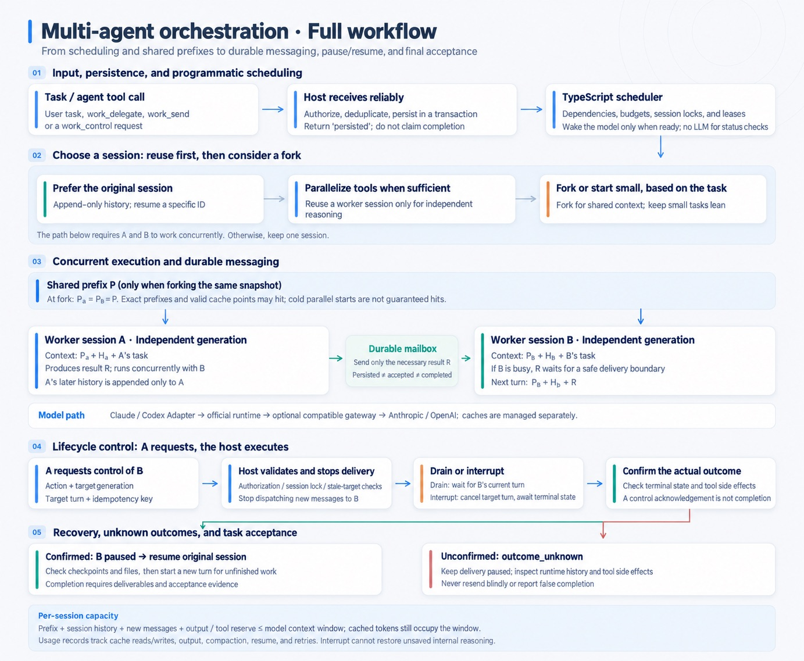

# Orchvia

Orchvia runs Claude Code and Codex agents as a team from your own application: one local engine, with TypeScript and Python SDKs.

- **Agents stay warm.** Each agent is a long-lived session that keeps its history, so follow-up work reuses it instead of starting over, or forks it to try another direction.
- **Nothing is lost or silently repeated.** Tasks, messages, approvals and token usage are stored in SQLite before anything runs. After a crash, work whose outcome is unknown waits for you instead of being retried.
- **You stay in charge.** Your code and the limits you configure decide what runs next, not a manager model. A result counts as done only after a person or a check you registered accepts it.



## Quickstart

You need Node.js 22.18 or later, on macOS or Linux. Orchvia uses Node's built-in SQLite, which prints an experimental warning.

```sh
git clone https://github.com/masonlee39/orchvia.git
cd orchvia
npm ci --ignore-scripts
node examples/typescript/quickstart.ts
```

The example uses a fake runtime, so it needs no account and calls no model. It runs two tasks, accepts each result, and the second task reuses the first agent's session:

```text
1. "Draft the release notes": completed, session <id>
2. "Tighten the draft you just wrote": completed, session <id>
The second task reused the first agent's session: true
```

From Python, the same kind of task runs through a Node host that Python starts:

```sh
PYTHONPATH=python/src python3 examples/python/fake_roundtrip.py
```

To run real agents, install Claude Code or Codex and follow the [integration guide](docs/guide.md). The packages are not on npm or PyPI yet; the first release publishes them as `@orchvia/*` and `orchvia`. Until then, [build them from source](docs/reference.md#install).

## How it compares

Orchvia runs coding agents. It is not a framework for building agents out of model calls, and it can sit next to one.

| | Orchvia | LLM agent frameworks[^frameworks] | Claude Code subagents[^subagents] | Several sessions by hand |
| --- | --- | --- | --- | --- |
| An agent is | a Claude Code or Codex session that stays open across tasks | model calls and tools that your code defines | a helper with its own context window, inside one Claude Code session | a terminal window |
| The next step is chosen by | your code and the limits you configure | your graph or code, or a model: a manager LLM in CrewAI's hierarchical process, or handoffs that the model calls as tools in the OpenAI Agents SDK | the main Claude agent, when a task matches a subagent's description | you |
| Scope | many agents and tasks in one engine, with a durable mailbox between them | whatever your graph, crew or workflow defines | one session | sessions that do not know about each other |

[^frameworks]: [LangGraph](https://docs.langchain.com/oss/python/langgraph/persistence), [CrewAI processes](https://docs.crewai.com/en/concepts/processes), [OpenAI Agents SDK handoffs](https://openai.github.io/openai-agents-python/handoffs/) and [Microsoft Agent Framework](https://learn.microsoft.com/en-us/agent-framework/overview/), the successor to AutoGen. Checked on 2026-09-23.

[^subagents]: [Claude Code subagents](https://code.claude.com/docs/en/sub-agents), checked on 2026-09-23.

## What it does

- **Sessions:** open, reuse, fork, compact, pause, resume and stop agents; each keeps its native history.
- **Scheduling:** dependencies between tasks, queues for busy agents, limits on how many run at once, and no two writers on the same files.
- **Messages and handoffs:** a durable mailbox between agents; delegation and handoffs that your host approves.
- **Acceptance:** human review of each result, or verification commands you register.
- **Accounting:** token usage recorded per task, with cost estimates from prices you register.
- **Recovery:** after a crash, nothing is resent or marked done by guesswork; you settle unknown outcomes explicitly.
- **Routing (optional):** a judge you choose, a model or plain rules, proposes which agent takes a request; nothing is submitted without you.

## Status

Orchvia is alpha software.

- Tested offline on macOS and Linux, with Node 22 and 24 and Python 3.11 and 3.14.
- The real Claude Code and Codex programs are tested in CI against a scripted local gateway, with no model calls.
- Not verified yet: runs with real models, operating-system sandbox enforcement, Windows, and speed or cost compared with other approaches. Measurements will be published with their raw data.

[Status](docs/status.md) lists what each check covered, the specifications and their evidence.

## Documentation

- [Integration guide](docs/guide.md): wire the engine into your application, step by step.
- [Reference](docs/reference.md): installation, the CLI, configuration and handling failures.
- [Concepts](docs/concepts.md): the terms these documents use, in plain words.
- [Design](docs/design.md): why the engine works the way it does.
- [Status](docs/status.md): what is verified, specifications and evidence.
- [Python SDK](python/README.md) and [contributing](CONTRIBUTING.md).

## License

[MIT](LICENSE). Third-party SDKs and native runtimes keep their own licenses.
