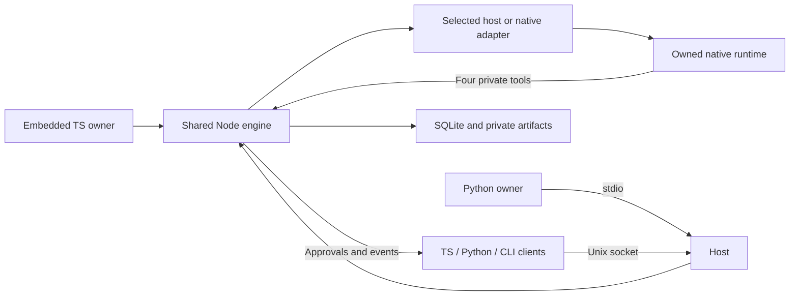

# Multi-agent orchestration SDK usage and detailed wiring

Updated 2026-09-21 for SPEC-0010. This guide describes implemented interfaces. All packages remain unpublished; use the local artifacts or source checkout. The five npm packages are **ESM-only**; direct require is not exported. A Claude consumer installs SDK + engine + adapter-claude. See [the local RC and CJS/ESM bundled-host contract](docs/acceptance/bundled-host.md). Offline process/transport/storage acceptance is recorded separately from real-model, sandbox, external-host and release acceptance in the [completion matrix](docs/specs/0009-complete-design.md#completion-matrix).

## 1. Choose an integration mode

| Mode | Owner | Runtime and storage |
| --- | --- | --- |
| Embedded TypeScript | `createOrchestrator(config)` | Same Node process; caller injects optional adapters |
| Managed Python | `await Orchestrator.local(engine_command=[...])` | Python owns one Node stdio host |
| Shared local host | CLI `host`, clients `connectOrchestrator` / `Orchestrator.connect` | One host owns SQLite and adapters; connected clients cannot administer the owner |

Use exactly one writer for a state directory. Python is a client, not a second scheduler. An application's existing execution pipeline can be supplied as a RuntimeAdapter; see section 5.1.

## 2. Overall wiring



Wire protocol 2.0 uses JSON-RPC 2.0 in UTF-8 JSONL frames. stdout is protocol-only for stdio hosts. The limits are 1 MiB per frame, 64 pending requests per connection, 32 connections, 256 host-wide pending requests, 8 MiB aggregate pending input and 8 MiB queued output per connection. No public TCP listener is provided. Trusted same-OS-user access is not an authenticated multi-tenant boundary.

## 3. Installation and directories

Node.js 22.18+ is required; Python needs 3.11+. Development source uses Node type stripping. Distribution tarballs contain emitted JS and declarations because installed node_modules cannot depend on source stripping.

```sh
npm ci --ignore-scripts
npm run check:generated
npm run typecheck
npm run build:packages
# Run in an isolated Python build environment with setuptools/wheel/build installed.
python -m build --no-isolation --sdist --wheel --outdir dist/release python
PACKAGE_BUILD_PYTHON="$(command -v python)" npm run test:packages
```

Install the engine and SDK tarballs together with the chosen adapter. An embedded Claude consumer needs `@agent-orch/sdk`, `@agent-orch/engine` and `@agent-orch/adapter-claude`; add `@agent-orch/cli` only for a standalone/managed host. Keep the npm package versions aligned, currently `0.1.0-rc.1` for the local RC. Claude's optional SDK and Zod 4 peers and Codex's native executable are separate runtime dependencies; ordinary startup does not download them. Host-injected Claude query owns dependency selection: provide matching MCP/inspection callbacks as described in the [bundled-host guide](docs/acceptance/bundled-host.md). Python installs the unchanged wheel with `python -m pip install --no-index --no-deps /absolute/release/agent_orch-0.1.0-py3-none-any.whl`.

Keep workspace, private state, and application/native credentials separate. The workspace and private directories must be canonical existing paths as required by CLI validation; state is outside the workspace. If using archive rollover, controlDir/storesRoot/archiveRoot must be private canonical outside-workspace directories, exclusively owned by this host. Do not use another application's state or history for fixture tests.

## 4. One configuration connects the components

This is runnable with explicit fake data after replacing the paths:

```json
{
  "configVersion": 1,
  "workspace": "/absolute/workspace",
  "stateDir": "/absolute/private/state",
  "transport": { "mode": "unix", "socketPath": "/absolute/private/state/host.sock" },
  "providers": { "fake": { "model": "fixture", "permissionProfile": "read-only" } },
  "limits": { "maxActiveSessions": 2, "maxTurnsPerTask": 20, "maxQuarantinedDispatches": 32 },
  "tools": { "enabled": true, "maxDepth": 4, "maxChildren": 32, "maxCallsPerDispatch": 100, "maxRepeatedCalls": 6 },
  "runtimeApprovals": { "enabled": true, "ttlMs": 30000 }
}
```

Each provider names its allowed models with `model` (one model) or `models` (a non-empty list of unique names), never both. Tasks and sessions must use an allowed model; removing a model on restart leaves existing sessions unchanged and rejects new tasks for it. A fork can move to another model only when the provider configures one of these lists (see section 8).

Host options also include verificationRules, registered writeScopes, pricing, budget, contextLimits, messageLimits, storage and stores. Read the typed [EngineConfig](packages/engine/src/types.ts) and validated [CLI config](packages/cli/src/config.ts) before adding fields. JSON providers remain read-only; native options, write profiles and callbacks use embedded TS. There is no generic auth/executable/gateway object. Native credentials and model endpoints belong to the selected runtime or an application-owned adapter, and are not stored in task specifications.

`doctor --config FILE` checks Node/SQLite, path access and the selected native dependency version without login or model calls. `doctor --socket PATH` proves the existing host handshake only. Neither proves authentication, tool sandboxing, model availability or task completion.

## 5. Embedded TypeScript wiring

Source entry points are under packages; installed imports use `@agent-orch/sdk`, `@agent-orch/engine/fake`, and the selected `@agent-orch/adapter-*` package. The complete [local example](examples/typescript/local.ts) creates a task, collects explicit fixture approval, handles shutdown and preserves supplied state. The [hosted example](examples/typescript/hosted.ts) tests an existing-runtime seam without a model.

```ts
import { createOrchestrator } from '@agent-orch/sdk';
import { createFakeAdapter } from '@agent-orch/engine/fake';

const orch = await createOrchestrator({
  workspace: '/absolute/workspace',
  stateDir: '/absolute/private/state',
  adapters: [createFakeAdapter()],
  tools: { enabled: true },
});
```

Creating an orchestrator is not submitting a task. Await task state and acceptance; save IDs and immutable retry identities. Close embedded owners explicitly. `SHUTDOWN_INCOMPLETE` retains the client and operationId for continuation. A connected client's close only disconnects.

### 5.1 Integrating an existing application's runtime

Use `createOrchestrator({ workspace, stateDir, adapters: [applicationAdapter] })` with an application-owned implementation of the current `RuntimeAdapter`. The built-in adapters are optional; do not start another provider runtime when the application already owns permission checks, tools, confirmations, and audit. This is an in-process extension point. The stock CLI currently allows only fake/Claude/Codex providers and is not a loader for arbitrary adapter modules.

Follow [design sections 7.3–7.5](./AGENT_ORCHESTRATION_DESIGN.md#73-current-application-adapter-extension-point) in this order:

1. Declare the exact provider, permission profiles, resume/interrupt support, budget v2 caps, and evidence v1 coverage. Require the engine's generation, shared remaining budget, and evidence callback; do not reset the timer at host admission.
2. Enter the host's full admission/execution pipeline with a trusted caller and a durable dispatch binding. A queue receipt is not native acceptance. Definite rejection before submission can produce failed plus pre-submission stop evidence; ambiguity after possible submission must remain unknown.
3. Preserve separate tool-confirmation and task-acceptance paths. Keep full host tool/UI events in the host; map native acceptance, result, usage, interruption, failure, and independently observed execution evidence into the engine contract.
4. Keep resource observation alive for owned child/background work after the main turn ends. Never declare terminal coverage simply because the host emitted a completed UI turn. Stop acknowledgements and no remaining in-memory handle are insufficient evidence.
5. Use stable identifiers and a durable projection checkpoint for host persistence. Recover a missing receipt with the original dispatch identity; do not replay uncertain work. Engine restart retains unresolved executions for owner reconciliation.

The [SPEC-0006](./docs/specs/0006-host-runtime-contract.md) implementation covers the typed contract, runtime validation, reusable offline acceptance, and a deterministic example. It does not implement a concrete Axion bridge, durable cross-store journal, authenticated multi-tenant API, package publication, or application hot update. The host journal and event projection above are requirements for the concrete integration, not current configuration fields.

`readRuntimeCapabilities(adapter)` returns a validated, detached, recursively frozen snapshot. `RuntimeBudgetCapabilities` requires version 2 and explicit nulls for unspecified caps; `RuntimeEvidenceCapabilities` names version 1 coverage. Inside a hosted adapter, call `requireEngineRuntimeInput(input)` before host submission to obtain `EngineRuntimeInput`. It preserves the original identity, signal, budget functions, and evidence callback; it is not authentication or proof of host enforcement. Ordinary standalone provider calls retain their optional `RuntimeInput` engine fields.

Run the complete offline example and contract tests from the source checkout:

```sh
node examples/typescript/hosted.ts
node --test tests/contract/host-runtime.test.ts tests/contract/runtime-capabilities.test.ts tests/contract/runtime-input.test.ts
node --test tests/contract/host-runtime-process.test.ts
```

The example creates and cleans up a temporary workspace/stateDir. Its output reports a null native ID while queued, waiting_approval before an explicitly simulated review, completed afterward, one dispatch, and no occupied execution slot. It never reads credentials or invokes a model. Its host bindings exist only in memory.

The optional `packages/engine/src/testing.ts` entry point exports `registerRuntimeAdapterContract(name, createFixture)`. A `RuntimeContractFixture` supplies the application adapter, its observed submissions and native IDs, observation-completion status, expected result/usage, controlled host actions, and cleanup. The actions cover accept, confirm-tool, reject, finish, main-result with background work, disconnect, mismatched-generation/dispatch stop evidence, and observed full stop. `finish` must emit duplicate usage under one ID so deduplication is exercised. A driver routes these actions through its controlled host/runtime boundary, not directly into engine state. Each case uses a fresh engine and temporary state; waits and cleanup are bounded. Drivers must remain offline and release every owned fixture resource in dispose.

The package exports `./testing` and `./testing-host` separately; neither is imported by normal engine startup. Use [the registration example](./tests/contract/host-runtime.test.ts) as a starting point, replacing the deterministic fixture with a driver for the actual application boundary. Passing the supplied fixture suite verifies the engine and test harness, not another application's adapter. A negative subprocess test verifies that the suite rejects a deliberately incorrect main-turn/full-stop mapping.

Acceptance must distinguish: (a) SDK source running under the target Node/Electron runtime; (b) deterministic lifecycle/failure-path acceptance; (c) the actual packaged application's permissions, UI, restart, and cleanup; (d) a separately authorized real-model run through the same host adapter. An earlier source-only probe in Electron's Node mode cannot establish (c) or (d).

### 5.2 Implemented host policy and usage forwarding

[SPEC-0007](./docs/specs/0007-host-policy-and-usage.md) implements these source interfaces. Native callback configuration is an embedded TypeScript surface; it is not a new Python/JSON configuration language. `EngineConfig.providers` and the adapter must select the same `permissionProfile`. Each adapter advertises only its configured profile, defaulting to `read-only`.

Claude `options` and `extendOptions(context)` preserve native callback types through a generic parameter. Use the types from the exact SDK installed by your host; the peer range is not a native compatibility matrix. This factory illustrates the typing without inventing full-stop observation:

```ts
import type { Options as NativeOptions } from '@anthropic-ai/claude-agent-sdk';
import {
  createClaudeAdapter,
  type ClaudeHostOptions,
  type ClaudeOwnedOption,
} from './packages/adapter-claude/src/index.ts';
import type { RuntimeStopObserver } from './packages/engine/src/types.ts';

type HostNative = Omit<NativeOptions, ClaudeOwnedOption>;

function hostClaude(
  options: ClaudeHostOptions<HostNative>,
  observeExecutionStop: RuntimeStopObserver,
) {
  return createClaudeAdapter<HostNative>({
    permissionProfile: 'workspace-write',
    options,
    extendOptions: async ({ input }) => ({
      systemPrompt: `Work only on dispatch ${input.dispatchId} in its allowed workspace.`,
    }),
    observeExecutionStop,
  });
}
```

The host can supply tools/allow/deny lists, `canUseTool`, `hooks`, `mcpServers`, `systemPrompt`, `maxTurns`, `env`, `settings`, `managedSettings`, and `settingSources`. Model, cwd, resume/session identity, prompt, abort controller, process spawn, and extra directory grants remain adapter-owned. Overrides fail at typecheck/runtime. Native options beyond the common policy fields are checked against the caller's installed SDK, not a universal compatibility promise. See the [positive/negative compilation fixture](./tests/fixtures/claude-options-types.ts).

Extensions run before submission and consume the original acceptance/turn budget. Rejection, timeout, or cancellation does not start a query. Their immutable input retains identity and remaining-budget functions. Tool/source arrays and hook containers are detached per dispatch; callback and native MCP instance identities are retained. The host must keep shared native objects and policy stable. Private options are not persisted.

Claude defaults to Read/Glob/Grep; write mode adds Edit/Write/Bash. Its built-in `PreToolUse` guard coexists with host hooks and blocks read-only mutation, engine-state access, outside-workspace edits including resolved symlinks, explicitly background Bash, and unsandboxed Bash. Write mode forces native sandbox availability, disables unsandboxed fallback, and restricts explicit writable roots. Host hooks/settings additionally enforce application-specific protected directories and custom/MCP authorization. `settingSources` selects native settings files; it does not replace guards, supplied settings, or confirmation policy. Symlink races, SDK scratch paths, native hook precedence, and actual OS enforcement still require native-runtime acceptance.

Supplying `canUseTool` without an explicit allow list/mode selects `allowedTools: []` and `permissionMode: default`. Explicit choices are preserved. Native tool confirmation and engine task-result approval are separate. SPEC-0009 adds opt-in `runtime_permission` requests through the existing approval event/decision API; the consuming application supplies its UI. Claude interruption follows the terminal and stop-proof contract below.

Codex accepts `permissionProfile`, `networkAccess` (default false), and `webSearch` (`disabled` by default, or `cached`/`live`). Search is independent from command network access. New/resumed threads and every turn receive the selected sandbox policy. Workspace-write uses the canonical workspace as its explicit writable root and excludes general temporary roots. Managed-home feature/MCP restrictions remain. JSON CLI supports network/search, but write and host callbacks remain embedded-only.

For extended Claude options or either write profile, `observeExecutionStop({ target, terminal, signal, remainingMs })` must observe complete remote/background stop for the exact dispatch/generation/native IDs. Return true only after actual host observation. False, rejection, absence, and timeout retain unknown execution. Waiting is bounded by cleanup time; late true evidence is retained without clearing business quarantine or resubmitting. Local child-process exit is independently required. With an observer configured, `terminalCoversExecution` denotes this combined proof; native-terminal evidence retains `remoteExecution: unknown` until host confirmation.

The writable Claude profile always requires the runtime's OS sandbox (`enabled` and `failIfUnavailable`, with no unsandboxed fallback). It works only where Claude Code can sandbox Bash. macOS uses its built-in sandbox; Linux needs `bubblewrap` and `socat` installed. Without them a writable task fails at its first dispatch with the runtime's `Sandbox required but unavailable` reason, and nothing runs unsandboxed. The engine's native checks cover macOS and Ubuntu CI with those packages. Other platforms are unverified; check Claude Code's sandbox support before enabling the writable profile there.

Usage consumers subscribe to existing engine events and read exact records:

```ts
for await (const event of orch.events({ storeId: savedStoreId, afterCursor: savedCursor })) {
  if (event.type === 'usage.recorded') {
    const record = await orch.usage.getRecord(event.data.usageRecordId as string);
    // Persist (event.storeId, record.id, record) to the host outbox transactionally.
  }
  // Advance the checkpoint only with/after that durable transaction.
}
```

The full [offline example](./examples/typescript/usage-forwarding.ts) implements the outbox/checkpoint transaction and destination deduplication. It reopens both databases, resumes a saved cursor, replays older events, and simulates a lost acknowledgment. Run `node examples/typescript/usage-forwarding.ts`; two delivery attempts produce one ledger row. Replace the fixture destination with an API honoring `(storeId, record.id)` idempotency. A failed delivery leaves the outbox pending. Larger streams must continue bounded pages until caught up. Do not count native usage both in the host and in this projection.

`reportUsage` plus iterator replay emits one atomic row/event per `dispatchId:usageId`; conflicting content rejects. Failed or late matching Claude results preserve usage despite cleanup uncertainty; mismatched sessions are excluded. Missing fields remain null. Python exposes `usage.get_record` and maps `usageRecordId` to `usage_record_id`, preserving raw provider keys. Wrong store/cursor pairs reject. The current host requires wire 2.0/schema 3 and namespace-bound mutations.

These guarantees cover observations that reached the engine. Historical rows are not backfilled, unreported crash-time usage cannot be recovered, and turn aggregates do not prove per-native-request accounting. `usage.get(taskId).completeness` retains its prior record-field meaning, not exhaustive upstream coverage. There is no distributed transaction with Work Nexus. Real host integration, native audit completeness, native permissions, and model acceptance remain separate; no Axion files are changed by this increment.

### 5.3 Claude interruption and revision

[SPEC-0008](./docs/specs/0008-claude-interruption.md) implements Claude `interrupt: true` using exactly one user message per open streaming input. The adapter owns the prompt UUID and `includePartialMessages: true`; host options cannot override them. Injected factories receive `AsyncIterable<ClaudeUserMessage>` instead of a string. They must consume that input and expose native `interrupt()` for active control; a legacy factory with no method cannot confirm interruption from the request alone.

After submission, the engine AbortSignal requests `Query.interrupt()` once. Startup cancellation waits for a matched main-turn assistant/stream event, because an init event can precede a running turn. The SDK controller remains alive to observe the result. A matched result with `terminal_reason: aborted_streaming` or `aborted_tools` becomes interrupted; arbitrary errors and missing reasons retain their error outcome. A success racing cancellation remains a success result for the engine's existing control rules. The adapter then closes input and cleans up owned processes. Extended host work still needs positive `observeExecutionStop` proof.

For an existing task `taskId`, pause it, queue revised context, and resume:

```ts
const task = await orch.tasks.get(taskId);
const session = await orch.sessions.get(task.sessionId);
const pause = await orch.sessions.control({
  sessionId: session.id,
  expectedGeneration: session.generation,
  expectedRevision: session.revision,
  expectedDispatchId: session.activeDispatchId,
  expectedState: session.status,
}, { action: 'pause', mode: 'interrupt' });
const paused = await pause.wait({ timeoutMs: 35000 });
if (paused.status !== 'completed') throw new Error(`Pause requires investigation: ${paused.status}`);
const current = await orch.sessions.get(session.id);
await orch.messages.send({
  taskId, toSessionId: current.id, expectedGeneration: current.generation,
  kind: 'finding', summary: 'Use the revised requirements in the next turn.',
});
await orch.tasks.resume(taskId);
```

Python uses the same `sessions.control` / `messages.send` / `tasks.resume` flow with snake_case fields. `tasks.cancel` interrupts an active Claude turn using the same evidence rules. There is no new `modify` action: revision is the existing pause, queued context, and resume sequence. Resume preserves saved native history; it does not recover unsaved reasoning. Read the returned operation/task state before treating control as successful.

A message waits for the target session's next dispatch until its TTL (`messages.ttlMs`, 24 hours by default). `message.expired` reports a TTL expiry without a `reason`, a cancelled task with `reason: "task_cancelled_before_submission"` and a stopped session with `reason: "session_stopped"`. Stopping a session expires every message still waiting for it, when the session actually closes: at once without a running dispatch, otherwise when that dispatch ends. Messages that the last dispatch carried keep that dispatch's outcome. `messages.send` to a stopped session fails with `SESSION_CLOSED` ([SPEC-0017](./docs/specs/0017-audit-corrections.md) A05).

`interruptTimeoutMs` defaults to 30000 and starts at the cancellation request, including startup waiting. It cannot extend acceptance/turn budgets or the host's `timeouts.interruptMs`. An expired host operation remains outcome_unknown/blocked even if late terminal/usage/exit evidence later releases execution capacity. No blind resend occurs. [Verification evidence](./docs/tdd/0008-claude-interruption.md) separates real local processes and installed native SDK transport from the still-unverified real CLI/model boundary.

## 6. Local Python wiring

Run `PYTHONPATH=python/src python3 examples/python/fake_roundtrip.py` from the checkout for a complete owned-host example, including known-fixture review and shutdown. Installed Python still needs the Node CLI and selected adapter in a stable tool directory.

```python
from agent_orch import Orchestrator, RuntimeSpec, TaskSpec, CheckAcceptanceSpec

orch = await Orchestrator.local(engine_command=[
    "/absolute/node", "/absolute/agent-orch-cli/dist/main.js",
    "host", "--stdio", "--config", "/absolute/host.json",
])
try:
    task = await orch.tasks.create(TaskSpec(
        goal="Perform the configured work",
        runtime=RuntimeSpec("fake", "fixture"),
        acceptance=CheckAcceptanceSpec(rule_refs=[{"id": "host-check", "version": "1"}]),
    ), idempotency_key="saved-business-key")
    result = await task.wait(timeout=30)
finally:
    await orch.close(timeout=5)
```

This checks example requires a registered host-check rule in host.json. A wait timeout stops only observation. Preserve shutdown errors and original business exceptions as shown in [Python README](python/README.md); do not delete state or kill shared processes after an incomplete close. Snake_case public fields map to camelCase wire fields; operation results and raw native JSON preserve wire keys.

## 7. Standalone host and CLI

```sh
node packages/cli/src/main.ts doctor --config /absolute/host.json
node packages/cli/src/main.ts host --config /absolute/host.json
# In another terminal:
node packages/cli/src/main.ts run --socket /absolute/private/state/host.sock --task /absolute/task.json
node packages/cli/src/main.ts attach --socket /absolute/private/state/host.sock --task TASK_ID
node packages/cli/src/main.ts control --socket /absolute/private/state/host.sock --target /absolute/target.json --action pause --mode drain
```

`submit` persists without observing; `status` reads a task; `approve` requires the approval ID, current revision and explicit approve/deny. `run`/`attach` detach on approval, blocked or paused by default; `--follow` keeps observing, `--interactive` requires TTY input for a decision, and `--timeout-ms` limits local observation. Ctrl-C detaches without cancelling shared work. `control` freezes all five session target fields, and compact/rotate/stop return durable operations.

The host handles SIGINT/SIGTERM with configured shutdown mode/time. Incomplete cleanup retains the control endpoint and operationId; another signal continues the same mode. Stdio parent EOF separately triggers bounded interrupt cleanup. No command approves automatically, enables fake implicitly, or invokes another management model.

## 8. Private tools, routing and verification

Owner-enabled tools have exactly four names: work_delegate, work_send, work_read, work_control. Claude uses SDK createSdkMcpServer/tool; Codex runs a private stdio MCP bridge. Its temporary Unix endpoint/token binds the original task/session/dispatch/generation, is inherited privately and revokes when the turn ends. Tool arguments cannot supply a trusted actor, escalate policy, control siblings/parents, approve work, register commands, administer storage or shut down the host. The model sees one fixed catalog with an outer request object.

work_delegate validates declared independence and inherited/narrowed provider/model/profile/write scope. Task dependencies wait without consuming execution slots and wake only after required acceptance. Reuse is serial, requires compatible context/root/profile/workspace, and has a finite persisted queue deadline. Only declared fallbackModes may create a different candidate. Continue/parallel_tools are in-turn intents, not hidden child tasks. Context references must name existing bounded digest-verified artifacts.

Logical session opening makes no native/model call. Fork captures a completed source checkpoint; first use must return a distinct native identity. Compact executes a maintenance turn and requires an actual compact boundary; a method acknowledgment is insufficient. Rotate requires a quiet settled session, archives generation evidence and clears the native binding. Stop closes scheduling independently of business cancellation. Inspect performs bounded read-only native history lookup and returns unknown execution; it never settles work automatically.

Fork preconditions and effects apply to every caller:

- The source session must be quiet. An in-flight dispatch, held lease, quarantined or verification-pending dispatch, or retained runtime resource fails with `RUNTIME_STILL_ACTIVE`; a non-terminal associated task fails with `SESSION_BUSY`.
- The source's associated task must be `completed`, and `snapshotRef` must be one of its `artifactRefs`; otherwise the fork fails with `INVALID_SNAPSHOT` (`NO_SESSION_TASK` when the session has no associated task). A failed or cancelled task cannot be forked. Continue in a new session instead; it does not carry the earlier history.
- The runtime must declare `fork`, and the source needs a native session ID and a completed native checkpoint; otherwise the fork fails with `UNSUPPORTED_CAPABILITY`.
- The fork is a new logical session with the source's provider, write paths and root task, and the permission profile configured for that provider. It keeps the source model unless the call names another allowed model (below). The source session is unchanged. The fork counts toward `limits.maxLogicalSessions` (`SESSION_CAPACITY_EXHAUSTED`) and is subject to quarantine admission (`QUARANTINE_CAPACITY_EXCEEDED`).
- A fork cannot change the provider name, permission profile or write paths. Use a new session for that; it does not carry the earlier history.
- `sessions.fork` only prepares the fork. The native fork happens on the fork's first dispatch.
- A task uses a prepared fork by naming it as `candidateSessionId`; the declared mode's usual rules apply, and `reuse` requires `independent: true`. Inline `requestedMode: "fork"` instead names the source session and `snapshotRef`, and also requires `independent: true` (`INVALID_ROUTING`). Either way, the task must match the fork's provider, model, permission profile and write paths (`SESSION_INCOMPATIBLE`), and must belong to the source's root task unless the owner enables `allowCrossRootReuse` (`HISTORY_REUSE_FORBIDDEN`).

A fork may continue the source history on another model of the same provider. These rules also apply to every caller:

- Pass `model` to `sessions.fork`. It must be in the provider's configured `models` (or `model`) list. Without a configured list, or for an unlisted model, the fork fails with `VALIDATION_ERROR`. Omitting `model`, or naming the source model, is an ordinary fork.
- The runtime must declare `forkModelChange: true`, otherwise `UNSUPPORTED_CAPABILITY`. Claude declares it; Codex does not. Both SDKs also require the host to advertise `sessionLifecycle.forkModel` before sending `model`.
- The caller must also pass `acknowledgeCacheLoss: true`, otherwise the fork fails with `CACHE_LOSS_NOT_ACKNOWLEDGED` and no session is created. The runtime resends the whole history with every request, so the new model receives the source conversation up to the checkpoint. It cannot reuse the source model's prompt cache: the first response after the change reprocesses the whole inherited history and is slower and more expensive; later responses warm the new model's cache. Tell end users this before they switch. The operation result and the `session.fork_prepared` event carry `modelChange: {fromModel, toModel, promptCacheReuse: false}` for that message.
- Tasks on the fork must declare the target model (`SESSION_INCOMPATIBLE` otherwise). `contextLimits`, pricing and budget reservation use the target model at dispatch, as for any task; a missing price under an active budget pauses the task with `BUDGET_PRICE_UNKNOWN`. The engine does not estimate inherited history from recorded usage, so `contextEstimate` must include the inherited history. The provider's own context limit remains the final boundary.
- Only a client can change the model. Inline `requestedMode: "fork"` keeps the source model, and bound runtime tools can neither name a model nor claim a prepared fork.

```ts
const branch = await orch.sessions.fork(target, snapshotRef, {
  model: 'claude-haiku-4-5',
  acknowledgeCacheLoss: true, // after telling the user about the slower, costlier first response
});
```

```python
branch = await orch.sessions.fork(target, snapshot_ref, model="claude-haiku-4-5",
                                  acknowledge_cache_loss=True)
```

Checks use owner-registered verificationRules with ID/version/argv/canonical cwd/time/output/profile/success criteria. The task freezes their digest at admission. Checks run after runtime stop, capture baseline hashes and output, and require all checks and dependencies to pass. Failed checks consume a finite repair/turn budget. Unconfirmed verifier cleanup retains execution/write ownership until explicit owner evidence. Registered commands run as the local user; baseline checks detect mutation afterward and are not an OS sandbox. Startup, store switches and configuration loading check only a rule's shape, including that its paths do not leave the workspace by name. Paths are resolved when a rule is registered and when a task that uses it is admitted: a path that cannot be resolved refuses the task with `INVALID_WORKSPACE_SCOPE`, and the message names the rule, the path and the system error code. A path removed after admission makes that check fail ([SPEC-0017](./docs/specs/0017-audit-corrections.md) A01).

Task acceptance mode human uses purpose task_acceptance. `runtimeApprovals.enabled` routes native permission requests as purpose runtime_permission with exact dispatch/tool digest and expiry. The consumer must distinguish them; no consumer, cancellation, expiry or stale target grants permission. The four owner-enabled orchestration tools are preapproved by native MCP and remain subject to engine authorization and limits. Native permission-hook coverage still requires real-runtime acceptance.

### 8.1 Host workflow controls

[SPEC-0014](./docs/specs/0014-host-workflow-controls.md) adds the controls below for every caller. `initialize` advertises them as `capabilities.workflow` (`version: 1` and one `true` flag per feature); both SDKs check the relevant flag before sending a new method or field and fail with `UNSUPPORTED_CAPABILITY` otherwise. Four of them change existing behavior on upgrade: dependency results in prompts, JSON-encoded message summaries, the default read fence and its Bash sandbox rules.

**Several profiles of one runtime.** `createClaudeAdapter({ provider, permissionProfile })` and `createCodexAdapter({ provider })` register under a chosen name (default `claude`/`codex`; 1–128 characters of `[A-Za-z0-9._-]`). One engine can therefore run a read-only and a writable Claude, for example `claude-read` and `claude-write`, each with its own `providers.<name>` entry. The adapter reports execution evidence under the same name; never rename an adapter by wrapping it, because evidence under another name is rejected and the dispatch stays quarantined. Pricing, `contextLimits` and provider configuration use the chosen name. The JSON CLI keeps the fixed names `fake`, `claude` and `codex`.

**Dependency results.** When a task with `dependencyTaskIds` is dispatched, its prompt includes each completed dependency's result artifact, in declared order, after the goal and context references, as `Untrusted dependency result {"taskId":…,"artifactRef":…}` followed by the JSON-encoded text. Each block is limited to 32 KiB and all blocks to 96 KiB, counted in UTF-8 bytes after JSON encoding, headers and omission records included. Text that encoding expands, such as control characters, quotes and backslashes, reaches the limit sooner. A larger or missing result contributes only its identifiers, size and the reason; a block that would leave no room for the records of later dependencies is omitted too. The results are repeated on later dispatches of the task only until one dispatch that carried them returns a result. No host action is needed, so a host no longer has to wait for the upstream task and create the downstream one itself. Include the injected results in `contextEstimate`. A bound `work_read` may read (kinds `task` and `artifact`) the tasks in its own task's `dependencyTaskIds` and their artifacts, but not their dependencies. Message summaries are now JSON-encoded in the prompt too, so text produced by one model cannot forge a message header for another.

**Revise, and decision comments.** `approvals.decide` accepts `comment` (1–16,384 UTF-8 bytes) with any choice and stores it on the approval. `choice: "revise"` requires a comment and applies only to `task_acceptance` approvals: the approval becomes `revised` (event `approval.revised`), the task returns to `queued` with reason `revision_requested` (or `paused` when its session is paused) in the same session, and the next dispatch prompt includes `Reviewer revision request (approval <id>)` with the JSON-encoded comment. Downstream tasks keep waiting, and each revision counts toward `maxTurnsPerTask`. `revise` on a runtime-permission approval fails with `VALIDATION_ERROR`. `revise` on a task whose session was stopped fails with `SESSION_CLOSED` and changes nothing; approve or deny the result instead (SPEC-0017 A03). Stopping a session expires the messages still waiting for it, so a later approve or deny ends the task normally (SPEC-0017 A05).

**Read fence.** By default the Claude adapter denies `Read`, `Glob` and `Grep` outside the workspace and `readRoots`, and inside `denyRead` or the state directory; a search root that contains a denied path is also denied. Configure `readRoots` (existing absolute directories), `denyRead` (absolute or workspace-relative paths) or `readFence: false` on the adapter; capabilities report `readFence`. In the writable profile the OS sandbox additionally denies Bash reads of the host process's home directory (`os.homedir()`), the state directory and `denyRead`, while re-allowing the workspace and `readRoots`; `denyRead` inside the workspace stays denied. Commands that read home-directory configuration such as `~/.gitconfig` or `~/.npmrc` need those paths in `readRoots`. A host-supplied `sandbox.filesystem.allowRead` that overlaps the state directory is rejected. Codex declares `readFence: false` because its sandbox does not restrict reads. The guard is covered by the Claude scripted-gateway smoke; the Bash sandbox rules were verified locally on macOS with `scripts/native-read-fence-smoke.mjs`, which needs an available OS sandbox.

**Concurrency.** `limits.maxActiveSessions` accepts 1–8 (default 2). The engine never raises it. Keep `maxQuarantinedDispatches` comfortably above it: with both at 8, eight running dispatches fill the quarantine floor and new tasks are refused with `QUARANTINE_CAPACITY_EXCEEDED` until work settles. Each active Claude or Codex session is a native child process.

**Delegation gate.** With `tools.approveDelegation: true`, a child created by `work_delegate` starts `paused` with reason `DELEGATION_APPROVAL_REQUIRED` and holds no execution slot. Approve it with `tasks.resume` and reject it with `tasks.cancel`; pausing or resuming its session, including from a runtime tool, does not release it. On approval the engine rechecks its dependencies and restarts its routing wait, so time spent awaiting the host never expires the route.

**Handoff requests.** With `tools.handoffs: true`, a `work_delegate` that reuses an existing open session outside the model's subtree records a pending handoff request instead of failing with `UNAUTHORIZED`, and returns `{handoffId, status: "pending"}`. The request carries only the goal and context references the requester may read: artifacts of its own subtree and of the tasks in its own `dependencyTaskIds`, not their dependencies or unrelated tasks. It creates no task, changes nothing in the target session and grants nothing. The host reads requests with `handoffs.get`/`handoffs.list` (events `handoff.requested`, `.accepted`, `.rejected`, `.expired`) and decides. To accept, the host creates the task itself — for example as a child of the target session's root task reusing that session, so it runs with that session's permissions and budget — then calls `handoffs.resolve` with `outcome: "accepted"` and the task's ID. The engine only records the link. Requests expire after `tools.handoffTtlMs` (default 24 hours, 1 minute to 7 days, wall-clock time), on time even on an idle host (SPEC-0017 A04), each root task may hold 100 pending requests (`HANDOFF_LIMIT`), and the requester can read its own request with `work_read` kind `handoff`. A backup import marks pending requests `invalidated`; they do not block a rollover or import.

**Narrowed write paths.** A task or `sessions.open` spec may add `writePath`, an existing workspace path inside its `writeScope`; the task's or session's write paths become that one path. Write conflicts, session compatibility and the Claude write sandbox use it, so agents with disjoint paths under one registered scope write concurrently. `work_delegate` accepts `writePath` within the parent's write paths, and a child inherits a narrowed parent path. Tasks with verification rules still lock the whole workspace. Clients still cannot register a new write root.

**Runtime rules.** The owner (in-process or stdio host) can call `rules.register({rule})` to append a verification rule version in the configured rule format; an existing `id@version` with the same content is a no-op and different content fails with `CONFLICT`. `rules.list()` shows effective rules with `source: "config" | "runtime"`. Registered rules persist in the active store; if a configured rule later conflicts with a registered one, startup fails with `VALIDATION_ERROR`. A rule whose directory was removed or renamed no longer blocks startup; tasks that use it are refused until the path exists again. `stores.rollover` carries registered rules into the new store. `stores.import` restores the backup's rules, so rules registered after the backup must be registered again; an import whose backup conflicts with a configured rule fails with `VALIDATION_ERROR` before switching. A rule `id` or `version` may contain `@`. Tasks still freeze their rules at admission. At most 1,000 rules may be effective. Limits, tool limits and message limits still change only on restart.

**Listing tasks.** `task.created` data includes `parentTaskId` and `rootTaskId`. `tasks.list({parentTaskId? | sessionId?, limit?, afterCursor?})` returns creation-ordered pages (default 50, at most 100) with `nextCursor`.

```ts
const page = await orch.tasks.list({ parentTaskId: root.id });
await orch.approvals.decide(approval.approvalId, {
  choice: 'revise',
  expectedRevision: approval.revision,
  comment: 'Add tests for the empty case',
});
const [request] = (await orch.handoffs.list({ status: 'pending' })).handoffs;
const takeover = await orch.tasks.create({
  goal: request.goal,
  runtime: { provider: 'claude-read', model: 'claude-sonnet-4-6' },
  acceptance: { mode: 'human', criteria: ['Reviewed'] },
  parentTaskId: agentRootTaskId,
  contextPlan: { requestedMode: 'reuse', independent: true, candidateSessionId: request.targetSessionId },
});
await orch.handoffs.resolve(request.handoffId, {
  expectedRevision: request.revision,
  outcome: 'accepted',
  taskId: takeover.id,
});
```

```python
page = await orch.tasks.list(parent_task_id=root.id)
await orch.approvals.decide(approval.approval_id, {"choice": "revise", "expected_revision": approval.revision,
                                                   "comment": "Add tests for the empty case"})
request = (await orch.handoffs.list(status="pending")).handoffs[0]
await orch.handoffs.resolve(request.handoff_id, expected_revision=request.revision, outcome="rejected")
```

### 8.2 Queue waits

[SPEC-0015](./docs/specs/0015-queue-waits.md) defines how long a task may wait in the queue for its first dispatch. It applies to every caller and changes behavior on upgrade.

- **The wait.** A task's wait is `contextPlan.maxQueueWaitMs`, from 0 to 604,800,000 ms (seven days). A task without a plan, or whose plan omits the field, uses the host default `limits.defaultMaxQueueWaitMs`, which is 30,000 ms unless configured. The wait is fixed when the task is admitted, so a configuration change affects only new tasks. An identical `tasks.create` retry returns the original task under any default, because the idempotency digest uses the fixed 30,000 ms fallback (SPEC-0017 A02). A request first admitted by rc.9 or rc.10 under another default gets `IDEMPOTENCY_CONFLICT` once if it is retried after the upgrade. `0` means the task must dispatch as soon as it is ready, or expire. This includes children created by `work_delegate` whose plan omits the field. A `work_delegate` call without a `contextPlan` continues in the caller's session and creates no child.
- **Only queued time counts.** A task that waits for its dependencies, or is paused, has no running deadline. Each time a task enters the queue, the wait restarts and `routing.enqueuedAt` and `routing.deadlineAt` are reset: when its dependencies complete, when it is resumed and when a delegation is approved. `enqueuedAt` is therefore not the creation time; use `createdAt`. While a task is not queued, `deadlineAt` is informational. Dispatch order stays creation order. A retry never renews a deadline.
- **Expiry.** A task still queued when its wait ends moves to a declared fallback, or becomes `blocked` with `SCHEDULING_BLOCKED`. It is never revived; create a new task.
- **Clock and host lifetime.** The wait is measured on the wall clock. Time the computer sleeps while a task is queued counts; after waking, an overdue task expires at the next scheduler pass. Time the host is not running never counts. Closing the host pauses queued tasks with reason `owner_shutdown`, and a start after a crash pauses them with `owner_restart`. They do not run until the host resumes them with `tasks.resume` or a session resume, and resuming restarts the full wait. A host whose users close the app or let the computer sleep with queued work should resume these tasks at startup and choose a default long enough to cover sleep.
- **Dependent tasks created up front** wait for their dependencies and their acceptance without a deadline, then get their full wait to be dispatched. Waiting tasks still count toward `limits.maxQueuedTasks`. A dependency that fails or is cancelled still blocks its dependents.

```ts
const orch = await createOrchestrator({
  workspace,
  stateDir,
  adapters,
  limits: { defaultMaxQueueWaitMs: 86_400_000 }, // a day; the JSON CLI accepts the same field
});
```

### 8.3 Optional routing layer

[SPEC-0018](./docs/specs/0018-routing-layer.md) adds `@agent-orch/sdk/routing` and `agent_orch.routing`, and [SPEC-0019](./docs/specs/0019-routing-corrections.md) corrects it; rc.13 includes the corrections, and the rc.12 package predates them. A judge answers typed questions about a request and the agents of one group. Code turns the answers into an ordinary `TaskSpec` with `contextPlan`, and the host submits it or not. The router adds no engine rule or storage. Its one engine addition is the read-only `context.checkRefs` of [SPEC-0020](./docs/specs/0020-context-check.md), after rc.13, and every engine rule still applies to what is submitted.

**Setup.**
- Create the router with `createRouter({ orchestrator, judge, runtimes, scope?, describe?, policy? })`, or `Router(orch, judge, read_only=..., writable=..., scope=..., describe=..., policy=...)` in Python.
- `runtimes` names the provider and default model for fresh read-only and for fresh writable work, each with an optional `small` and `large` model. Those models must be in the provider's configured model list.
- `scope` sets what a group is:
  - `'root'`, the default: a group is one root task. Pass the group's `rootTaskId`; the proposed task becomes its child.
  - `'engine'`: a group is the whole engine. Run one engine per group, with its own workspace and `allowCrossRootReuse: true`. The engine does not report that flag, so a wrong scope shows up as `HISTORY_REUSE_FORBIDDEN` on submit.

**Candidates.** `route({ goal, acceptance, members, rootTaskId?, needsWrites?, spec? })` considers only the given member session ids, at most 16.
- It reads each member with `sessions.get` and its latest task with `tasks.get`.
- It drops a member when:
  - the session is closed, paused, pausing or has an unknown outcome;
  - the session has no task;
  - it belongs to another root task under `'root'`;
  - the request's `spec.writeScope` or `spec.writePath` differs from the member's.
- A member counts as busy when it is not idle, or when its latest task has not ended. Waiting for approval counts as not ended.
- A reused member keeps its provider, model, write scope and write path.

**What the judge receives.** One call per route.
- State: `{ request: { goal }, agents: { A1: { description, status: 'idle' | 'busy', access: 'read-only' | 'writable' }, … } }`. Aliases follow the member order.
- Questions:
  - `best`: a choice over the aliases and `fresh`;
  - `relevant.<alias>`: yes/no, one per member;
  - `writes`: yes/no, asked only without `needsWrites`;
  - `size`: a score of trivial, moderate or large, asked only when a ladder has `small` or `large`;
  - `depends.<alias>` and `clash.<alias>`, for each busy member: a score of none, helpful or essential, and a yes/no.
- Notifications send `{ finding: { text }, agents }` and ask `affects.<alias>`, a yes/no, for every member except the source.

**Decisions.** The thresholds are `policy` fields.

| Situation | Proposal |
| --- | --- |
| The judge fails or times out | Fresh session with no context; `JUDGE_UNAVAILABLE`; confirmation unless `onJudgeFailure: 'fresh'` |
| `best` is `fresh`, or no eligible member reaches `relevantAt` (0.5) | Fresh session carrying the results of members at `contextAt` (0.7) or above, most relevant first, at most `maxContextRefs` (20); a result over 32 KiB is left out with `CONTEXT_OMITTED` |
| The best member is idle | `reuse` it, wait up to `busyWaitMs` (20 minutes), fall back to `fresh` |
| The best member is busy and `clash` ≥ `clashAt` (0.5) or P(essential) ≥ `essentialAt` (0.5) | `reuse` it and wait; no fallback when P(essential) ≥ `essentialNoFallbackAt` (0.7) |
| The best member is busy otherwise | Fresh session now, carrying that member's result first |
| The request needs writes | Read-only members are removed and the `best` probabilities renormalized; the shares only order the alternatives |
| Model for fresh work | `small` when P(trivial) ≥ `smallAt` (0.85), `large` when P(large) ≥ `largeAt` (0.7), else the default |

`needsConfirmation` is set by any of these reasons:
- `LOW_CONFIDENCE`: `confidence` is below `confirmBelow` (0.85). It is the lower of the judge's own `best` confidence (`judgeConfidence`) and the judge's probability for the proposed option; for a fresh session because no member is relevant, 1 minus the highest relevance takes that probability's place;
- `NARROW_MARGIN`: the top two options are within `minMargin` (0.2);
- `WRITES_UNCERTAIN`: the writes probability is between 0.3 and 0.7;
- `RUNTIME_MISSING`: the needed runtime is not configured.

`alternatives` lists the options as session ids or `fresh`, each with `probability`, its share among the options that can take the work, and `judgeProbability` (Python `judge_probability`), the probability the judge gave it.

**Carried results.** Every path that carries results, including a busy member's own, measures each result in UTF-8 bytes from the task snapshot and leaves out any over the engine's 32 KiB inline limit. It records a `CONTEXT_OMITTED` reason with `sessionId`, `artifactRef`, `reason: 'too_large'`, `maxBytes` and, when known, `bytes`; the result takes no `maxContextRefs` place and is never summarized. It does not set `needsConfirmation`; a host that wants a confirmation checks `reasons` for `CONTEXT_OMITTED`.

**Checking results before submitting** ([SPEC-0020](./docs/specs/0020-context-check.md)). Where `initialize` reports `capabilities.workflow.contextCheck`, the router asks the engine about every result it might carry, in one `context.checkRefs` call per 20, and leaves out the ones the engine refuses. Their `CONTEXT_OMITTED` reason is `expired`, `corrupt`, `missing`, `unreadable` or `too_large`, with the engine's `code` and, when known, `bytes`. An engine without the capability gets the size check only, and the proposal adds `CONTEXT_UNCHECKED` with the number of unchecked results. A failed check fails `route()`. The engine checks again on submit, so a result that changes in between still fails with its error and creates nothing.

Any client, including a socket client that is not the owner, can call `orch.context.checkRefs([{ artifactRef, version: 1 }])`, or `await orch.context.check_refs([{"artifact_ref": ref, "version": 1}])` in Python, with 1 to 20 references. The result lists, in order, `{ artifactRef, admissible, code?, bytes? }`: what task admission would decide at that moment. The codes are `ARTIFACT_TOO_LARGE`, `ARTIFACT_HISTORY_EXPIRED`, `ARTIFACT_CORRUPT`, `NOT_FOUND` and `ARTIFACT_UNREADABLE`. The call reads only: it returns no content, records nothing and does not extend retention. Admission reports a reference it cannot read as `ARTIFACT_UNREADABLE` too.

**Findings.** `notifications({ text, fromSessionId, members, rootTaskId? })` first checks the group, before the judge is asked. The source must be one of `members`, or it fails with `RoutingError` `ROUTING_SOURCE_NOT_MEMBER`. Under `'root'` the group is the source's own root task, and a different `rootTaskId` fails with `ROUTING_ROOT_MISMATCH`; under `'engine'` `rootTaskId` is ignored. It returns three lists:
- `notify`: members at `notifyAt` (0.7) or above whose task has not ended. `notify(plan)` sends them `finding` messages.
- `confirm`: members between 0.5 and 0.7 whose task has not ended; the host decides.
- `followUp`: affected members whose task ended. The engine does not accept messages for them, so start a follow-up task instead.

If the judge fails, the plan is empty and reports why.

**Jev.** `createJevJudge({ apiKey, model?, baseUrl?, timeoutMs? })`, or `JevJudge(api_key, ...)` in Python:
- calls `POST https://api.typesafe.ai/v1/systemone` with a bearer token, and pins `jev-1.13.0` by default;
- retries once on HTTP 429, 529, 5xx or a network error, within `timeoutMs` (10 seconds by default), which bounds the whole evaluation, including the retry, its pause and a slowly arriving response. Python runs each request on its own thread and shuts the connection down at the deadline or on cancellation; a name lookup cannot be interrupted, so that thread then only ends when the lookup returns;
- raises `JudgeError` with one of these codes: `JUDGE_AUTH`, `JUDGE_INVALID_REQUEST`, `JUDGE_RATE_LIMITED`, `JUDGE_UNAVAILABLE`, `JUDGE_TIMEOUT`, `JUDGE_PROTOCOL`.

Any other judge only has to return the documented answer shapes; malformed answers count as `JUDGE_PROTOCOL`.

## 9. Usage, costs and context estimates

Usage belongs to the original dispatch/task/root even when a native session is reused. Callback/yield replay deduplicates observations by dispatch and source ID. Late records remain on the original owner. Missing fields and ambiguous cumulative scope remain unknown; overlapping total/cached token buckets are not billed twice.

Owner pricing identifies provider, model, currency, version and decimal per-million-token rates. Costs use exact decimal arithmetic; costs.get supports direct/tree/host_overhead, and owner-only recordOverhead deduplicates a supplied billingId. Reservations are committed before dispatch and include concurrent held reservations. Confirmed complete usage settles unused reserve; missing usage retains reserve. These are scheduling estimates, not upstream invoices or hard provider-side spend caps.

context.estimate reports per-request keep/compact scenarios for continued cache hits, TTL rebuilds, partial retained prefixes and history growth. Compaction is counted once; unknown intervals/metrics yield explicit ranges or unknown. No automatic economic routing or compaction optimization is enabled without measured native capability/benefit evidence.

## 10. Namespace, retention and archives

Every mutation uses expectedStoreId. TS receipts/errors expose retryIdentity; Python exposes retry_identity. Preserve `(storeId, method, scope, idempotencyKey, digestVersion, requestDigest)` with the original request. SDK retry reuses this identity and rejects changed payloads. `refresh()` intentionally observes the current active namespace; it never rewrites an old retry. An old key sent into a new store must fail before mutation.

Read operations.lookup in the original store. After rollover, use archives.lookup with the original storeId/method/scope/key and optional requestDigest. Expired details produce OPERATION_HISTORY_EXPIRED while lifetime tombstones preserve deduplication. ARCHIVE_UNAVAILABLE, ARCHIVE_CORRUPT and ARCHIVE_NOT_FOUND are distinct and are never proof of non-execution.

Save event cursor with storeId. CURSOR_EXPIRED requires state.snapshot: retain its snapshotId/cursor, read bounded pages using nextOffset, rebuild visible state, release the lease and resume events exclusively after the captured cursor. The snapshot is fixed, lasts at most 60 seconds, and does not reconstruct deleted audit history. Expiry requires a new snapshot rather than mixing pages.

Owner storage APIs expose status/configure/collect/pin/unpin/backup. Protected references override retention. GC operates in bounded batches; inspect oversizedArtifacts and pressure instead of assuming one call removes all eligible data. Policy changes are audited and do not initiate destructive rollover automatically. Full/I/O errors stop admission and release emergency reserve for bounded recovery; degraded public close releases owned resources and reports STORAGE_DEGRADED_CLOSED with durableReceipt=false if it could not save a shutdown receipt.

stores.rollover requires configured controlDir/storesRoot/archiveRoot and a fully settled old store. It verifies a complete archive, prepares a fresh identity, retires/fences the old writer, commits the active manifest and then activates the new writer. Restart resumes the same durable switch. Old state remains preserved. Unfinished tasks, unknowns, resources, approvals/messages/outbox, operations, conflicts, GC and leases block rollover with IDs.

storage.backup returns a registered backupId. stores.importBackup / stores.import_backup imports it under a fresh store identity, preserves provenance, and quarantines unfinished work with explicit reconciliation targets. It never restores credentials or replays tasks. Original native history outside managed runtime storage is not promised in a backup. No cross-store semantic deduplication is inferred.

## 11. Startup, shutdown, and recovery SOP

### 11.1 Startup order

Run offline doctor; select exactly one owner; let migration/file recovery complete; negotiate wire 2.0 and capabilities; attach event/approval consumers; explicitly submit or resume work. Native identity, authentication and sandbox checks are separate acceptance steps. Recovery never blindly sends an unfinished dispatch again.

### 11.2 Normal shutdown

Use `orch.close({mode:'drain',timeoutMs:30000})` for an embedded owner or `await orch.close(mode="drain",timeout=30)` for Python. Drain does not escalate automatically. If SHUTDOWN_INCOMPLETE occurs, retain its live client and operationId and explicitly continue or request interrupt. Preserve the original business result/error/cancellation while handling cleanup. Connected clients simply disconnect. Public close after a latched storage failure may report STORAGE_DEGRADED_CLOSED after releasing resources, because no durable shutdown receipt can be promised.

What close leaves behind ([SPEC-0016](./docs/specs/0016-session-after-task-end.md) S02):

- `close({mode:'interrupt'})` pauses running tasks with reason `runtime_interrupted`, and pauses their sessions without a `pauseOrigin`. It pauses queued tasks with reason `owner_shutdown`.
- After the next start, `tasks.resume` continues these tasks, and each resumed queued task gets its full queue wait again (SPEC-0015).
- A client's own pause records `pauseOrigin: "client"` on the session, and the task reason is also `runtime_interrupted` if the pause interrupted a turn. A host that resumes interrupted work automatically must skip sessions whose `pauseOrigin` is `client`, or it overrides the user's pause.

### 11.3 Restart recovery

Reconnect to a live host instead of starting a second writer. Reuse canonical workspace/state paths and correct runtime configuration. Unknown execution remains blocked with original native/dispatch IDs. Read-only sessions.inspect may add evidence but never proves non-execution from missing history. Resume only after the relevant explicit owner resolution. Do not restore an old database over live state, discard tombstones or reset keys to bypass uncertainty.

If the host process ends before `close` completes, the next start finds:

- Each running task `blocked` with reason `outcome_unknown: previous owner exited during a dispatch`. Its session is `outcome_unknown`, and it holds an execution slot and a quarantine slot.
- Queued tasks paused with reason `owner_restart`.

Reconcile each unknown dispatch with `sessions.reconcile` (section 11.4). The evidence decides what is released:

- **`localResources` and `remoteExecution` stopped, but `sideEffects` or `outcome` unknown:** the execution slot is released and the dispatch keeps its quarantine slot. The session stays `outcome_unknown` and cannot be reused. When `limits.maxQuarantinedDispatches` slots (default 32) are held this way, no new work is admitted (`QUARANTINE_CAPACITY_EXCEEDED`). Once the side effects are known, reconcile the same session again with a resolved attestation to free the slot.
- **Resolved, with `outcome: "interrupted"`:** use this after the host has confirmed its processes ended and the side effects were checked. It releases both slots and fails the task with `reconciled_interrupted`. The session stays `paused`. To continue with its history, resume the session with `sessions.control` (`action: "resume"`), which returns it to `idle`, then create a task that reuses it. The resume runs nothing by itself. The same resume works for any paused session whose task has ended, for example one paused while its task awaited acceptance and then approved or denied.

### 11.4 Implemented owner attestation

Current A/A2 accounts for execution resources separately from business reconciliation. Confirmed execution/cleanup releases the lease while business unknown remains quarantined. Two possibly running unknowns fill two execution slots; larger quarantine capacity cannot bypass concurrency. [A2 evidence](./docs/tdd/0003-a2-wiring.md) covers offline TS/Python and actual Node stdio/Unix hosts, not real models.

Host defaults are acceptanceMs=30000, turnMs=1800000, drainMs=300000, interruptMs=30000, reconcileMs=60000, each integer 1..86400000 ms. Embedded TS passes createOrchestrator configuration; CLI/Python use [README host JSON](./README.md#standalone-host-and-cross-language-integration). Python passes engine_command=[node, cli, "host", "--stdio", "--config", config_file], not local(timeouts=...). Convert LifecycleTimeouts snake_case values with agent_orch.types.to_wire. SDK wait does not renew deadlines.

Total budget starts at dispatch and includes initialization/acceptance; acknowledgments/output do not renew it. Use the shorter host/explicit-provider cap; longer provider caps cannot extend host time. CLI requestTimeoutMs/turnTimeoutMs accept integer 1..3600000 ms. Cleanup fields are Claude cleanupTimeoutMs and Codex closeTimeoutMs with the same range; crossed names fail. Claude additionally accepts interruptTimeoutMs with the same range. No implicit 300-second cap remains when unspecified. Upgrades/config changes do not renew old deadlines.

Timeout retains dispatch/control/related messages as outcome_unknown and Task blocked. Potentially executing unknown work keeps its slot. Late matched terminal/cleanup can release resources without business reconciliation. sessions.reconcile records an owner declaration after actual history/resource/side-effect investigation; it does not perform that investigation. Only embedded TS or managed-stdio Python owners qualify; ordinary sockets return UNAUTHORIZED. SDKs require initialize.capabilities.lifecycle={version:1,reconcile:"owner-attestation",durableDeadlines:true} before send, otherwise UNSUPPORTED_CAPABILITY.

Evidence fields below map camelCase to snake_case in Python:

| Field | Value |
| --- | --- |
| source / summary | "owner_attestation" / human investigation summary |
| localResources / remoteExecution | Each "stopped" or "unknown" |
| sideEffects | "resolved" or "unknown" |
| outcome | "not_executed", "completed", "failed", "interrupted", or "unknown" |
| result | Required for completed: reviewed complete string, genuinely empty allowed, maximum 524288 characters; still subject to human acceptance |

These functions accept **an existing owner SDK instance, task ID, reviewed human evidence, and durable business key**. They never infer stopped/resolved from timeout. They illustrate a first reconciliation: read an exact target, submit it, and return current state. Applications requiring recovery must save the complete target/evidence/key before the first RPC. After failure, do not rerun a helper that reads a new target; use the saved-parameter continuation below. The creating application still owns section 11.2 shutdown.

```ts
import type { Orchestrator, ReconcileEvidence } from './packages/sdk-typescript/src/index.ts';

export async function reconcileReviewedTask(
  orch: Orchestrator,
  taskId: string,
  evidence: ReconcileEvidence,
  idempotencyKey: string,
) {
  const task = await orch.tasks.get(taskId);
  const session = await orch.sessions.get(task.sessionId);
  if (task.status !== 'blocked' || session.status !== 'outcome_unknown' || !session.activeDispatchId) {
    throw new Error('Task is not awaiting reconciliation');
  }
  const operation = await orch.sessions.reconcile({
    sessionId: session.id,
    expectedGeneration: session.generation,
    expectedRevision: session.revision,
    expectedDispatchId: session.activeDispatchId,
    expectedState: session.status,
  }, evidence, { idempotencyKey });
  const outcome = await operation.wait({ timeoutMs: 30_000 });
  return { operation: outcome, task: await orch.tasks.get(taskId) };
}
```

```python
from agent_orch import Orchestrator, ReconcileEvidence


async def reconcile_reviewed_task(
    orch: Orchestrator, task_id: str, evidence: ReconcileEvidence, idempotency_key: str,
):
    task = await orch.tasks.get(task_id)
    session = await orch.sessions.get(task.session_id)
    if (task.status != "blocked" or session.status != "outcome_unknown"
            or not session.active_dispatch_id):
        raise ValueError("Task is not awaiting reconciliation")
    operation = await orch.sessions.reconcile({
        "session_id": session.id,
        "expected_generation": session.generation,
        "expected_revision": session.revision,
        "expected_dispatch_id": session.active_dispatch_id,
        "expected_state": session.status,
    }, evidence, idempotency_key=idempotency_key)
    outcome = await operation.wait(timeout=30)
    return {"operation": outcome, "task": await orch.tasks.get(task_id)}
```

Operation completed confirms both the reconciliation record and any required adapter-record cleanup. Inspect result.executionReleased, result.resolved, and current task separately. Both resources stopped with no active handles/conflicts can yield executionReleased=true,resolved=false when business fields remain unknown: release only A, retain Q/blocked/outcome_unknown/activeDispatchId, and forbid resume. Python operation.result is raw JSON: receipt.result["executionReleased"] and ["resolved"], not execution_released. Active execution observation or an observed process returns RUNTIME_STILL_ACTIVE. R04 permits only the narrow owner path for an exact record whose observation ended, whose spawn callback is sealed, and for which no process was ever observed. Contradictory evidence returns EVIDENCE_CONFLICT; changed targets return STALE_TARGET. On a lost receipt, operations.lookup uses method=sessions.reconcile, scope=sessionId, and the original key. Preserve original target/evidence; do not put a newly read target under the old key or blindly switch keys.

R04 adds two result fields. `unobservedResourcesReconciled` is true only after unobserved resource records are retired and durably acknowledged; it is false when no such records exist or cleanup remains pending. Optional `resourceCleanup={status:"pending"|"completed",ownerInstanceId}` exists only when this cleanup is required. Python reads `receipt.result["unobservedResourcesReconciled"]` and `receipt.result.get("resourceCleanup")`; nested ownerInstanceId remains camelCase.

RESOURCE_CLEANUP_INCOMPLETE means **the declaration committed but cleanup is unconfirmed**. It carries operationId and auditCommitted=true (Python: `error.operation_id` and `error.data["auditCommitted"]`); earlier resource/business decisions are not rolled back. This host pauses new dispatches with RESOURCE_CLEANUP_PENDING. First inspect the original receipt with get/lookup, then let the owner explicitly decide whether to continue. `operations.get/lookup` and `OperationHandle.wait()` are read-only. persisted is not terminal, so wait alone polls until local timeout without invoking the finalizer.

The following snippets explicitly continue on **the same still-running owner**. originalTarget/originalEvidence/originalKey are the complete values saved before the first request:

```ts
const operation = await owner.sessions.reconcile(originalTarget, originalEvidence, {
  idempotencyKey: originalKey,
});
const receipt = await operation.wait({ timeoutMs: 10_000 });
```

```python
operation = await owner.sessions.reconcile(
    original_target, original_evidence, idempotency_key=original_key,
)
receipt = await operation.wait(timeout=10)
```

A same-key retry continues the original finalizer, or only persists acknowledgement if the record was already retired. On another failure, preserve the original error and parameters; do not loop automatically or change keys. Restart loses the original in-memory finalizer and leaves the receipt outcome_unknown; same-key retries still report RESOURCE_CLEANUP_INCOMPLETE. Neither disappearance of the in-memory blocker nor wait returning unknown proves the original cleanup succeeded.

Completed business attestation saves full output and pauses; explicit tasks.resume requests human acceptance only. not_executed permits explicit requeue; failed/interrupted fails the original. Unknown controls retain history plus resolution, not false on-time completion. See [historical A evidence](./docs/tdd/0003-a-evidence.md) and [A2 wiring](./docs/tdd/0003-a2-wiring.md).

### 11.5 Implemented scheduler queries and resource conflicts

limits.maxActiveSessions defaults to 2, integer 1..8. limits.maxQuarantinedDispatches defaults to 32, integer 1..1024 and at least effective maxActiveSessions. scheduler.get reads A/Q/R and conflict data in one database transaction: A=executionOccupied held leases, Q=quarantined business unknown, R=quarantineReserved unquarantined reservations including initialization/cleanup. canDispatch/reasons also include this host's closing flag and in-memory cleanup records, so the complete response is not a pure database snapshot. A/Q overlap. Admission needs A < maxActiveSessions and Q+R < maxQuarantinedDispatches, with no shutdown, cleanup, or conflict blocker. At quarantine capacity, refuse new work but retain original receipts, queries, cancel, reconcile, approval, close, and saved-result acceptance resume.

orch is an existing SDK instance. Queries need no owner authority and invoke no models. Occupancy/conflict examples each cap at 16; check truncated/conflictsTruncated and totals.

```ts
const status = await orch.scheduler.get();
console.log(status.executionOccupied, status.quarantined, status.quarantineReserved);
console.log(status.canDispatch, status.reasons);
if (status.conflicts.length) {
  const conflict = await orch.scheduler.getConflict({ conflictId: status.conflicts[0].conflictId });
  console.log(conflict.id, conflict.revision, conflict.dispatchId, conflict.status);
}
```

```python
status = await orch.scheduler.get()
print(status.execution_occupied, status.quarantined, status.quarantine_reserved)
print(status.can_dispatch, status.reasons)
if status.conflicts:
    conflict = await orch.scheduler.get_conflict(status.conflicts[0].conflict_id)
    print(conflict.id, conflict.revision, conflict.dispatch_id, conflict.status)
```

All three scheduler methods require exact initialize.capabilities.executionIsolation={version:1,resourceRelease:true,schedulerStatus:true,ownerConflictResolution:true,budgetVersion:2}; missing/incompatible capability yields UNSUPPORTED_CAPABILITY before send. Ordinary sockets can read; the server checks owner authority for resolution. Current stable reasons include EXECUTION_CAPACITY_EXHAUSTED, QUARANTINE_CAPACITY_EXCEEDED, HOST_STOPPING, RESOURCE_CLEANUP_PENDING, and EXECUTION_EVIDENCE_CONFLICT; clients must tolerate future additional reasons. See the preceding section for owner continuation of RESOURCE_CLEANUP_PENDING. Optional sessions.get execution includes dispatchId, lease, quarantined, lastEvidence, and budget. Budget stores policyVersion=2, start/end, effective acceptance/total limits, and sources. Python maps known fields to snake_case; remaining-time callbacks are not wire data.

Matched contradictory evidence after release durably blocks new dispatch through restart. Functions below accept **an existing owner, conflictId, reviewed stop declaration, and durable key**. Use ReconcileEvidence with both localResources/remoteExecution (snake_case in Python) stopped; sideEffects/outcome may remain unknown. Do not infer declarations from timeout.

```ts
import type { Orchestrator, ReconcileEvidence } from './packages/sdk-typescript/src/index.ts';

export async function resolveReviewedConflict(
  owner: Orchestrator, conflictId: string, evidence: ReconcileEvidence, idempotencyKey: string,
) {
  const conflict = await owner.scheduler.getConflict({ conflictId });
  const operation = await owner.scheduler.resolveConflict({
    conflictId: conflict.id, expectedRevision: conflict.revision, evidence,
  }, { idempotencyKey });
  return await operation.wait({ timeoutMs: 10_000 });
}
```

```python
async def resolve_reviewed_conflict(owner, conflict_id, evidence, idempotency_key):
    conflict = await owner.scheduler.get_conflict(conflict_id)
    operation = await owner.scheduler.resolve_conflict(
        conflict.id, evidence, expected_revision=conflict.revision,
        idempotency_key=idempotency_key,
    )
    return await operation.wait(timeout=10)
```

Resolve by durable conflictId even if activeDispatchId cleared. Reject stale revision, active handles, or insufficient proof. Resolve every conflict, then satisfy normal capacity/close gates before dispatch. This does not rewrite business outcomes, original unknown, or acceptance history. Idempotency uses method=scheduler.resolveConflict, scope=conflictId. Recover lost receipts by original-key lookup; do not substitute a new revision under that key.

## 12. Layered acceptance

| Evidence | What it establishes | Still required |
| --- | --- | --- |
| Full Node/Python suites | Engine, wire, actual local IPC, owned process and storage-fault behavior | Real upstream execution |
| Installed pinned native SDK / generated CLI types | Actual offline MCP/permission transport and versioned API shape | Real model, history and sandbox behavior |
| Clean package installation | Emitted npm packages and wheel/sdist run in fresh offline environments | Publication/license/release operation |
| Local capacity report | Bounded measurements on the recorded host and data size | Unexecuted OS/runtime matrix cells and production sizing |
| Opt-in native plan | Explicit version, identity source, spending estimate and evidence preparation | Separate authorization and real execution |

Follow [native acceptance instructions](docs/acceptance/README.md). A source/runtime probe is not packaged-application acceptance. A protocol response or main-turn result is not complete process/resource stop. A fixed price estimate is not a measured cost benefit. No Axion implementation, external ledger integration, credentials or paid model requests are part of the offline suite.
