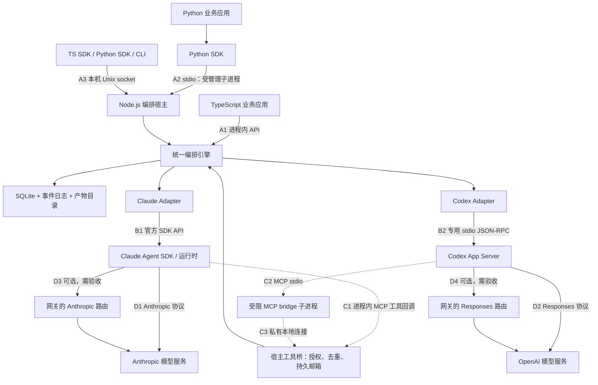
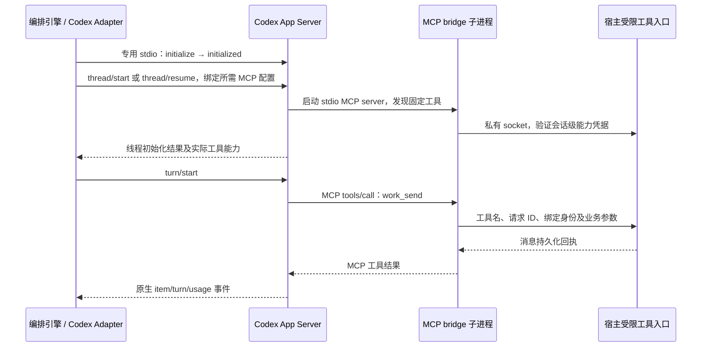

# 多 Agent 编排 SDK 使用说明与详细接线方案

更新日期：2026-09-20。配套文档：[设计文档](./AGENT_ORCHESTRATION_DESIGN.md)。

本文定义完整首版目标的安装、接线与使用体验。**基础增量、SPEC-0003-A/A2 已有 SDK、CLI、配置解析器、生命周期与执行隔离实现，并通过离线 fixture 验证；实际可用接口以 [README](./README.md)、[SPEC-0001](./docs/specs/0001-foundation.md)、[SPEC-0003-A](./docs/specs/0003-a-lifecycle.md)、[SPEC-0003-A2](./docs/specs/0003-a2-execution-isolation.md) 及源码示例为准；本篇的完整流程尚未全部实现，也未发布安装包。** `@agent-orch/*`、`agent-orch`、`agent_orch` 为暂定包名；下文含未来 API、auth/executable 配置和尚未实现命令，不能直接当作当前可执行说明。第 11.4–11.5 节为已实现的人工核对和调度诊断用法。官方运行时的事实在对应位置链接来源，真实模型仍未验收。

本文补充主设计中尚未展开的接线契约：统一配置文件、客户端连接入口、受限 MCP 回调桥、批准事件字段及本地 CLI 参数。实现时应同步固化到公共 schema、API 参考和契约测试，不能由两种语言分别猜测。

2026-09-19 设计复核另补了选路责任、存储保留/GC、控制期限和费用归属，详见主设计 4.5、5.1、5.4、6.1、9.1、12.1 节及 [SPEC-0003](./docs/specs/0003-policy-retention-deadlines.md)。A/A2 的期限、执行租约、业务隔离及所有者人工核对已实现；B/C 的选路、保留/GC 和费用规则仍待实现，不要用其拟议参数尝试启用。本文示例需结合以下规则理解：

- 待实现的 contextPlan 由应用或已有主会话声明意图；宿主将校验授权、依赖、版本和资源，不从自然语言自行判定值得 fork。未声明回退不静默创建额外会话。
- SDK 本地 wait 超时、执行控制 deadline 和资源回收期限分别处理；未确认的执行保持 unknown，不能超时后换键重发。close 超时仍按原 operationId 继续处理。
- 待实现的保留规则为事件至少 30 天、终结操作/消息详情至少 90 天，保护引用优先；防重 tombstone 与 store 同寿命。未来详情过期不能允许旧键重新执行，GC 后的 CURSOR_EXPIRED 将通过一致快照续读；当前没有 GC 或 state.snapshot。
- 未来复用会话时，每个 dispatch 固定成本归属；D 读取前序历史的费用归 D。busy 会话有明确排队期限，不能仅为缓存等待而无限阻塞任务。
- 当前已支持持久 deadline 和 sessions.reconcile 的 owner-attestation 入口，没有上游历史自动 inspection；fork/compact/rotate、state.snapshot、GC 和自动策略选择仍未实现。

## 1. 先选择接入方式

| 你的应用 | 接入方式 | 哪个进程负责调度 | 应用退出后任务能否继续 |
| --- | --- | --- | --- |
| TypeScript / Node.js 后端或桌面主进程 | SDK 嵌入模式 | 你的 Node.js 进程 | 不能保证；退出前需关闭引擎，重启后显式恢复 |
| Python 脚本、Notebook、异步后端 | Python SDK 本地模式 | SDK 启动的 Node.js 子进程 | 不能保证；随 Python 所有者关闭 |
| 多个应用共同访问，或需要关闭客户端后继续工作 | 连接已有宿主 | 独立的本地宿主进程 | 宿主及运行时存活时可以继续 |

同一个状态目录只允许一个引擎所有者。TS 与 Python 操作同一组任务时，应连接同一宿主；不要各自以嵌入/本地模式打开同一数据库。

首次接入建议先选一种语言、一种运行时并使用模型直连，完成第 12 节的完整验收后，再加入第二运行时、多个客户端和可选网关。这是接入顺序，两种 SDK 和两个适配器仍属于首版交付范围。

## 2. 总接线图



直连和网关路线二选一，不会为同一请求同时向两条路线发送。图中的编排引擎是同一份实现，嵌入模式与宿主模式按部署方式选择。

### 2.1 每根连接线的协议、所有者与验证方式

| 编号 | 发起方 → 接收方 | 传输 / 内容 | 谁负责建立 | 接通标准 |
| --- | --- | --- | --- | --- |
| A1 | TS SDK → 引擎 | 同进程异步方法调用 | `createOrchestrator` | 初始化返回实例；任务可持久化 |
| A2 | Python SDK → 宿主 | 子进程 stdin/stdout，本项目 JSON-RPC | `Orchestrator.local` | 版本握手、状态目录和 instanceId 一致 |
| A3 | SDK/CLI → 宿主 | Unix socket，本项目 JSON-RPC | `connect` / CLI | 握手成功，权限与事件重放正常 |
| B1 | Claude Adapter → 官方 SDK | `query()`、输入流、原生事件 | Claude Adapter | session ID、工具目录和真实结果可核对 |
| B2 | Codex Adapter → App Server | 独立 stdio，Codex 自身 JSON-RPC | Codex Adapter | initialize 后可创建/恢复线程并收到轮次事件 |
| C1 | Claude 工具调用 → 宿主 | 官方 SDK 的进程内 MCP server | Claude Adapter | 调用进入宿主授权与消息账本 |
| C2 | Codex → MCP bridge | MCP stdio | 受管 Codex 运行时 | 固定工具可发现，工具调用有正常回执 |
| C3 | MCP bridge → 宿主工具入口 | 私有 Unix socket + 会话级能力凭据 | 引擎创建入口，bridge 连接 | 只能以绑定 agent 身份访问获授权工具 |
| D1/D2 | 运行时 → 模型服务 | HTTPS 流式模型协议 | 官方运行时 | 完整模型轮次、工具往返和 usage 正常 |
| D3/D4 | 运行时 → 兼容网关 | 对应厂商协议与网关认证 | 运行时读取实例配置 | 网关路径下同样通过完整轮次验收 |

A2、B2、C2 是三组不同的管道；不要把它们接到同一个 stdout。A3 和 C3 也是不同权限的入口：业务客户端可以查看获授权任务，agent 工具桥只能访问固定工具，不能调用宿主关闭或人工批准接口。

### 2.2 地址与端口

| 项目 | 地址由谁提供 | 是否占 TCP 端口 |
| --- | --- | --- |
| TS 嵌入引擎 | 无地址 | 否 |
| Python 受管宿主 | SDK 持有 stdin/stdout 句柄 | 否 |
| 独立宿主 | 配置中的 `transport.socketPath` | 否，Unix socket |
| agent 回调入口 | 引擎创建的私有 socket | 否，Unix socket |
| Codex App Server | 适配器持有的 stdio 句柄 | 否 |
| MCP bridge | Codex 持有的 stdio 句柄 | 否 |
| 模型直连 / 网关 | 运行时对应配置中的 HTTPS 地址 | 出站连接，通常为 443 |

首版没有“每个 agent 一个 HTTP 端口”。逻辑 agent/session ID 由宿主路由，接收方暂停或运行时退出时，邮箱地址仍可使用。`socketPath` 必须短于目标 OS 的路径限制；由实现预检实际长度，不假定任意深的 stateDir 都适合直接放 socket。

## 3. 安装与目录准备

### 3.1 需要准备什么

| 场景 | Node.js | 本项目 npm 包 | 本项目 Python 包 | 官方运行时 |
| --- | --- | --- | --- | --- |
| TS 嵌入 | 需要 | SDK + 选中的适配器 | 不需要 | 按所选适配器准备 |
| Python 本地 | 需要 | CLI/宿主 + 选中的适配器 | 需要 | 位于宿主环境 |
| TS/Python 连接宿主 | 宿主需要；TS 客户端也需要 | 宿主侧 CLI + 适配器；TS 侧 SDK | Python 客户端需要 | 位于宿主环境 |

计划支持 Node.js 22+、Python 3.11+、macOS/Linux；正式支持以发布兼容矩阵为准。Python 本地模式依赖 Node.js 引擎；不需要再安装两家厂商的 Python SDK。

发布后的安装模板如下，**当前这些本项目包未发布，不能执行此模板验收**。版本变量必须填写某个真实发布版本，禁止使用占位符下载同名未知包。

```sh
# TypeScript，选 Claude。替换为实际发布版本后使用。
npm install --save-exact "@agent-orch/sdk@${ORCH_VERSION:?请先填写已发布版本}" "@agent-orch/adapter-claude@${ORCH_VERSION}"

# Python 本地模式的 Node 宿主：安装到固定工具目录，不依赖临时 npx 下载。
npm install --prefix "${ORCH_TOOL_DIR:?请先填写固定安装目录}" --save-exact "@agent-orch/cli@${ORCH_VERSION:?请先填写已发布版本}" "@agent-orch/adapter-claude@${ORCH_VERSION}"

# Python 客户端。
python3 -m venv .venv
.venv/bin/python -m pip install "agent-orch==${ORCH_VERSION:?请先填写已发布版本}"
```

若选择 Codex，替换为 `@agent-orch/adapter-codex`；同时使用两家则同时安装两个适配器。安装到 CLI 工具目录的适配器必须能被该宿主解析，不能只装进另一份业务项目的 node_modules 然后依赖碰巧正确的 cwd。

本项目适配器负责声明兼容的官方 SDK 依赖。Codex 可执行文件的路径和版本显式预检；Claude SDK 及其运行时的打包方式按锁定版本准备，不假设系统 PATH 上任意一个 CLI 就是已验证版本。

### 3.2 三类目录分开

```text
业务项目 workspace/            agent 可以读写的目标项目
工具安装目录 tools/            SDK/CLI/adapter 的固定安装位置
私有状态目录 state/            引擎拥有，不作为 agent 的业务工作目录
  store.sqlite                任务、消息、控制、事件、usage
  artifacts/                  日志、结果、证据和内容摘要
  runtime/                    引擎实例的运行时配置和会话引用
  run/                        本机 socket 与实例所有权记录
  logs/                       脱敏后的宿主诊断信息
```

路径全部传绝对路径。状态、凭据和工具安装目录应放在业务 workspace 之外，并从 agent 可读写范围排除；不向模型提供能修改宿主配置或读取能力凭据的文件权限。单 OS 用户模式本身不是对任意恶意本地代码的强隔离。

不要删除 `state` 作为普通排障步骤。更改 stateDir 会创建另一套任务历史；更改 workspace 则必须重新核对会话对应的代码基线。

## 4. 一份配置连接所有组件

### 4.1 编排器配置草案

下面是本项目拟议的 `orchestrator.json`，**不是 Claude 或 Codex 原生配置**。适配器把它转换成受支持的运行时选项。`/absolute/...` 和尖括号内容需在实现后的接入时替换。

```json
{
  "configVersion": 1,
  "workspace": "/absolute/path/to/project",
  "stateDir": "/absolute/path/to/private-state",
  "transport": {
    "mode": "unix",
    "socketPath": "/absolute/path/to/private-state/run/host.sock"
  },
  "providers": {
    "claude": {
      "adapter": "@agent-orch/adapter-claude",
      "model": "<CLAUDE_MODEL_ID>",
      "auth": {
        "mode": "env",
        "apiKeyEnv": "ANTHROPIC_API_KEY"
      },
      "permissionProfile": "read-only"
    },
    "codex": {
      "adapter": "@agent-orch/adapter-codex",
      "executable": "/absolute/path/to/codex",
      "model": "<CODEX_MODEL_ID>",
      "auth": {
        "mode": "runtime"
      },
      "permissionProfile": "read-only"
    }
  },
  "limits": {
    "maxActiveSessions": 2,
    "maxTurnsPerTask": 20
  },
  "shutdown": {
    "mode": "drain",
    "timeoutMs": 30000
  },
  "verificationRules": []
}
```

只接 Claude 或 Codex 时删除未使用的 provider 条目。配置两个 provider 不表示启动任务时会同时调用两家；TaskSpec.runtime.provider 指定本次任务选择。

| 字段 | 配置责任方 | 处理规则 |
| --- | --- | --- |
| workspace / stateDir | 宿主所有者 | 校验绝对路径、访问范围、目录归属和单实例锁 |
| transport | 宿主所有者 | 独立宿主使用；`--stdio` 模式覆盖传输类型且不打开业务 socket |
| providers.*.adapter | 安装者 | 只加载安装且允许的模块；不接受模型指定的任意模块名 |
| providers.*.model | 应用开发者 | 精确模型 ID；不给未知模型假设窗口或价格 |
| providers.*.auth | 宿主所有者 | 只记录凭据来源，不写密钥本身 |
| permissionProfile | 应用开发者 | 本项目策略名；适配器必须实现实际限制，不只是系统提示 |
| limits | 应用开发者 | 由引擎统一执行，双语言不能各自计算并发预算 |
| verificationRules | 宿主所有者 | 预先登记并版本化的验证命令，不接受 agent 临时提供命令 |

`read-only` 在 Claude 与 Codex 上的具体机制不同；权限映射未经契约验证时必须初始化失败，不能退化为全权限。需要修改代码时显式改为经过验证的写入策略并配置允许目录。

JSON 不自动展开 shell 环境变量、`~` 或 `<占位符>`。第一版按绝对路径处理；凭据只有 `apiKeyEnv` 这种专用字段会由适配器读取环境值。重复来源配置规则：显式选择 stdio 可覆盖 transport，除此之外冲突的同名初始化字段直接报错，避免 workspace/stateDir 被静默改写。

### 4.2 凭据接到哪一层

| 认证材料 | 谁读取 | 不应放在哪里 |
| --- | --- | --- |
| Anthropic API key | 宿主启动的 Claude 运行时环境 | TaskSpec、消息、系统提示或事件日志 |
| Codex 官方账户会话 | 受管 Codex 运行时的受支持认证存储 | Python 客户端消息或模型网关自定义 header |
| 自定义模型 provider 的 key | 受管运行时读取指定环境变量 | CLI 参数明文、Git 中的 JSON/TOML |
| 本项目 agent 回调能力凭据 | 受限 MCP bridge / 宿主工具入口 | 模型工具参数或普通业务客户端配置 |

`auth.mode=runtime` 表示适配器使用所选运行时支持的认证流程/存储；它不承诺新建隔离运行时后自动继承桌面登录。需要登录时返回明确的认证需求，由用户走上游支持的流程，不能偷偷复制整个用户配置目录。

第一版本机业务 socket 根据文件权限和 OS 对端用户识别可信应用调用者，在宿主策略允许时处理任务操作与人工批准；它不在同一个 OS 用户的任意应用之间提供强隔离。宿主关闭另需所有者凭据，默认只交给启动连接或受管管理入口。agent 则使用 C3 的独立入口和受限凭据，不能借普通工具参数升级为业务客户端。

## 5. TypeScript 嵌入模式接线

```text
你的 Node.js 进程
  ├─ 业务逻辑
  ├─ TypeScript SDK → 编排引擎 → SQLite / 事件日志
  ├─ Claude Adapter → 官方 SDK → 受管运行时
  └─ Codex Adapter  → 独立 App Server 子进程
```

接入步骤：安装 SDK 和所选适配器；读取配置；明确创建适配器；创建引擎；创建任务；消费事件和批准；等待已验收结果；按所有权关闭引擎。SDK 不替调用者管理 Web 服务器的退出或信号处理。

以下业务函数展示人工验收接线，API 均为草案；引擎的配置、创建与关闭由第 11.2 节的外层函数统一负责。`approvalUi.review` 是应用自己的异步 UI 回调，展示目标和证据后返回 approve/deny/defer，并必须响应取消。它只在客户端运行，不序列化到宿主。独立终端用户可以直接选择第 7 节的 CLI attach。

```ts
import { readFile } from "node:fs/promises";
import { createOrchestrator, type ApprovalRequest } from "@agent-orch/sdk";
import { createClaudeAdapter } from "@agent-orch/adapter-claude";

type ApprovalUI = {
  review(request: ApprovalRequest, options: { signal: AbortSignal }): Promise<"approve" | "deny" | "defer">;
};

export async function runDemo(
  orch: Awaited<ReturnType<typeof createOrchestrator>>,
  model: string,
  approvalUi: ApprovalUI,
) {
  const task = await orch.tasks.create({
    goal: "只读查看项目根目录，列出关键文件并说明作用，提交证据供人工验收。",
    runtime: { provider: "claude", model },
    acceptance: { mode: "human", criteria: ["内容与实际文件一致", "没有修改文件"] },
  }, { idempotencyKey: "read-only-demo-001" });

  // 初次按 taskId 订阅，会重放该任务保留的持久事件，避免漏掉早到的批准请求。
  for await (const event of orch.events({ taskId: task.id })) {
    console.log(event.type);
    if (event.type === "approval.requested") {
      const request = await orch.approvals.get(event.data.approvalId);
      if (request.status !== "pending" || request.revision !== event.data.revision) continue;
      const remainingMs = Math.min(60_000, Date.parse(request.expiresAt) - Date.now());
      if (remainingMs <= 0) continue;
      const signal = AbortSignal.timeout(remainingMs);
      let choice: "approve" | "deny" | "defer";
      try {
        choice = await approvalUi.review(request, { signal });
      } catch (error) {
        if (!signal.aborted) throw error;
        return await orch.tasks.get(task.id); // 返回待处理状态，交给调用者恢复。
      }
      if (choice === "defer") return await orch.tasks.get(task.id);
      try {
        await orch.approvals.decide(request.approvalId, {
          choice, expectedRevision: request.revision,
        }, {}); // SDK 为这一次决定生成并在传输重试中保留幂等键。
      } catch (error) {
        if ((error as { code?: string }).code !== "STALE_TARGET") throw error;
        // 请求在 UI 打开期间被其他客户端处理或失效，继续消费最新状态。
      }
    }
    if (["task.paused", "task.blocked"].includes(event.type)) {
      const snapshot = await orch.tasks.get(task.id);
      if (["paused", "blocked"].includes(snapshot.status)) {
        console.log("任务需调用者处理", snapshot.status, snapshot.reason);
        return snapshot; // 历史事件先核对当前状态，外层随后执行关闭流程。
      }
    }
    if (["task.completed", "task.failed", "task.cancelled"].includes(event.type)) break;
  }

  const result = await task.wait();
  console.log(result.status, result.artifactRefs);
  return result; // 调用者检查 status，不能把所有返回都当作成功。
}
```

示例中的 read-only 目标不能替代 permissionProfile。固定幂等键便于重试核对；真正发起另一项任务时必须使用新的业务键。遇到 paused/blocked，示例返回状态供调用者处理，因而返回值可能是 TaskSnapshot，也可能是终态 TaskResult；见第 10 节。

## 6. Python 本地模式接线

```text
Python 进程
  └─ agent_orch.Orchestrator.local
       ├─ stdin  → Node 宿主接收本项目 JSON-RPC
       ├─ stdout ← Node 宿主响应与事件
       └─ stderr ← 宿主脱敏日志，单独消费

Node 宿主
  └─ 同一套编排引擎 → 同一套 Claude/Codex Adapter
```

Python SDK 必须使用参数数组创建子进程，不拼接 shell 字符串；持续读取 stdout 和 stderr，不因调用者暂时不消费事件而堵塞管道。模型凭据由宿主所需的显式环境继承策略提供；日志不得输出环境变量值。

拟议 `local` 支持两种初始化形式：传 workspace/state_dir 等结构化参数，或由 `engine_command` 明确传 `--config`。使用配置文件形式时，以宿主握手返回的配置摘要核对 workspace/stateDir，不再同时传互相覆盖的路径参数。

以下示例与 TypeScript 对应。Python 事件 envelope 和已知事件 data 使用 snake_case 类型化字段；自定义产物内容不擅自转换键名。`approval_ui.review(request)` 为调用者提供、可取消的异步 UI 协程，返回 approve/deny/defer；不能在其中用阻塞的 input()，也不能用无法随取消停止的后台 input 线程冒充异步 UI。

```python
import asyncio
import json
from datetime import datetime, timezone
from pathlib import Path
from agent_orch import Orchestrator, TaskSpec, RuntimeSpec, AcceptanceSpec


async def run_demo(orch, model: str, approval_ui):
    task = await orch.tasks.create(
        TaskSpec(
            goal="只读查看项目根目录，列出关键文件并说明作用，提交证据供人工验收。",
            runtime=RuntimeSpec(provider="claude", model=model),
            acceptance=AcceptanceSpec(
                mode="human", criteria=["内容与实际文件一致", "没有修改文件"]
            ),
        ),
        idempotency_key="read-only-demo-001",
    )
    async for event in orch.events(task_id=task.id):
        print(event.type)
        if event.type == "approval.requested":
            request = await orch.approvals.get(event.data.approval_id)
            if request.status != "pending" or request.revision != event.data.revision:
                continue
            expires = datetime.fromisoformat(request.expires_at.replace("Z", "+00:00"))
            remaining = min(60.0, (expires - datetime.now(timezone.utc)).total_seconds())
            if remaining <= 0:
                continue
            try:
                choice = await asyncio.wait_for(approval_ui.review(request), timeout=remaining)
            except TimeoutError:
                return await orch.tasks.get(task.id)
            if choice == "defer":
                return await orch.tasks.get(task.id)
            try:
                await orch.approvals.decide(
                    request.approval_id,
                    {"choice": choice, "expected_revision": request.revision},
                )
            except Exception as error:
                if getattr(error, "code", None) != "STALE_TARGET":
                    raise
        if event.type in {"task.paused", "task.blocked"}:
            snapshot = await orch.tasks.get(task.id)
            if snapshot.status in {"paused", "blocked"}:
                print("任务需调用者处理", snapshot.status, snapshot.reason)
                return snapshot
        if event.type in {"task.completed", "task.failed", "task.cancelled"}:
            break
    result = await task.wait()
    print(result.status, result.artifact_refs)
    return result
```

普通脚本通过第 11.2 节的 `main` 包装处理关闭异常后，再调用 `asyncio.run(main(...))`；已有事件循环的 Notebook/服务里直接 await 同一包装。不要在运行中的事件循环里再调用 asyncio.run。Python 协程取消不等于取消已提交任务。

## 7. 独立宿主：TS、Python 和 CLI 连接同一组任务

适用于任务需要独立于客户端继续运行的场景。先把 ORCH_ENGINE_BIN、ORCH_CONFIG、ORCH_SOCKET、ORCH_TASK_FILE 设为已经核对的绝对路径；凭据在宿主启动前通过选定认证来源就绪。下面是供 `--task` 使用的任务 JSON 草案：

```json
{
  "goal": "只读检查项目并提交关键文件列表与证据",
  "runtime": { "provider": "claude", "model": "<CLAUDE_MODEL_ID>" },
  "acceptance": { "mode": "human", "criteria": ["列表与实际文件一致", "没有修改文件"] }
}
```

以下 CLI 参数是本项目的拟议契约：

```sh
# 首次启动前：离线检查依赖和配置，不启动模型轮次。
"$ORCH_ENGINE_BIN" doctor --config "$ORCH_CONFIG"

# 终端 A：保持前台宿主运行。参数路径需替换为真实绝对路径。
"$ORCH_ENGINE_BIN" host --config "$ORCH_CONFIG"

# 终端 B：只读预检，不调用模型。
"$ORCH_ENGINE_BIN" doctor --socket "$ORCH_SOCKET"

# 提交任务文件；回执是已持久化，不代表完成。
"$ORCH_ENGINE_BIN" submit --socket "$ORCH_SOCKET" --task "$ORCH_TASK_FILE" --idempotency-key "issue-123-attempt-1"

# TASK_ID 必须来自提交回执。
"$ORCH_ENGINE_BIN" status --socket "$ORCH_SOCKET" --task "$ORCH_TASK_ID"
"$ORCH_ENGINE_BIN" attach --socket "$ORCH_SOCKET" --task "$ORCH_TASK_ID"
```

`doctor --config` 做启动前的离线检查，`doctor --socket` 查询已运行宿主；两种入口都不调用模型。`host --stdio` 与 socket 宿主模式互斥；stdio 模式通常由 Python SDK 启动，手工运行只会等待协议帧，不是交互命令行。`attach` 消费事件并在有交互终端及批准权限时显示批准；断开 attach 不取消任务。

TypeScript 连接入口草案：

```ts
import { connectOrchestrator } from "@agent-orch/sdk";

const orch = await connectOrchestrator({ socketPath: socketPath });
try {
  const snapshot = await orch.tasks.get(taskId);
  console.log(snapshot.status);
} finally {
  await orch.close(); // 只关闭客户端连接。
}
```

Python 连接入口草案：

```python
async with Orchestrator.connect(socket_path=socket_path) as orch:
    snapshot = await orch.tasks.get(task_id)
    print(snapshot.status)
```

连接客户端不再设置 provider key、workspace 或 stateDir。它们由宿主决定；客户端握手检查 storeId、instanceId、权限和协议版本，避免连到了另一套任务库。首版连接限同一台机器；跨机器部署不能只把 socket 路径换成 URL。

## 8. 运行时与 Agent 工具回调的详细接线

### 8.1 Claude 路线

按以下顺序由适配器完成，业务方只配置 provider 并调用公共 SDK：

1. 为逻辑会话绑定 ownerScope、session ID、代次及工具授权范围。
2. 将固定工具实现包装为官方 `tool()` / `createSdkMcpServer()`，通过 query 的 `mcpServers` 选项注入。
3. 工具函数闭包绑定调用者的逻辑会话身份，不能相信模型参数中的 fromSessionId；只给出目标任务/会话与业务载荷。
4. 以 streaming input 开启受管会话；持久化官方返回的 session ID，并只在安全边界追加下一批输入。
5. 工具回调进入宿主统一的授权、幂等和事务保存路径，返回持久化回执；不直接给目标 agent 进程发送临时网络消息。
6. 原生运行时事件经适配器进入同一账本；权限请求交给批准通道，不由管理 agent 自行批准。

官方 Claude 进程内 MCP server 是应用内对象，不能直接放入 Codex 的 `command` 字段当可执行服务。工具名会带 MCP server 前缀；`allowedTools` 是预批准配置，不能代替工具白名单或宿主授权。[Claude 自定义工具](https://code.claude.com/docs/en/agent-sdk/custom-tools)

环境接线要保持启动依赖：官方 TypeScript SDK 的 `options.env` 使用替换语义。适配器应先构造有意保留 PATH、必要系统变量和所选凭据的环境，再加入 provider 专用设置；不传一个只有 `ANTHROPIC_BASE_URL` 的对象，也不无差别把其他厂商密钥传给所有运行时。[SDK 配置](https://code.claude.com/docs/en/agent-sdk/configuration)

### 8.2 Codex 路线

控制调用与工具回调是两条连接：



拟议实现选择：为需要不同工具身份/权限配置的 Codex 会话分配隔离的 App Server worker 及其 bridge 绑定，避免共享的 MCP 配置使不同逻辑会话使用同一身份。未来若复用 App Server 进程，必须先验证按线程注入/识别工具身份的真实能力，不能从模型提供的 session ID 推断调用者。

Codex 原生 MCP stdio 配置片段如下，**由适配器写入自己管理的实例配置或使用受支持的显式运行参数注入**。本次不修改用户全局 `~/.codex/config.toml`。命令、能力文件与 socket 都由引擎生成，不由模型填写。

```toml
[mcp_servers.orchestration]
command = "/absolute/path/to/agent-orch"
args = ["tool-bridge", "--stdio"]
env = { ORCH_BRIDGE_SOCKET = "/absolute/path/to/private-state/run/bridge.sock", ORCH_BRIDGE_CREDENTIAL_FILE = "/absolute/path/to/private-state/runtime/worker-1/bridge-capability" }
required = true
enabled_tools = ["work_delegate", "work_send", "work_read", "work_control"]
```

上例中 `tool-bridge` 是本项目计划提供的内部命令；配置键 `command/args/env/required/enabled_tools` 来自 Codex 的 MCP 接入机制。配置还需锁定版本下的验证，不能将文件存在视为 MCP 已加载。[Codex MCP](https://developers.openai.com/zh-Hans/docs/extend/mcp)

bridge 只做 MCP 协议转换与受限宿主调用，不持有 SQLite 写权限或独立调度循环。宿主根据能力凭据固定 actor、generation 和授权集合；代次变化、worker 关闭或凭据撤销后拒绝旧调用。权限隔离依赖实际运行时和文件访问边界；同 OS 用户下不能把一个可被任意 shell 读取的 token 文件宣传为强沙箱。

工具列表必须稳定。`required=true` 的目标是桥接失败时不带着缺失的编排工具继续执行。应读取原生工具目录并实际调用一次，确认请求到达正确账本。不能只凭提示词要求禁用原生子 agent；还要按主设计约束原生委派与 shell 再启动路径。

### 8.3 四个工具怎样回到同一个 SDK

| 工具 | 传入内容 | 宿主执行 | 立即回执 |
| --- | --- | --- | --- |
| work_delegate | 有边界的任务、依赖、目标或会话选择约束 | 校验授权/预算，创建任务并排队 | taskId + persisted |
| work_send | 目标逻辑会话、预期代次、必要结果及产物引用 | 事务写入 messages + outbox | messageId + persisted |
| work_read | 指定任务/会话/产物引用 | 一次性读取获授权快照 | 当前状态，不触发模型 |
| work_control | 目标代次/轮次及 pause/resume/compact/rotate/stop | 建立控制 operation，经会话锁执行 | operationId，后续结果另查 |

SDK 的公共 API 和 MCP 工具共用引擎处理函数，工具的调用者权限更窄。工具参数不能携带可接受为“人类已经批准”的文字或布尔值。

## 9. 模型直连与可选网关

### 9.1 先把三种连接分开配置

| 连接 | 例子 | 影响范围 |
| --- | --- | --- |
| SDK → 本地宿主 | Unix socket / stdio | 编排任务与事件，不承载模型 HTTP 协议 |
| 运行时 → MCP bridge | MCP stdio | 工具调用，不是模型 API 代理 |
| 运行时 → 模型直连/网关 | Anthropic / Responses HTTPS endpoint | 模型请求、流式事件、工具协议、usage 与缓存参数 |

HTTP_PROXY/HTTPS_PROXY 等网络代理与模型 API base URL 也不是同一个配置。不能把宿主 socket、MCP URL 或 ChatGPT 网页地址填到模型 base URL。

### 9.2 Claude 的模型接线

直连时使用所选官方认证路径和默认模型 endpoint。需要网关时，由 Claude 适配器在运行时环境中映射 `ANTHROPIC_BASE_URL` 及网关实际要求的认证变量；不要将编排器自定义 JSON 原样塞进官方 query 选项。

官方支持 base URL 配置，但“能配置地址”不等于网关支持全部请求。至少验证流式响应、工具调用/返回、错误、取消、usage 和缓存相关字段。非第一方地址的 tool search 行为也需要单独核对，不能强行开启代理不认识的 tool_reference。[Claude 环境变量](https://code.claude.com/docs/en/env-vars)

### 9.3 Codex 的模型接线

Codex 官方账户认证与自定义 API provider 分别配置。`auth.mode=runtime` 必须先确认受管运行时实际登录状态；自定义 provider 使用自己的凭据来源，不能假设 ChatGPT 订阅身份可以直接用于任意网关。[Codex 认证](https://developers.openai.com/zh-Hans/docs/auth)

以下为 Codex 官方配置字段示例；地址、provider 名和模型 ID 仍是占位内容。由适配器放到所管理实例的有效配置层，不能只写入业务仓库的项目级配置并假设生效。

```toml
model = "<VERIFIED_MODEL_ID>"
model_provider = "orchestration_gateway"

[model_providers.orchestration_gateway]
name = "Project Responses Gateway"
base_url = "https://gateway.example.invalid/v1"
env_key = "ORCH_GATEWAY_API_KEY"
wire_api = "responses"
```

`env_key` 是环境变量名称，不是密钥内容。网关必须兼容 Responses 及所选模型要求的行为；base_url 路径按网关文档与实际请求验证，防止重复追加 `/v1`。官方当前文档说明项目级 `.codex/config.toml` 会忽略 provider 路由相关键；本项目应使用实例级配置或受支持的运行覆盖，不改用户全局配置。仅修改内置 OpenAI provider 的 base URL 时，官方还提供 `openai_base_url` 路线，不必强制创建新 provider。[Codex 高级配置](https://developers.openai.com/zh-Hans/docs/config-file/config-advanced)

### 9.4 网关验收清单

1. 确认认证模式、模型名称映射和实际请求协议；不要只验证 HTTP 200/401。
2. 一次真实请求得到完整输出与终态；没有重复计费式的隐式重试。
3. 至少完成一次工具调用、工具结果回传和后续模型输出。
4. 人工批准、取消和错误能回到相应任务，不把断流误当完成。
5. 对照直连保存原始 usage；缺失的缓存读写字段标记 unknown。
6. 网关分别保留两家协议的必要字段；不把缓存读取统计变成“跨厂商共享缓存”的承诺。

以上是真实调用验收，会消耗模型额度，实施时单独设置预算。SDK 不自动发送付费请求做启动探测或缓存保温。

## 10. 创建任务之后怎样通信、批准和控制

### 10.1 状态回执怎么读

| 状态或结果 | 可以得出的结论 |
| --- | --- |
| persisted | 引擎已保存任务/消息/操作，后续可按 ID 核对 |
| dispatching | 正在投递或尚未确认运行时受理 |
| runtime_accepted | 有可归属的原生受理证据 |
| 消息 completed | 对应输入批次已处理；不代表整个任务验收通过 |
| task.completed | 依赖、交付物、验证和所需批准已满足 |
| outcome_unknown | 无法确认执行结果；不能盲目重发 |

### 10.2 A 向 B 发消息

调用者先获得 B 的逻辑会话快照，拿到 sessionId 与 generation，然后提交必要内容。厂商原生 session/thread ID 不作为普通业务层的跨 agent 收件地址。

```ts
const target = await orch.sessions.get(bSessionId);
const receipt = await orch.messages.send({
  taskId,
  toSessionId: target.id,
  expectedGeneration: target.generation,
  kind: "finding",
  summary: "复现信息已整理，详见对应产物。",
  artifactRefs: [artifactId],
}, { idempotencyKey: "finding-issue-123-v1" });
console.log(receipt.messageId, receipt.status);
```

fromSessionId/actor 由当前获授权调用身份决定。B 正在生成时普通消息排队；B 闲置时才启动下一轮；B 的进程退出时先恢复原会话。A 和 B 可以独立并发，发消息不会自动打断 B。

### 10.3 人工批准与任务验收接线

宿主发出 `approval.requested`。拟议事件 data 的必需字段为 approvalId、purpose、revision、target、summary、evidenceRefs、expiresAt；Python 对应 snake_case。purpose 为 runtime_permission 或 task_acceptance，两者不能相互替代。

关键状态事件采用 `task.completed / task.failed / task.cancelled / task.paused / task.blocked` 等稳定类型名，均持久化。订阅 taskId 且未提供游标时重放该任务保留的事件；SDK/应用按事件版本读取现态，历史批准已经决定、过期或被替换时不再次提示或提交批准。示例首次运行消费的是新任务事件；同一幂等键重复打开旧任务时，必须应用这条重放处理规则。

应用的批准界面展示完整 target 和证据，收集人类决定，再调用 approvals.decide。先用 `approvals.get(approvalId)` 核对 pending 状态；决定带 expectedRevision，SDK 为单次决定生成并保留幂等键。不同客户端的不同人工决定不能共用一个硬编码操作键。迟到决定返回 STALE_TARGET 后读取最新状态，不自动套用到新轮次。管理 agent 无此接口权限。

示例中的 UI 回调负责实际的人类交互；UI 可独立消费同一应用事件流，遇到请求失效或任务结束时取消显示中的请求，且必须遵守示例设置的截止时间。订阅事件不调用模型。Web 应用应由其后端持有 SDK，前端提交经过业务身份认证的决定；不能把 socket 或模型 key 暴露给浏览器。

若拒绝后进入 paused/blocked，应用应停止把它当作“仍在正常运行”。可显示阻塞原因，显式恢复符合条件的工作，或调用 `tasks.cancel` 并等待核对后的终态。事件等待函数支持超时，超时只停止等待，不隐式取消任务。

### 10.4 自动验收

在宿主配置中登记规则，并在 TaskSpec 引用确定版本。例：

```json
{
  "verificationRules": [
    {
      "id": "project-tests",
      "version": "1",
      "argv": ["/absolute/path/to/npm", "test", "--", "--runInBand"],
      "cwdRelative": ".",
      "timeoutMs": 120000,
      "permissionProfile": "workspace-write",
      "success": { "exitCode": 0 }
    }
  ]
}
```

这是测试项目使用对应测试命令时的模板；实际 argv 必须改成目标项目现有且授权的验证命令，不假设所有项目都支持 --runInBand。TaskSpec 设置 `acceptance: { mode: "checks", ruleRefs: [{ id: "project-tests", version: "1" }] }`。检查在受配置约束的工作目录与权限下执行，结果绑定产物版本。自动验收不等于自动批准模型申请的额外权限。

### 10.5 暂停、恢复和结果不明

```ts
const before = await orch.sessions.get(bSessionId);
const pause = await orch.sessions.control({
  sessionId: before.id,
  expectedGeneration: before.generation,
  expectedDispatchId: before.activeDispatchId,
  expectedRevision: before.revision,
  expectedState: before.status,
}, { action: "pause", mode: "drain" }, { idempotencyKey: "pause-B-001" });

const result = await pause.wait({ timeoutMs: 60_000 });
console.log(result.status); // outcome_unknown 不能当作 paused。
```

drain 是默认软暂停，等 B 当前轮结束；interrupt 请求取消目标轮次，仍需终态和工具副作用核对。恢复前重新读取快照，以新 revision 调用 action=resume；任务若也处于 paused，再按 tasks.resume 的任务级语义恢复。compact 和 rotate 同样走 operation，不能把请求返回当作压缩完成。

操作回执丢失时使用 `operations.lookup`，提供原方法、作用域及幂等键；错误附带自动生成的幂等键时也应保存。不得换一个新键重复执行可能已经成功的文件或外部操作。

## 11. 启动、关闭与恢复 SOP

### 11.1 启动顺序

1. 检查依赖、版本、绝对路径、凭据来源和适配器模块解析结果。
2. 选择唯一的引擎所有者，检查 stateDir 锁和旧实例身份。
3. 初始化数据库及既有 schema，核对未完成操作，不自动重发。
4. 建立 SDK 协议握手；stdio/stdout 保持纯协议，诊断输出进入日志通道。
5. 建立所选运行时与固定工具桥，检查工具目录和身份绑定。
6. 批准事件消费者就绪后，显式提交新任务或恢复选中的旧任务。

### 11.2 正常关闭

| 调用方 | 关闭动作 | 预期结果 |
| --- | --- | --- |
| TS 嵌入所有者 | `orch.close({ mode: "drain", timeoutMs })` | 停止新派发、等待当前轮次、落盘后回收自有资源 |
| Python local 所有者 | `async with` 退出或显式 close | 同样的 drain，随后关闭自己启动的 Node 宿主 |
| 连接模式客户端 | `orch.close()` / 上下文退出 | 仅断开连接，独立宿主继续工作 |
| 宿主管理者 | host.shutdown | 关闭宿主；普通连接客户端不自动有权调用 |

drain 超时返回 SHUTDOWN_INCOMPLETE，不能视为引擎已停止。保留异常中的句柄、operationId 和管道；使用 host.shutdown.continue 延长等待或显式升级为 interrupt。此调用可由 SDK 所有者关闭接口封装，不让普通用户手工构造协议帧。

使用说明将该封装明确为 `client.close({ operationId, mode, timeoutMs })` / `await client.close(operation_id=..., mode=..., timeout=...)`。有 operationId 时映射 host.shutdown.continue，无 operationId 时映射初始关闭。`SHUTDOWN_INCOMPLETE` 异常携带仍有效的 client 与关闭 operationId；SDK 不能提前销毁这两个恢复入口。

TypeScript 调用者的外层包装草案（与第 5 节函数放在同一模块）：

```ts
type Orchestrator = Awaited<ReturnType<typeof createOrchestrator>>;
type ShutdownUI = {
  choose(error: { operationId: string }): Promise<"drain" | "interrupt">;
};

async function closeOwner(orch: Orchestrator, shutdownUi: ShutdownUI) {
  let client = orch;
  let operationId: string | undefined;
  let mode: "drain" | "interrupt" = "drain";
  while (true) {
    try {
      await client.close({ operationId, mode, timeoutMs: 30_000 });
      return;
    } catch (error) {
      if (!error || typeof error !== "object" ||
          !("code" in error) || error.code !== "SHUTDOWN_INCOMPLETE") throw error;
      const pending = error as { code: string; operationId: string; client: Orchestrator };
      client = pending.client;
      operationId = pending.operationId;
      mode = await shutdownUi.choose(pending); // 异步选择，或调用者预先明确的关闭策略。
    }
  }
}

async function runWithShutdownHandling(
  configFile: string, approvalUi: ApprovalUI, shutdownUi: ShutdownUI,
) {
  const config = JSON.parse(await readFile(configFile, "utf8"));
  // 此例配置只启用 Claude；使用 Codex 时按第 8 节替换适配器。
  const orch = await createOrchestrator({
    ...config,
    adapters: [createClaudeAdapter(config.providers.claude)],
  });
  let result!: Awaited<ReturnType<typeof runDemo>>;
  let businessFailed = false;
  let businessError: unknown;
  try {
    result = await runDemo(orch, config.providers.claude.model, approvalUi);
  } catch (error) {
    businessFailed = true;
    businessError = error;
  }
  try {
    await closeOwner(orch, shutdownUi);
  } catch (closeError) {
    if (businessFailed) {
      throw new AggregateError([businessError, closeError], "业务处理与关闭均未正常完成");
    }
    throw closeError;
  }
  if (businessFailed) throw businessError;
  return result;
}
```

Python 包装草案，保证处理发生在事件循环退出之前：

```python
from agent_orch import ShutdownIncomplete


async def main(config_file, engine_executable, approval_ui, shutdown_ui):
    config_path = Path(config_file).resolve()
    config = json.loads(config_path.read_text(encoding="utf-8"))
    business_error = None
    result = None
    try:
        try:
            # engine_executable 是本项目 CLI 的绝对路径，不是 codex 可执行文件。
            async with Orchestrator.local(
                engine_command=[engine_executable, "host", "--stdio", "--config", str(config_path)],
                close_timeout=30.0,
            ) as orch:
                try:
                    result = await run_demo(orch, config["providers"]["claude"]["model"], approval_ui)
                except BaseException as error:
                    business_error = error  # 同时保留 CancelledError；完成关闭后重新抛出。
        except ShutdownIncomplete as error:
            pending = error
            while True:
                mode = await shutdown_ui.choose(pending)  # 返回 drain 或 interrupt，不阻塞事件循环。
                try:
                    await pending.client.close(
                        operation_id=pending.operation_id, mode=mode, timeout=30.0
                    )
                    break
                except ShutdownIncomplete as next_error:
                    pending = next_error
    except BaseException as close_error:
        if business_error is not None:
            raise business_error from close_error  # 两个异常均保留，取消仍以取消形式向上传递。
        raise
    if business_error is not None:
        raise business_error
    return result
```

两段包装分别保存业务结果和关闭状态：关闭完成后返回原业务结果；业务原先抛错或取消时重新抛出，不能被关闭超时吞掉。两者都出错时保留两个异常。任务成功仍以返回状态和验收记录为准，需要更新状态时用已保存的 taskId 查询。UI 回调由调用者实现并管理其可用性。人工明确选择再次 drain 可以继续等待；普通异常、清理期间再次取消或进程崩溃则按下述异常恢复流程核对，不能无限自动重试中断。

Python 退出事件循环之前处理关闭异常。若调用者崩溃或管道 EOF，宿主只能尽力停止自有进程并持久化未知状态；不能承诺撤回已经提交给外部系统的副作用。不要先删除 socket 或 stateDir 再尝试停止进程。

### 11.3 重启恢复

重新使用原 stateDir、正确 workspace 基线及兼容的运行时配置。核对 taskId、逻辑 sessionId、provider session ID 和待完成 operation；恢复任务必须显式选择。

如果只有客户端断线而独立宿主仍在运行，重连并用 `afterCursor` 重放事件即可，不创建第二个宿主。游标与 storeId 一起保存。当前 CURSOR_EXPIRED 先核对 store 身份与游标，读取已有任务/会话/批准状态，不能静默跳过状态缺口；统一 state.snapshot 与 GC 后的快照续传属于待实现的 B 增量。

如果运行时是否执行过某个副作用无法核对，保留 outcome_unknown 并暂停普通投递。恢复对话不等于恢复缓存，也不等于撤销或重复执行 shell 操作。

### 11.4 本轮已实现：所有者人工核对

本节描述当前 0003-A/A2：执行资源与业务核对分别记账，确认执行停止及清理完成后可释放执行租约，业务 unknown 继续隔离。仍可能执行的两项 unknown 会占满两个执行名额；不能以增加隔离额度绕过并发上限。[A2 接线证据](./docs/tdd/0003-a2-wiring.md) 覆盖离线 TS/Python 和真实 Node stdio/Unix 宿主，真实模型仍未验收。

宿主 `timeouts` 默认 `acceptanceMs=30000`、`turnMs=1800000`、`drainMs=300000`、`interruptMs=30000`、`reconcileMs=60000`，每项均为 1..86400000 整数毫秒。TS 嵌入时传入 `createOrchestrator` 配置；CLI/Python 使用 [README 中的宿主 JSON](./README.md#独立宿主和双语言接线)。Python 通过 `engine_command=[node, cli, "host", "--stdio", "--config", config_file]` 传递，不支持 `local(timeouts=...)`；`LifecycleTimeouts` 的 snake_case 值可用 `agent_orch.types.to_wire` 转成配置对象。本地 wait 超时不刷新这些执行期限。

总预算从派发开始，包含初始化与受理；受理回执和输出不续时。宿主与 provider 显式上限取较短值，较长 provider 配置不能延长宿主期限。Claude/Codex 的 `requestTimeoutMs`、`turnTimeoutMs` 在 CLI 中接受 1..3600000 整数毫秒；独立清理预算字段分别为 Claude `cleanupTimeoutMs` 与 Codex `closeTimeoutMs`，使用相同整数范围，错名会拒绝。未显式设置时不保留隐藏的 300 秒上限。已有持久期限不会因升级或改配置刷新。

超时将当前 dispatch、控制及相关消息保持为 outcome_unknown，Task blocked。仍可能执行的未知 dispatch 继续占执行名额；迟到匹配终态及清理证据可释放执行租约，不自动核对业务。`sessions.reconcile` 由已核对上游历史、资源及副作用的人工所有者提交声明；接口不会自动完成这些调查。只允许 TS 嵌入所有者或 Python 受管 stdio 所有者，普通 socket 客户端返回 UNAUTHORIZED。SDK 在发送前要求 `initialize.capabilities.lifecycle={version:1,reconcile:"owner-attestation",durableDeadlines:true}`；能力缺失返回 UNSUPPORTED_CAPABILITY。

`evidence` 使用以下字段；Python 将 camelCase 转为 snake_case：

| 字段 | 值 |
| --- | --- |
| source / summary | `"owner_attestation"` / 人工核对说明 |
| localResources / remoteExecution | 分别为 `"stopped"` 或 `"unknown"` |
| sideEffects | `"resolved"` 或 `"unknown"` |
| outcome | `"not_executed"`、`"completed"`、`"failed"`、`"interrupted"` 或 `"unknown"` |
| result | 仅 completed 必填，提供已核对的完整结果字符串；真实结果可为空，最大长度 524288，仍须人工验收 |

下面两个函数接收**已经建立的所有者 SDK 实例、任务 ID、人工证据和持久业务键**；不根据超时自动生成 stopped/resolved 声明。它们重新读取精确目标、提交核对并返回最新状态，生命周期关闭仍由创建实例的应用按第 11.2 节处理。

```ts
import type { Orchestrator, ReconcileEvidence } from './packages/sdk-typescript/src/index.ts';

export async function reconcileReviewedTask(
  orch: Orchestrator,
  taskId: string,
  evidence: ReconcileEvidence,
  idempotencyKey: string,
) {
  const task = await orch.tasks.get(taskId);
  const session = await orch.sessions.get(task.sessionId);
  if (task.status !== 'blocked' || session.status !== 'outcome_unknown' || !session.activeDispatchId) {
    throw new Error('Task is not awaiting reconciliation');
  }
  const operation = await orch.sessions.reconcile({
    sessionId: session.id,
    expectedGeneration: session.generation,
    expectedRevision: session.revision,
    expectedDispatchId: session.activeDispatchId,
    expectedState: session.status,
  }, evidence, { idempotencyKey });
  const outcome = await operation.wait({ timeoutMs: 30_000 });
  return { operation: outcome, task: await orch.tasks.get(taskId) };
}
```

```python
from agent_orch import Orchestrator, ReconcileEvidence


async def reconcile_reviewed_task(
    orch: Orchestrator, task_id: str, evidence: ReconcileEvidence, idempotency_key: str,
):
    task = await orch.tasks.get(task_id)
    session = await orch.sessions.get(task.session_id)
    if (task.status != "blocked" or session.status != "outcome_unknown"
            or not session.active_dispatch_id):
        raise ValueError("Task is not awaiting reconciliation")
    operation = await orch.sessions.reconcile({
        "session_id": session.id,
        "expected_generation": session.generation,
        "expected_revision": session.revision,
        "expected_dispatch_id": session.active_dispatch_id,
        "expected_state": session.status,
    }, evidence, idempotency_key=idempotency_key)
    outcome = await operation.wait(timeout=30)
    return {"operation": outcome, "task": await orch.tasks.get(task_id)}
```

操作 completed 只表示核对记录已保存，须分别检查 `result.executionReleased` 与 `result.resolved` 及最新任务状态。两端资源均 stopped、无活动句柄或证据冲突时，业务 sideEffects/outcome 仍 unknown 也可返回 `executionReleased=true,resolved=false`：只释放 A，Q、blocked/outcome_unknown 及原 activeDispatchId 保留，不允许 resume。Python 的 operation.result 是原始 JSON，键保持 camelCase，读取 `receipt.result["executionReleased"]` 和 `receipt.result["resolved"]`，不要写成 `execution_released`。本地消费/清理资源未结束返回 RUNTIME_STILL_ACTIVE，声明与终态冲突返回 EVIDENCE_CONFLICT，目标变化返回 STALE_TARGET。遇到丢回执先用 `operations.lookup` 按 method=`sessions.reconcile`、scope=sessionId 和原 idempotencyKey 查询；保留原 target/evidence，不把重新读取后改变的目标塞入同一个键，也不换键盲目重试。

业务核对完成后，completed 保存完整结果并保持任务 paused，显式 `tasks.resume` 只重新申请人工验收；not_executed 允许显式 resume 重排；failed/interrupted 将原任务置 failed。原 unknown 控制操作保留历史并追加 resolution，不会伪装为按时完成。A 的历史验证记录保留在 [原生命周期证据](./docs/tdd/0003-a-evidence.md)，本轮新增行为见 [A2 接线证据](./docs/tdd/0003-a2-wiring.md)。

### 11.5 本轮已实现：调度查询与资源冲突

`limits.maxQuarantinedDispatches` 默认 32，接受 1..1024 整数且不小于有效 `maxActiveSessions`（默认 2）。`scheduler.get()` 返回一致数据库快照：A=`executionOccupied` 为 held 执行租约；Q=`quarantined` 为业务 unknown；R=`quarantineReserved` 为未隔离在途预留，包含初始化和待清理。A 与 Q 可重叠。新派发需 `A < maxActiveSessions` 且 `Q + R < maxQuarantinedDispatches`。到达隔离上限拒绝新增工作，原幂等回执、查询、取消、核对、批准、关闭及已有成果重申验收仍可处理。

下面的 `orch` 是已经建立的 SDK 实例；查询不需要所有者权限，也不调用模型。占用/冲突示例各最多 16 条，结合 `truncated`、`conflictsTruncated` 与总数读取。

```ts
const status = await orch.scheduler.get();
console.log(status.executionOccupied, status.quarantined, status.quarantineReserved);
console.log(status.canDispatch, status.reasons);
if (status.conflicts.length) {
  const conflict = await orch.scheduler.getConflict({ conflictId: status.conflicts[0].conflictId });
  console.log(conflict.id, conflict.revision, conflict.dispatchId, conflict.status);
}
```

```python
status = await orch.scheduler.get()
print(status.execution_occupied, status.quarantined, status.quarantine_reserved)
print(status.can_dispatch, status.reasons)
if status.conflicts:
    conflict = await orch.scheduler.get_conflict(status.conflicts[0].conflict_id)
    print(conflict.id, conflict.revision, conflict.dispatch_id, conflict.status)
```

三个 scheduler 方法都要求精确的 `initialize.capabilities.executionIsolation={version:1,resourceRelease:true,schedulerStatus:true,ownerConflictResolution:true,budgetVersion:2}`；能力缺失或值不兼容时，SDK 发送前返回 UNSUPPORTED_CAPABILITY。普通 socket 可查询，解除操作仍由服务端检查所有者身份。稳定阻塞原因包括 EXECUTION_CAPACITY_EXHAUSTED、QUARANTINE_CAPACITY_EXCEEDED、HOST_STOPPING 和 EXECUTION_EVIDENCE_CONFLICT。`sessions.get` 的可选 `execution` 包含 dispatchId、lease、quarantined、lastEvidence 及 budget；budget 保存 policyVersion=2、起止时间、有效受理/总预算与来源。Python 将这些已知快照字段映射为 snake_case，内部剩余时间回调不进入 wire。

已经 released 的原执行出现匹配矛盾证据时，冲突会持久阻止新派发，重启不解除。以下函数只接受**已建立的所有者实例、指定 conflictId、已核对的停止声明和持久业务键**。evidence 使用 `ReconcileEvidence`，localResources/remoteExecution（Python 为 snake_case）都必须为 stopped，业务 sideEffects/outcome 可为 unknown；不能根据超时自行生成声明。

```ts
import type { Orchestrator, ReconcileEvidence } from './packages/sdk-typescript/src/index.ts';

export async function resolveReviewedConflict(
  owner: Orchestrator, conflictId: string, evidence: ReconcileEvidence, idempotencyKey: string,
) {
  const conflict = await owner.scheduler.getConflict({ conflictId });
  const operation = await owner.scheduler.resolveConflict({
    conflictId: conflict.id, expectedRevision: conflict.revision, evidence,
  }, { idempotencyKey });
  return await operation.wait({ timeoutMs: 10_000 });
}
```

```python
async def resolve_reviewed_conflict(owner, conflict_id, evidence, idempotency_key):
    conflict = await owner.scheduler.get_conflict(conflict_id)
    operation = await owner.scheduler.resolve_conflict(
        conflict.id, evidence, expected_revision=conflict.revision,
        idempotency_key=idempotency_key,
    )
    return await operation.wait(timeout=10)
```

解除按持久 conflictId 定位，session 已清空 activeDispatchId 时仍可核对；旧 revision、活动句柄或停止证据不足会拒绝。所有冲突逐项解决后，普通容量与关闭条件也满足才恢复派发。该操作不改写业务结果、原 unknown 或人工验收历史；幂等 method=`scheduler.resolveConflict`、scope=conflictId，丢回执先以原键 `operations.lookup`，不把新 revision 塞入同一键。

### 11.6 A2 升级与自定义适配器

当前数据库 schema 为 2，wire 仍为 1.0、事件 schemaVersion 仍为 1。schema 1 升级时，宿主先在 stateDir 中生成 `store-schema1-<uuid>.sqlite`，核验完整性、storeId 和 workspace，再事务升级；失败则宿主启动失败，不提交模型调用。缺租约的旧 unknown 保守恢复为 held 与 quarantined；已有期限不刷新。旧宿主拒绝 schema 2，备份本身不处理备份之后的外部副作用，不能直接恢复旧库继续重放。B 的完整归档、命名空间切换和防重恢复仍待实现。

自定义 Node 适配器须实现 `executionBudget={version:2,acceptanceCapMs,turnCapMs}`，只有显式 provider cap 才填整数，未设置填 null；消费 RuntimeInput 的单调剩余受理/总预算，不能在受理后另起完整 turn 计时。缺能力/版本不兼容在新任务创建及派发前拒绝，避免隐含旧 300 秒行为。执行停止与清理证据须按原 dispatch/session/generation 和序列通知；单纯声明 terminal coverage 不代表真实能力已验证，缺停止证明仍持有租约。内建 fake/Claude/Codex 已接入并通过离线 fixture 验证，真实运行时版本、身份与模型结果需要单独验收。

## 12. 分层验收：每根线如何证明接通

| 层级 | 操作 | 必须取得的证据 | 仍不能据此声称 |
| --- | --- | --- | --- |
| 1 环境 | doctor | 路径、版本、模块、配置与权限校验结果 | 模型或工具已可用 |
| 2 SDK → 宿主 | 初始化并只读查询 | instanceId/storeId/protocolVersion 一致 | 运行时已启动模型轮次 |
| 3 持久化 | 创建测试任务后断开客户端再查询 | 同 taskId、同幂等键、状态可核对 | 任务已被运行时受理 |
| 4 官方运行时 | 一次有预算的只读任务 | 真实 session/thread ID、终态和最终产物 | 消息、控制、缓存全部通过 |
| 5 工具回调 | A 发送一条必要结果给 B | 正确 actor、messageId、持久化→受理→处理事件 | 任意 shell 副作用严格一次 |
| 6 人工批准 | 请求、显示、决定、继续 | approvalId/revision/目标和身份可核对 | 模型可以自行批准 |
| 7 控制 | 软暂停、恢复，再测受控中断 | 原生终态、检查点与结果核对 | 硬中断后续接未保存推理 |
| 8 成果验收 | 执行预登记规则或人工确认 | verificationId、产物版本、最终 task.completed | 固定比例成本下降 |
| 9 成本 | 重复同等任务，记录 cache/usage | 原始计量、范围、定价版本与缺失标记 | 相同前缀必然缓存命中 |

TS × Claude、TS × Codex、Python × Claude、Python × Codex 四组分别记录结果；语言无关引擎共用测试并不能替代每种客户端真实接线验收。另测同一独立宿主下 TS/Python 共同读状态、事件重放和单实例保护。

本文编写阶段未执行上述模型验收。发布时记录具体命令、版本、日志、通过/失败及未验证项；不能把接口草案或 fake adapter 结果充当真实完成证明。

## 13. 常见接线故障

| 现象 | 先检查 | 正确处理 |
| --- | --- | --- |
| Python 报 ENGINE_NOT_FOUND | 当前 engine_command 的 Node 可执行路径与本项目 CLI 路径是否正确 | 修正安装与参数数组；不要改成 codex 二进制 |
| SDK/宿主 PROTOCOL_MISMATCH | npm/PyPI/宿主的版本与支持范围 | 使用已验证组合，不跳过握手 |
| HOST_ALREADY_RUNNING | stateDir 对应实例、进程与锁 | 连接原宿主，或核对停止后再启动 |
| stdio 出现无法解析的 JSON | stdout 是否混入日志、shell 欢迎文字或另一个协议 | 分离 A2/B2/C2 的管道，日志写 stderr |
| Claude 启动后找不到运行时/命令 | options.env 是否覆盖掉必要环境 | 构造完整且有意筛选的运行时环境 |
| Codex 看不到 work_send | MCP 配置是否生效，bridge 命令能否启动，required 是否报错 | 核对真实工具目录与 bridge 日志 |
| 工具调用被 UNAUTHORIZED 拒绝 | actor/generation/能力凭据是否绑定当前 worker | 重建合法绑定，不让模型填写另一个 actor |
| 消息已保存但 B 没反应 | B 是否 running、paused、waiting_approval、compacting 或 unknown | 按状态排队/批准/核对，不无限唤醒模型 |
| 任务一直 waiting_approval | 是否启动批准消费者，批准目标是否仍有效 | 显示并处理请求；无权限时等待授权主体 |
| 网关地址配置后仍走直连 | 是否写到了被忽略的 Codex 项目级 provider 配置 | 使用适配器管理的有效配置层并核对请求目的地 |
| 网关有输出但工具失败 | 协议、流式 tool 事件和结果格式是否完整 | 通过工具往返验收后再启用该路由 |
| usage 或 cache 字段缺失 | 运行时是否公开、网关是否丢字段、统计范围是否正确 | 保留 unknown，不补零或编造命中率 |
| 停止后还有工具进程 | 关闭的是客户端、会话还是宿主，进程归属是否明确 | 核对自有进程及副作用，不杀死无关进程 |
| 缓存变差 | TTL、模型、权限、工具目录、路径和前缀是否改变 | 用真实 cache usage 核对；不靠心跳保持模型缓存 |

排障日志至少保留脱敏后的 engine/adapter/runtime 版本、instanceId、taskId、sessionId、operationId、dispatchId、generation、事件 cursor 和错误码。不得输出 API key、回调能力凭据或完整环境变量。

## 14. 文档与实现交付要求

正式发布前，将本使用说明中的拟议内容替换为真实包名、已测试的安装命令、可运行双语言示例、配置 schema 和版本矩阵。配套测试至少校验：配置字段、SDK 示例、CLI 参数、MCP 回调身份、批准/关闭行为以及四组语言与运行时接线。

实现过程若更改 connect/local 参数、事件 data、配置加载或桥接方式，必须同时更新主设计、本文和契约测试。官方配置参考只证明上游机制存在；本项目的适配器和网关接入仍需自己的运行证据。
