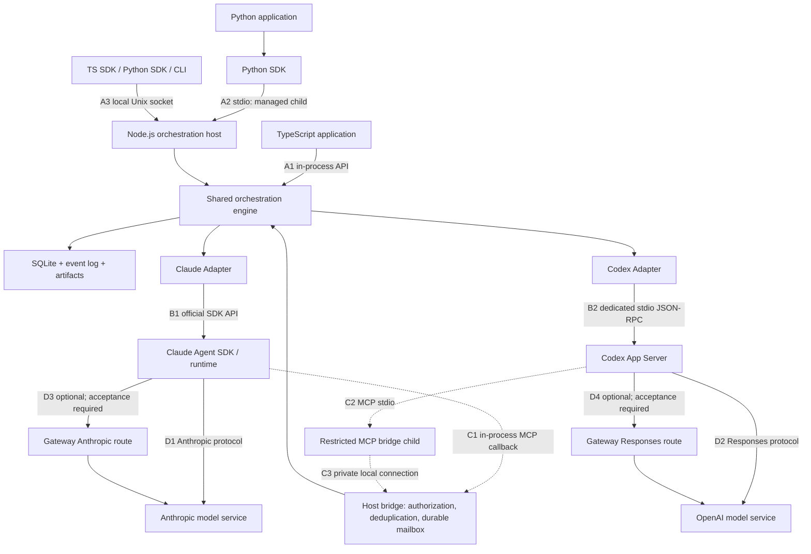

# Multi-agent orchestration SDK usage and detailed wiring

Updated: 2026-09-20. Companion: [design document](./AGENT_ORCHESTRATION_DESIGN.md).

This guide defines the installation, wiring, and usage experience for the complete first-version target. **The foundation and SPEC-0003-A/A2 SDKs, CLI, configuration parser, lifecycle, and execution isolation are implemented and verified with offline fixtures. Current interfaces are defined by [README](./README.md), [SPEC-0001](./docs/specs/0001-foundation.md), [SPEC-0003-A](./docs/specs/0003-a-lifecycle.md), [SPEC-0003-A2](./docs/specs/0003-a2-execution-isolation.md), and source examples. The complete flow below is not yet implemented, and packages are unpublished.** `@agent-orch/*`, `agent-orch`, and `agent_orch` are provisional names. Future APIs, auth/executable settings, and commands below are not current runnable instructions. Sections 11.4–11.5 describe implemented owner attestation and diagnostics. Upstream facts link to sources; real-model acceptance remains pending.

This complements the design with shared configuration, client connection entry points, restricted MCP callbacks, approval-event fields, and CLI arguments. Implementation must codify them together in schema, API reference, and contract tests rather than let each SDK infer its own behavior.

The 2026-09-19 review added routing responsibility, retention/GC, control deadlines, and cost ownership; see design sections 4.5, 5.1, 5.4, 6.1, 9.1, 12.1 and [SPEC-0003](./docs/specs/0003-policy-retention-deadlines.md). A/A2 deadlines, leases, quarantine, and owner attestation are implemented. B/C routing, retention/GC, and accounting remain pending; their proposed parameters cannot enable them. Read examples with these rules:

- Future contextPlan is declared by the application/existing primary session. The host validates authorization, dependencies, versions, and resources rather than infer profitable forks from prose. No silent extra sessions without declared fallback.
- SDK wait timeout, execution/control deadlines, and cleanup budgets are separate. Unconfirmed work stays unknown; never change keys and resend after timeout. Continue incomplete close with the original operationId.
- Proposed retention: events at least 30 days, terminal operation/message details at least 90 days, protected references overriding age, tombstones lasting with the store. Expired details never permit old-key replay; future GC cursor expiry uses consistent snapshots. GC/state.snapshot do not exist yet.
- Future reused sessions bind each dispatch to one cost owner; D pays for reading preceding history. Busy-session waits are bounded rather than indefinite for cache preservation.
- Durable deadlines and owner-attestation sessions.reconcile are available. Automatic upstream history inspection, fork/compact/rotate, state.snapshot, GC, and automatic routing remain unimplemented.

## 1. Choose an integration mode

| Application | Mode | Scheduler owner | Can tasks outlive the application? |
| --- | --- | --- | --- |
| TS/Node backend or desktop main process | Embedded SDK | Your Node process | Not guaranteed; close before exit and explicitly resume after restart |
| Python script, notebook, async backend | Local Python SDK | SDK-spawned Node child | Not guaranteed; closes with the Python owner |
| Multiple clients or work that must outlive client connections | Existing host | Independent local host process | Yes while host/runtime remain alive |

One state directory permits one engine owner. TS/Python sharing tasks should connect to the same host, not independently open the same database in embedded/local modes.

For first integration, use one language, one runtime, and a direct model route. Complete section 12 acceptance before adding the second runtime, multiple clients, or a gateway. This is an integration sequence; both SDKs/adapters remain in first-release scope.

## 2. Overall wiring



Choose either direct or gateway routing; never send one request down both. The engine is the same implementation in embedded/hosted deployments.

### 2.1 Protocol, ownership, and proof for each connection

| ID | Sender → recipient | Transport / content | Established by | Connection acceptance |
| --- | --- | --- | --- | --- |
| A1 | TS SDK → engine | In-process async calls | createOrchestrator | Initialization returns an instance; tasks persist |
| A2 | Python SDK → host | Child stdin/stdout, project JSON-RPC | Orchestrator.local | Version handshake, matching state directory/instanceId |
| A3 | SDK/CLI → host | Unix socket, project JSON-RPC | connect / CLI | Handshake, authorization, event replay |
| B1 | Claude adapter → SDK | query, input stream, native events | Claude adapter | Auditable session ID, tool catalog, real result |
| B2 | Codex adapter → App Server | Separate stdio, Codex JSON-RPC | Codex adapter | Initialize, create/resume thread, receive turn events |
| C1 | Claude tool call → host | SDK in-process MCP server | Claude adapter | Call enters host authorization/message accounting |
| C2 | Codex → MCP bridge | MCP stdio | Managed Codex runtime | Fixed tool discovery and valid call receipts |
| C3 | Bridge → host tool entry | Private Unix socket + session capability credential | Engine creates; bridge connects | Only bound agent identity accesses authorized tools |
| D1/D2 | Runtime → model service | HTTPS streaming protocol | Official runtime | Complete model turn, tool roundtrip, usage |
| D3/D4 | Runtime → gateway | Provider protocol/gateway authentication | Runtime instance configuration | Same complete-turn acceptance through gateway |

A2/B2/C2 are separate pipes and must not share stdout. A3/C3 also have different authority: business clients read authorized tasks; agent bridges access fixed tools, never host shutdown or human approval.

### 2.2 Addresses and ports

| Component | Address source | TCP port? |
| --- | --- | --- |
| Embedded TS engine | None | No |
| Managed Python host | SDK-owned stdin/stdout handles | No |
| Standalone host | transport.socketPath | No; Unix socket |
| Agent callback | Engine-created private socket | No; Unix socket |
| Codex App Server | Adapter-owned stdio | No |
| MCP bridge | Codex-owned stdio | No |
| Direct model / gateway | Runtime HTTPS configuration | Outbound, usually 443 |

No per-agent HTTP ports in v1. The host routes logical IDs, so mailboxes survive pause/runtime exit. Preflight socketPath against the actual OS length limit; deeply nested stateDir paths may be unsuitable.

## 3. Installation and directories

### 3.1 Prerequisites

| Mode | Node.js | Project npm packages | Project Python package | Official runtime |
| --- | --- | --- | --- | --- |
| Embedded TS | Required | SDK + selected adapter | Not required | Prepare selected runtime |
| Local Python | Required | CLI/host + selected adapter | Required | In host environment |
| Connected TS/Python | Host requires Node; TS client also does | Host CLI/adapter; TS client SDK | Python client requires it | In host environment |

Current implementation requires Node.js 22.18+ and Python 3.11+, targeting macOS/Linux. Release support depends on the verified matrix. Python local mode uses Node; it does not require either provider's Python SDK.

Post-publication templates follow. **These project packages are currently unpublished; do not run this as installation acceptance.** Set versions to actual releases, never download unknown same-named packages using placeholders.

```sh
# TypeScript with Claude; use only after selecting an actual published version.
npm install --save-exact "@agent-orch/sdk@${ORCH_VERSION:?Set an actual published version first}" "@agent-orch/adapter-claude@${ORCH_VERSION}"

# Local Python's Node host: use a fixed tool directory, not transient npx downloads.
npm install --prefix "${ORCH_TOOL_DIR:?Set a fixed installation directory first}" --save-exact "@agent-orch/cli@${ORCH_VERSION:?Set an actual published version first}" "@agent-orch/adapter-claude@${ORCH_VERSION}"

# Python client.
python3 -m venv .venv
.venv/bin/python -m pip install "agent-orch==${ORCH_VERSION:?Set an actual published version first}"
```

For Codex, substitute @agent-orch/adapter-codex; install both only if using both. The CLI host must resolve its adapters from its tool installation, not depend on a coincidentally correct cwd or another project's node_modules.

Adapters declare compatible upstream SDK dependencies. Preflight the Codex executable path/version explicitly. Prepare Claude SDK/runtime packaging for the selected version; any CLI on PATH is not automatically a verified runtime.

### 3.2 Separate three directory classes

```text
workspace/                    Target project within the agent's permitted access
tools/                        Fixed SDK/CLI/adapter installation
state/                        Private engine state; never the agent workspace
  store.sqlite                Tasks, messages, controls, events, usage
  artifacts/                  Logs, results, evidence, content digests
  runtime/                    Instance runtime configuration/session references
  run/                        Local sockets and ownership records
  logs/                       Redacted host diagnostics
```

Use absolute paths. Keep state, credentials, and tool installation outside the business workspace and agent access. Do not grant model file access to host configuration/capability credentials. A single-OS-user boundary is not strong isolation against arbitrary malicious local code.

Do not delete state as routine troubleshooting. A different stateDir creates separate history; a changed workspace requires verifying the session's code baseline.

## 4. One configuration connects the components

### 4.1 Proposed orchestrator configuration

This proposed orchestrator.json is **project configuration, not native Claude/Codex configuration**. Adapters map it to supported upstream options. Replace /absolute/... and angle-bracket placeholders only when integrating implemented support.

```json
{
  "configVersion": 1,
  "workspace": "/absolute/path/to/project",
  "stateDir": "/absolute/path/to/private-state",
  "transport": {
    "mode": "unix",
    "socketPath": "/absolute/path/to/private-state/run/host.sock"
  },
  "providers": {
    "claude": {
      "adapter": "@agent-orch/adapter-claude",
      "model": "<CLAUDE_MODEL_ID>",
      "auth": {
        "mode": "env",
        "apiKeyEnv": "ANTHROPIC_API_KEY"
      },
      "permissionProfile": "read-only"
    },
    "codex": {
      "adapter": "@agent-orch/adapter-codex",
      "executable": "/absolute/path/to/codex",
      "model": "<CODEX_MODEL_ID>",
      "auth": {
        "mode": "runtime"
      },
      "permissionProfile": "read-only"
    }
  },
  "limits": {
    "maxActiveSessions": 2,
    "maxTurnsPerTask": 20
  },
  "shutdown": {
    "mode": "drain",
    "timeoutMs": 30000
  },
  "verificationRules": []
}
```

Remove unused providers for single-runtime use. Configuring two does not invoke both for a task; TaskSpec.runtime.provider selects one.

| Field | Owner | Rules |
| --- | --- | --- |
| workspace / stateDir | Host owner | Absolute paths, access, ownership, single-instance lock |
| transport | Host owner | Standalone host; --stdio overrides transport and opens no business socket |
| providers.*.adapter | Installer | Load only installed/allowed modules, never arbitrary model-specified modules |
| providers.*.model | Application developer | Exact model ID; no invented window/pricing for unknown models |
| providers.*.auth | Host owner | Credential source only, never the secret itself |
| permissionProfile | Application developer | Project policy name mapped to actual enforcement, not just a prompt |
| limits | Application developer | Central engine enforcement, not separate per-SDK concurrency accounting |
| verificationRules | Host owner | Preregistered/versioned commands; no ad hoc agent commands |

Read-only mechanisms differ by provider. Unverified permission mapping must fail initialization, not fall back to full access. Code-writing support requires an explicitly selected, verified write policy and allowed directories; it is outside the current minimal read-only adapters.

JSON does not expand environment variables, ~, or placeholders automatically. Use absolute paths. Only dedicated credential fields such as apiKeyEnv read environment values. Explicit stdio may override transport; otherwise conflicting duplicate initialization fields fail instead of silently changing workspace/stateDir.

### 4.2 Where credentials belong

| Material | Read by | Never place in |
| --- | --- | --- |
| Anthropic API key | Host-launched Claude runtime environment | TaskSpec, messages, system prompts, events |
| Codex account session | Managed runtime's supported authentication storage | Python messages or custom gateway headers |
| Custom model-provider key | Runtime's designated environment variable | Plain CLI arguments or Git JSON/TOML |
| Agent callback capability | Restricted bridge / host tool entry | Model tool parameters or ordinary business-client config |

auth.mode=runtime means supported runtime authentication/storage, not automatic inheritance of desktop login into an isolated environment. Report login requirements and use supported user authentication; never silently copy the entire user configuration directory.

The target local business socket uses file permissions/OS peer identity within a trusted same-user boundary for policy-authorized tasks/approvals. It does not strongly isolate arbitrary apps of the same user. Shutdown additionally needs owner authority, normally held by the starter/managed administration path. Agents use separate C3 credentials and cannot promote themselves through tool parameters.

## 5. Embedded TypeScript wiring

```text
Your Node.js process
  ├─ Application logic
  ├─ TypeScript SDK → engine → SQLite / event log
  ├─ Claude adapter → official SDK → managed runtime
  └─ Codex adapter → separate App Server child
```

Install SDK/adapter, read configuration, construct the adapter/engine explicitly, create tasks, consume events/approvals, await accepted results, and close owned resources. SDKs do not manage your web server's signals/exit.

This draft business function illustrates human acceptance. Section 11.2 owns outer configuration/construction/close. approvalUi.review is a caller-provided async UI that presents target/evidence, returns approve/deny/defer, and honors cancellation. It stays client-side, never serialized. Terminal users may choose proposed CLI attach in section 7.

```ts
import { readFile } from "node:fs/promises";
import { createOrchestrator, type ApprovalRequest } from "@agent-orch/sdk";
import { createClaudeAdapter } from "@agent-orch/adapter-claude";

type ApprovalUI = {
  review(request: ApprovalRequest, options: { signal: AbortSignal }): Promise<"approve" | "deny" | "defer">;
};

export async function runDemo(
  orch: Awaited<ReturnType<typeof createOrchestrator>>,
  model: string,
  approvalUi: ApprovalUI,
) {
  const task = await orch.tasks.create({
    goal: "Inspect the project root read-only, list key files and their roles, and provide evidence for human acceptance.",
    runtime: { provider: "claude", model },
    acceptance: { mode: "human", criteria: ["Matches the actual files", "No files modified"] },
  }, { idempotencyKey: "read-only-demo-001" });

  // Initial task subscription replays retained events, including early approval requests.
  for await (const event of orch.events({ taskId: task.id })) {
    console.log(event.type);
    if (event.type === "approval.requested") {
      const request = await orch.approvals.get(event.data.approvalId);
      if (request.status !== "pending" || request.revision !== event.data.revision) continue;
      const remainingMs = Math.min(60_000, Date.parse(request.expiresAt) - Date.now());
      if (remainingMs <= 0) continue;
      const signal = AbortSignal.timeout(remainingMs);
      let choice: "approve" | "deny" | "defer";
      try {
        choice = await approvalUi.review(request, { signal });
      } catch (error) {
        if (!signal.aborted) throw error;
        return await orch.tasks.get(task.id); // Return pending state for caller recovery.
      }
      if (choice === "defer") return await orch.tasks.get(task.id);
      try {
        await orch.approvals.decide(request.approvalId, {
          choice, expectedRevision: request.revision,
        }, {}); // SDK generates and retains this decision's key across transport retries.
      } catch (error) {
        if ((error as { code?: string }).code !== "STALE_TARGET") throw error;
        // Another client decided/expired the request while UI was open; consume current state.
      }
    }
    if (["task.paused", "task.blocked"].includes(event.type)) {
      const snapshot = await orch.tasks.get(task.id);
      if (["paused", "blocked"].includes(snapshot.status)) {
        console.log("Task needs caller action", snapshot.status, snapshot.reason);
        return snapshot; // Check current state before acting on history; outer scope closes.
      }
    }
    if (["task.completed", "task.failed", "task.cancelled"].includes(event.type)) break;
  }

  const result = await task.wait();
  console.log(result.status, result.artifactRefs);
  return result; // Check status; a returned value is not automatically success.
}
```

A read-only goal does not replace permissionProfile. Fixed keys allow retry recovery; genuinely new work needs a new business key. Paused/blocked paths return state for caller handling, so return may be TaskSnapshot or terminal TaskResult; see section 10.

## 6. Local Python wiring

```text
Python process
  └─ agent_orch.Orchestrator.local
       ├─ stdin  → Node host receives project JSON-RPC
       ├─ stdout ← Node host responses/events
       └─ stderr ← Redacted host logs, consumed separately

Node host
  └─ Shared orchestration engine → shared Claude/Codex adapters
```

Python must spawn with an argument array, not a shell string, and continuously drain stdout/stderr even when callers pause event consumption. Provide credentials through an explicit host environment policy; never log environment values.

The proposed local API accepts structured workspace/state_dir settings or engine_command with --config. With file configuration, verify workspace/stateDir against the handshake summary instead of supplying conflicting path overrides.

This matches the TS example. Known event envelope/data fields use typed snake_case; arbitrary artifact keys are untouched. approval_ui.review is a cancellable caller-provided async coroutine returning approve/deny/defer. Do not block with input() or disguise an uncancellable background input thread as async UI.

```python
import asyncio
import json
from datetime import datetime, timezone
from pathlib import Path
from agent_orch import Orchestrator, TaskSpec, RuntimeSpec, AcceptanceSpec


async def run_demo(orch, model: str, approval_ui):
    task = await orch.tasks.create(
        TaskSpec(
            goal="Inspect the project root read-only, list key files and their roles, and provide evidence for human acceptance.",
            runtime=RuntimeSpec(provider="claude", model=model),
            acceptance=AcceptanceSpec(
                mode="human", criteria=["Matches the actual files", "No files modified"]
            ),
        ),
        idempotency_key="read-only-demo-001",
    )
    async for event in orch.events(task_id=task.id):
        print(event.type)
        if event.type == "approval.requested":
            request = await orch.approvals.get(event.data.approval_id)
            if request.status != "pending" or request.revision != event.data.revision:
                continue
            expires = datetime.fromisoformat(request.expires_at.replace("Z", "+00:00"))
            remaining = min(60.0, (expires - datetime.now(timezone.utc)).total_seconds())
            if remaining <= 0:
                continue
            try:
                choice = await asyncio.wait_for(approval_ui.review(request), timeout=remaining)
            except TimeoutError:
                return await orch.tasks.get(task.id)
            if choice == "defer":
                return await orch.tasks.get(task.id)
            try:
                await orch.approvals.decide(
                    request.approval_id,
                    {"choice": choice, "expected_revision": request.revision},
                )
            except Exception as error:
                if getattr(error, "code", None) != "STALE_TARGET":
                    raise
        if event.type in {"task.paused", "task.blocked"}:
            snapshot = await orch.tasks.get(task.id)
            if snapshot.status in {"paused", "blocked"}:
                print("Task needs caller action", snapshot.status, snapshot.reason)
                return snapshot
        if event.type in {"task.completed", "task.failed", "task.cancelled"}:
            break
    result = await task.wait()
    print(result.status, result.artifact_refs)
    return result
```

Scripts call asyncio.run(main(...)) using section 11.2's wrapper so shutdown exceptions are handled first. Notebooks/services with a running loop await the wrapper directly; never nest asyncio.run. Coroutine cancellation does not cancel submitted tasks.

## 7. Standalone host: TS, Python, and CLI share tasks

Use this when tasks must outlive client connections. Set ORCH_ENGINE_BIN, ORCH_CONFIG, ORCH_SOCKET, and ORCH_TASK_FILE to verified absolute paths; prepare the selected authentication source before host startup. Proposed --task JSON:

```json
{
  "goal": "Inspect the project read-only and provide key files with evidence",
  "runtime": { "provider": "claude", "model": "<CLAUDE_MODEL_ID>" },
  "acceptance": { "mode": "human", "criteria": ["List matches actual files", "No files modified"] }
}
```

The following CLI arguments describe the proposed project contract:

```sh
# Before first startup: offline dependency/configuration checks, no model turn.
"$ORCH_ENGINE_BIN" doctor --config "$ORCH_CONFIG"

# Terminal A: keep the foreground host alive; use real absolute paths.
"$ORCH_ENGINE_BIN" host --config "$ORCH_CONFIG"

# Terminal B: read-only preflight, no model calls.
"$ORCH_ENGINE_BIN" doctor --socket "$ORCH_SOCKET"

# Submit the task file; receipt means persisted, not completed.
"$ORCH_ENGINE_BIN" submit --socket "$ORCH_SOCKET" --task "$ORCH_TASK_FILE" --idempotency-key "issue-123-attempt-1"

# ORCH_TASK_ID must come from the submission receipt.
"$ORCH_ENGINE_BIN" status --socket "$ORCH_SOCKET" --task "$ORCH_TASK_ID"
"$ORCH_ENGINE_BIN" attach --socket "$ORCH_SOCKET" --task "$ORCH_TASK_ID"
```

Proposed doctor --config checks offline before startup; doctor --socket queries a running host. Neither calls models. host --stdio and Unix-host modes are exclusive. Python normally starts stdio; manual launch waits for protocol frames, not interactive commands. attach consumes events and presents approvals only with an interactive terminal/authority; disconnect does not cancel tasks.

Proposed TypeScript connection:

```ts
import { connectOrchestrator } from "@agent-orch/sdk";

const orch = await connectOrchestrator({ socketPath: socketPath });
try {
  const snapshot = await orch.tasks.get(taskId);
  console.log(snapshot.status);
} finally {
  await orch.close(); // Disconnect this client only.
}
```

Proposed Python connection:

```python
async with Orchestrator.connect(socket_path=socket_path) as orch:
    snapshot = await orch.tasks.get(task_id)
    print(snapshot.status)
```

Connected clients do not set provider keys, workspace, or stateDir; the host owns them. Check storeId/instanceId/permissions/protocol in handshake to avoid a different task database. V1 connections are same-machine only; replacing a socket path with a URL does not enable remote deployment.

## 8. Runtime and agent callback wiring

### 8.1 Claude path

In the full design, the adapter performs these steps while applications select providers and use the public SDK:

1. Bind logical ownerScope/session/generation/tool authorization.
2. Wrap fixed tools with official tool()/createSdkMcpServer() and inject through query mcpServers.
3. Bind caller identity in closures; do not trust model-provided fromSessionId. Parameters supply only target/business payload.
4. Open managed streaming input, persist the returned session ID, and append batches only at safe boundaries.
5. Route callbacks through shared host authorization/idempotency/transaction persistence and return durable receipts, not temporary peer-process messages.
6. Record native events through the adapter; permission requests use approvals, never managing-agent self-approval.

Claude's in-process MCP server is an object, not an executable for Codex command. Tool names include the MCP prefix. allowedTools is preapproval, not an authorization/tool-exposure boundary. [Claude custom tools](https://code.claude.com/docs/en/agent-sdk/custom-tools)

Preserve startup dependencies when wiring environments. TS SDK options.env uses replacement semantics; deliberately retain PATH, needed system variables, and selected credentials before adding provider settings. Do not supply only ANTHROPIC_BASE_URL or pass every provider's secrets to every runtime. [SDK configuration](https://code.claude.com/docs/en/agent-sdk/configuration)

### 8.2 Codex path

Control requests and tool callbacks use separate connections:

```mermaid
sequenceDiagram
  participant E as Engine / Codex adapter
  participant A as Codex App Server
  participant B as MCP bridge child
  participant T as Restricted host tool entry
  E->>A: Dedicated stdio: initialize → initialized
  E->>A: thread/start or thread/resume with MCP binding
  A->>B: Start stdio MCP server; discover fixed tools
  B->>T: Private socket; verify session capability
  A-->>E: Thread initialization and actual tool capabilities
  E->>A: turn/start
  A->>B: MCP tools/call：work_send
  B->>T: Tool name, request ID, bound identity, business parameters
  T-->>B: Durable message receipt
  B-->>A: MCP tool result
  A-->>E: Native item/turn/usage events
```

The proposed design isolates App Server workers/bridge bindings for different tool identities/permissions, preventing shared MCP configuration from assigning one identity to multiple logical sessions. Future process reuse needs verified per-thread identity injection/detection; model-supplied session IDs do not identify callers.

Native Codex MCP stdio example below is **written only to adapter-managed instance configuration or supported explicit runtime overrides**. Do not modify user-global ~/.codex/config.toml. Engine-generated command/capability-file/socket values never come from model parameters.

```toml
[mcp_servers.orchestration]
command = "/absolute/path/to/agent-orch"
args = ["tool-bridge", "--stdio"]
env = { ORCH_BRIDGE_SOCKET = "/absolute/path/to/private-state/run/bridge.sock", ORCH_BRIDGE_CREDENTIAL_FILE = "/absolute/path/to/private-state/runtime/worker-1/bridge-capability" }
required = true
enabled_tools = ["work_delegate", "work_send", "work_read", "work_control"]
```

tool-bridge is a planned project command. command/args/env/required/enabled_tools are Codex MCP settings. Validate against the locked version; a file existing does not prove MCP loaded. [Codex MCP](https://developers.openai.com/codex/mcp)

The bridge translates MCP and makes restricted host calls; it has no SQLite write permission or independent scheduler. The host binds actor/generation/grants to credentials and rejects stale calls after generation changes, worker closure, or revocation. Enforcement depends on runtime/file boundaries; a token readable by arbitrary same-user shell is not a strong sandbox.

Keep the tool catalog stable. required=true aims to stop execution when orchestration tools fail to load. Inspect actual discovery and make a real tool call into the correct ledger. A no-native-subagent prompt is insufficient; restrict native delegation/shell spawn under the main design.

### 8.3 Four tools, one engine

| Tool | Input | Host action | Immediate receipt |
| --- | --- | --- | --- |
| work_delegate | Bounded task, dependencies, target/session constraints | Authorize/budget, create and queue | taskId + persisted |
| work_send | Logical target, generation, result, artifact references | Atomic messages + outbox | messageId + persisted |
| work_read | Task/session/artifact reference | One authorized snapshot read | Current state, no model call |
| work_control | Generation/turn and pause/resume/compact/rotate/stop | Control operation through session lock | operationId; query outcome later |

Public SDKs and MCP tools share engine handlers, with narrower tool authority. Tool text/booleans cannot establish human approval.

## 9. Direct model access and optional gateways

### 9.1 Configure three separate connection types

| Connection | Example | Scope |
| --- | --- | --- |
| SDK → local host | Unix socket / stdio | Orchestration tasks/events, not model HTTP |
| Runtime → MCP bridge | MCP stdio | Tools, not a model API proxy |
| Runtime → model/gateway | Anthropic / Responses HTTPS endpoint | Model stream, tool protocol, usage, cache settings |

HTTP_PROXY/HTTPS_PROXY network proxies differ from model API base URLs. Never put a host socket, MCP URL, or ChatGPT webpage into model base_url.

### 9.2 Claude model connection

Direct mode uses selected supported authentication/default endpoint. Gateways map ANTHROPIC_BASE_URL and required authentication into the runtime environment. Do not pass custom orchestrator JSON directly into official query options.

A configurable base URL does not prove full gateway compatibility. Verify streams, tool calls/results, errors, cancellation, usage, and cache fields. Check tool search separately on third-party endpoints; do not force unsupported tool_reference behavior. [Claude environment variables](https://code.claude.com/docs/en/env-vars)

### 9.3 Codex model connection

Configure official account authentication separately from custom API providers. auth.mode=runtime requires actual managed-runtime login verification; custom providers use their own credentials. A ChatGPT subscription is not automatically valid for arbitrary gateways. [Codex authentication](https://developers.openai.com/codex/auth)

The native configuration example uses placeholder address/provider/model. Place it in the managed instance's effective configuration layer, not only a project file assumed to be active.

```toml
model = "<VERIFIED_MODEL_ID>"
model_provider = "orchestration_gateway"

[model_providers.orchestration_gateway]
name = "Project Responses Gateway"
base_url = "https://gateway.example.invalid/v1"
env_key = "ORCH_GATEWAY_API_KEY"
wire_api = "responses"
```

env_key names an environment variable, not a secret. The gateway must support Responses and the selected model. Verify actual base_url/path behavior to avoid duplicate /v1. The design reference notes that project-level .codex/config.toml may ignore provider-routing keys; use a verified instance layer or supported override, without editing user-global configuration. For only the built-in OpenAI endpoint, check the supported openai_base_url route rather than requiring a custom provider. [Codex advanced configuration](https://developers.openai.com/codex/config-advanced)

### 9.4 Gateway acceptance

1. Verify authentication, model mapping, and actual protocol, beyond HTTP 200/401.
2. Complete one actual request through final output/terminal without hidden duplicate-billing retries.
3. Complete a tool call, result return, and subsequent model response.
4. Route approval, cancellation, and errors to the correct task; disconnection is not completion.
5. Compare raw usage with direct mode; missing cache read/write fields remain unknown.
6. Preserve each provider protocol's required fields; cache metrics do not imply cross-provider cache sharing.

These real-call checks consume model allowance and require a separate budget. SDK startup does not automatically spend on probing or cache warming.

## 10. Messaging, approval, and control after task creation

### 10.1 Reading receipts

| State/result | Supported conclusion |
| --- | --- |
| persisted | Engine saved task/message/operation; recover by ID |
| dispatching | Delivery underway or upstream acceptance unconfirmed |
| runtime_accepted | Attributable native acceptance evidence exists |
| Message completed | Input batch handled, not whole-task acceptance |
| task.completed | Dependencies, deliverables, checks, and required approvals satisfied |
| outcome_unknown | Execution outcome unconfirmed; no blind resend |

### 10.2 A sends a message to B

Read B's logical session snapshot for sessionId/generation before sending necessary content. Native provider session/thread IDs are not ordinary cross-agent business addresses.

```ts
const target = await orch.sessions.get(bSessionId);
const receipt = await orch.messages.send({
  taskId,
  toSessionId: target.id,
  expectedGeneration: target.generation,
  kind: "finding",
  summary: "Reproduction details are ready; see the referenced artifact.",
  artifactRefs: [artifactId],
}, { idempotencyKey: "finding-issue-123-v1" });
console.log(receipt.messageId, receipt.status);
```

Authorized caller identity determines fromSessionId/actor. Ordinary mail queues while B generates, starts a turn when idle, or resumes the original session after process exit. A/B can run independently; sending does not automatically interrupt B.

### 10.3 Human approval and task acceptance

The host emits approval.requested. Target data includes approvalId, purpose, revision, target, summary, evidenceRefs, and expiresAt, mapped to snake_case in Python. runtime_permission and task_acceptance are distinct purposes.

Durable stable events include task.completed/failed/cancelled/paused/blocked. Initial taskId subscriptions replay retained events. Read current state using event versions; do not reprompt/reapprove decided, expired, or superseded historical requests. The first example run sees new-task events; reopening via the same key must apply replay checks.

UI shows full target/evidence, collects a human decision, then calls approvals.decide. Check pending through approvals.get first and submit expectedRevision. SDK retains a key per decision; different clients/decisions must not share one hard-coded key. On STALE_TARGET, read current state rather than applying to a new turn. Managing agents lack this authority.

Caller UI provides actual human interaction, may independently consume events, and cancels displayed requests on expiry/task end while respecting deadlines. Event subscription calls no model. Web backends hold SDKs; browsers submit authenticated business decisions, never receive sockets/model keys.

Treat paused/blocked after refusal as requiring action, not normal ongoing work. Show the reason, explicitly resume eligible work, or tasks.cancel and await a reconciled terminal. Event-wait timeout stops waiting only.

### 10.4 Automatic acceptance (planned)

Register rules in host configuration and reference fixed versions from TaskSpec. Example:

```json
{
  "verificationRules": [
    {
      "id": "project-tests",
      "version": "1",
      "argv": ["/absolute/path/to/npm", "test", "--", "--runInBand"],
      "cwdRelative": ".",
      "timeoutMs": 120000,
      "permissionProfile": "workspace-write",
      "success": { "exitCode": 0 }
    }
  ]
}
```

"argv" must be an existing authorized command for the target project; --runInBand is only illustrative, not universal. Use acceptance: { mode: "checks", ruleRefs: [{ id: "project-tests", version: "1" }] }. Run within configured cwd/permissions and bind results to artifact versions. Automatic acceptance is not automatic approval of extra runtime privileges. This mode remains unimplemented.

### 10.5 Pause, resume, and unknown outcomes

```ts
const before = await orch.sessions.get(bSessionId);
const pause = await orch.sessions.control({
  sessionId: before.id,
  expectedGeneration: before.generation,
  expectedDispatchId: before.activeDispatchId,
  expectedRevision: before.revision,
  expectedState: before.status,
}, { action: "pause", mode: "drain" }, { idempotencyKey: "pause-B-001" });

const result = await pause.wait({ timeoutMs: 60_000 });
console.log(result.status); // outcome_unknown is not paused.
```

Drain is the default soft pause, waiting for B's turn. Interrupt requests cancellation but still needs terminal/side-effect checks. Reread the snapshot before action=resume using its current revision; apply task-level resume semantics if the task is paused too. Future compact/rotate also return operations, not immediate completion.

On lost receipts, operations.lookup uses original method/scope/key. Save SDK-generated keys exposed in errors. Never switch keys to repeat possibly successful file/external actions.

## 11. Startup, shutdown, and recovery SOP

### 11.1 Startup order

1. Check dependencies, versions, absolute paths, credential sources, and adapter resolution.
2. Select one engine owner; inspect stateDir lock and old instance identity.
3. Initialize database/schema and reconcile unfinished operations without automatic resend.
4. Handshake the SDK protocol; keep stdout protocol-only and diagnostics separate.
5. Establish selected runtime and, when implemented, fixed tool bridge; verify discovery/identity.
6. After approval consumers are ready, explicitly submit new work or resume selected old tasks.

### 11.2 Normal shutdown

| Caller | Action | Expected result |
| --- | --- | --- |
| Embedded TS owner | orch.close({ mode: "drain", timeoutMs }) | Stop dispatch, await turns, persist, reclaim owned resources |
| Python local owner | async-with exit or explicit close | Same drain, then close its spawned Node host |
| Connected client | orch.close() / context exit | Disconnect only; standalone host continues |
| Host administrator | host.shutdown | Close host; ordinary clients do not automatically have authority |

Drain timeout returns SHUTDOWN_INCOMPLETE, not proof of stop. Retain exception handle/operationId/pipes and use shutdown.continue to wait longer or explicitly interrupt. Owner SDK close wraps this without requiring hand-built protocol frames.

Use client.close({operationId,mode,timeoutMs}) / await client.close(operation_id=...,mode=...,timeout=...). An operationId maps to shutdown.continue; absent ID starts shutdown. SHUTDOWN_INCOMPLETE retains a valid client/operationId, which the SDK must not destroy early.

Draft TS outer wrapper, in the same module as section 5:

```ts
type Orchestrator = Awaited<ReturnType<typeof createOrchestrator>>;
type ShutdownUI = {
  choose(error: { operationId: string }): Promise<"drain" | "interrupt">;
};

async function closeOwner(orch: Orchestrator, shutdownUi: ShutdownUI) {
  let client = orch;
  let operationId: string | undefined;
  let mode: "drain" | "interrupt" = "drain";
  while (true) {
    try {
      await client.close({ operationId, mode, timeoutMs: 30_000 });
      return;
    } catch (error) {
      if (!error || typeof error !== "object" ||
          !("code" in error) || error.code !== "SHUTDOWN_INCOMPLETE") throw error;
      const pending = error as { code: string; operationId: string; client: Orchestrator };
      client = pending.client;
      operationId = pending.operationId;
      mode = await shutdownUi.choose(pending); // Async choice or preauthorized caller policy.
    }
  }
}

async function runWithShutdownHandling(
  configFile: string, approvalUi: ApprovalUI, shutdownUi: ShutdownUI,
) {
  const config = JSON.parse(await readFile(configFile, "utf8"));
  // This config enables only Claude; substitute Codex under section 8 when needed.
  const orch = await createOrchestrator({
    ...config,
    adapters: [createClaudeAdapter(config.providers.claude)],
  });
  let result!: Awaited<ReturnType<typeof runDemo>>;
  let businessFailed = false;
  let businessError: unknown;
  try {
    result = await runDemo(orch, config.providers.claude.model, approvalUi);
  } catch (error) {
    businessFailed = true;
    businessError = error;
  }
  try {
    await closeOwner(orch, shutdownUi);
  } catch (closeError) {
    if (businessFailed) {
      throw new AggregateError([businessError, closeError], "Business work and shutdown both failed");
    }
    throw closeError;
  }
  if (businessFailed) throw businessError;
  return result;
}
```

Draft Python wrapper, keeping recovery inside the live event loop:

```python
from agent_orch import ShutdownIncomplete


async def main(config_file, engine_executable, approval_ui, shutdown_ui):
    config_path = Path(config_file).resolve()
    config = json.loads(config_path.read_text(encoding="utf-8"))
    business_error = None
    result = None
    try:
        try:
            # engine_executable is this project's CLI absolute path, not the codex executable.
            async with Orchestrator.local(
                engine_command=[engine_executable, "host", "--stdio", "--config", str(config_path)],
                close_timeout=30.0,
            ) as orch:
                try:
                    result = await run_demo(orch, config["providers"]["claude"]["model"], approval_ui)
                except BaseException as error:
                    business_error = error  # Preserve CancelledError too; rethrow after close.
        except ShutdownIncomplete as error:
            pending = error
            while True:
                mode = await shutdown_ui.choose(pending)  # Async drain/interrupt choice.
                try:
                    await pending.client.close(
                        operation_id=pending.operation_id, mode=mode, timeout=30.0
                    )
                    break
                except ShutdownIncomplete as next_error:
                    pending = next_error
    except BaseException as close_error:
        if business_error is not None:
            raise business_error from close_error  # Preserve both errors and cancellation semantics.
        raise
    if business_error is not None:
        raise business_error
    return result
```

Both wrappers preserve business outcome separately from shutdown. After closing, return the original result or rethrow the original error/cancellation; shutdown timeout must not swallow it. If both fail, preserve both. Task success still depends on status/acceptance; query saved taskId for updates. Callers own UI availability. Explicit human drain may continue waiting; ordinary errors, repeated cleanup cancellation, or crashes follow recovery below rather than infinite automatic interrupt retries.

Handle Python close exceptions before event-loop exit. On caller crash/EOF, the host can only make a bounded attempt to stop owned processes and persist unknown state; it cannot promise to reverse external effects. Do not delete socket/stateDir before stopping processes.

### 11.3 Restart recovery

Reuse original stateDir, correct workspace baseline, and compatible runtime configuration. Check taskId, logical/native session IDs, and unfinished operations; select tasks explicitly for resume.

If only the client disconnected and the host lives, reconnect/replay afterCursor without a second host. Persist cursor with storeId. For current CURSOR_EXPIRED, verify identity/cursor and read task/session/approval snapshots without silently skipping state gaps. Unified state.snapshot and post-GC resume are pending B work.

If side-effect execution is unprovable, keep outcome_unknown and stop ordinary delivery. Restoring conversation is neither cache recovery nor undo/replay of shell actions.

### 11.4 Implemented owner attestation

Current A/A2 accounts for execution resources separately from business reconciliation. Confirmed execution/cleanup releases the lease while business unknown remains quarantined. Two possibly running unknowns fill two execution slots; larger quarantine capacity cannot bypass concurrency. [A2 evidence](./docs/tdd/0003-a2-wiring.md) covers offline TS/Python and actual Node stdio/Unix hosts, not real models.

Host defaults are acceptanceMs=30000, turnMs=1800000, drainMs=300000, interruptMs=30000, reconcileMs=60000, each integer 1..86400000 ms. Embedded TS passes createOrchestrator configuration; CLI/Python use [README host JSON](./README.md#standalone-host-and-cross-language-integration). Python passes engine_command=[node, cli, "host", "--stdio", "--config", config_file], not local(timeouts=...). Convert LifecycleTimeouts snake_case values with agent_orch.types.to_wire. SDK wait does not renew deadlines.

Total budget starts at dispatch and includes initialization/acceptance; acknowledgments/output do not renew it. Use the shorter host/explicit-provider cap; longer provider caps cannot extend host time. CLI requestTimeoutMs/turnTimeoutMs accept integer 1..3600000 ms. Cleanup fields are Claude cleanupTimeoutMs and Codex closeTimeoutMs with the same range; crossed names fail. No implicit 300-second cap remains when unspecified. Upgrades/config changes do not renew old deadlines.

Timeout retains dispatch/control/related messages as outcome_unknown and Task blocked. Potentially executing unknown work keeps its slot. Late matched terminal/cleanup can release resources without business reconciliation. sessions.reconcile records an owner declaration after actual history/resource/side-effect investigation; it does not perform that investigation. Only embedded TS or managed-stdio Python owners qualify; ordinary sockets return UNAUTHORIZED. SDKs require initialize.capabilities.lifecycle={version:1,reconcile:"owner-attestation",durableDeadlines:true} before send, otherwise UNSUPPORTED_CAPABILITY.

Evidence fields below map camelCase to snake_case in Python:

| Field | Value |
| --- | --- |
| source / summary | "owner_attestation" / human investigation summary |
| localResources / remoteExecution | Each "stopped" or "unknown" |
| sideEffects | "resolved" or "unknown" |
| outcome | "not_executed", "completed", "failed", "interrupted", or "unknown" |
| result | Required for completed: reviewed complete string, genuinely empty allowed, maximum 524288 characters; still subject to human acceptance |

These functions accept **an existing owner SDK instance, task ID, reviewed human evidence, and durable business key**. They never infer stopped/resolved from timeout. They illustrate a first reconciliation: read an exact target, submit it, and return current state. Applications requiring recovery must save the complete target/evidence/key before the first RPC. After failure, do not rerun a helper that reads a new target; use the saved-parameter continuation below. The creating application still owns section 11.2 shutdown.

```ts
import type { Orchestrator, ReconcileEvidence } from './packages/sdk-typescript/src/index.ts';

export async function reconcileReviewedTask(
  orch: Orchestrator,
  taskId: string,
  evidence: ReconcileEvidence,
  idempotencyKey: string,
) {
  const task = await orch.tasks.get(taskId);
  const session = await orch.sessions.get(task.sessionId);
  if (task.status !== 'blocked' || session.status !== 'outcome_unknown' || !session.activeDispatchId) {
    throw new Error('Task is not awaiting reconciliation');
  }
  const operation = await orch.sessions.reconcile({
    sessionId: session.id,
    expectedGeneration: session.generation,
    expectedRevision: session.revision,
    expectedDispatchId: session.activeDispatchId,
    expectedState: session.status,
  }, evidence, { idempotencyKey });
  const outcome = await operation.wait({ timeoutMs: 30_000 });
  return { operation: outcome, task: await orch.tasks.get(taskId) };
}
```

```python
from agent_orch import Orchestrator, ReconcileEvidence


async def reconcile_reviewed_task(
    orch: Orchestrator, task_id: str, evidence: ReconcileEvidence, idempotency_key: str,
):
    task = await orch.tasks.get(task_id)
    session = await orch.sessions.get(task.session_id)
    if (task.status != "blocked" or session.status != "outcome_unknown"
            or not session.active_dispatch_id):
        raise ValueError("Task is not awaiting reconciliation")
    operation = await orch.sessions.reconcile({
        "session_id": session.id,
        "expected_generation": session.generation,
        "expected_revision": session.revision,
        "expected_dispatch_id": session.active_dispatch_id,
        "expected_state": session.status,
    }, evidence, idempotency_key=idempotency_key)
    outcome = await operation.wait(timeout=30)
    return {"operation": outcome, "task": await orch.tasks.get(task_id)}
```

Operation completed confirms both the reconciliation record and any required adapter-record cleanup. Inspect result.executionReleased, result.resolved, and current task separately. Both resources stopped with no active handles/conflicts can yield executionReleased=true,resolved=false when business fields remain unknown: release only A, retain Q/blocked/outcome_unknown/activeDispatchId, and forbid resume. Python operation.result is raw JSON: receipt.result["executionReleased"] and ["resolved"], not execution_released. Active execution observation or an observed process returns RUNTIME_STILL_ACTIVE. R04 permits only the narrow owner path for an exact record whose observation ended, whose spawn callback is sealed, and for which no process was ever observed. Contradictory evidence returns EVIDENCE_CONFLICT; changed targets return STALE_TARGET. On a lost receipt, operations.lookup uses method=sessions.reconcile, scope=sessionId, and the original key. Preserve original target/evidence; do not put a newly read target under the old key or blindly switch keys.

R04 adds two result fields. `unobservedResourcesReconciled` is true only after unobserved resource records are retired and durably acknowledged; it is false when no such records exist or cleanup remains pending. Optional `resourceCleanup={status:"pending"|"completed",ownerInstanceId}` exists only when this cleanup is required. Python reads `receipt.result["unobservedResourcesReconciled"]` and `receipt.result.get("resourceCleanup")`; nested ownerInstanceId remains camelCase.

RESOURCE_CLEANUP_INCOMPLETE means **the declaration committed but cleanup is unconfirmed**. It carries operationId and auditCommitted=true (Python: `error.operation_id` and `error.data["auditCommitted"]`); earlier resource/business decisions are not rolled back. This host pauses new dispatches with RESOURCE_CLEANUP_PENDING. First inspect the original receipt with get/lookup, then let the owner explicitly decide whether to continue. `operations.get/lookup` and `OperationHandle.wait()` are read-only. persisted is not terminal, so wait alone polls until local timeout without invoking the finalizer.

The following snippets explicitly continue on **the same still-running owner**. originalTarget/originalEvidence/originalKey are the complete values saved before the first request:

```ts
const operation = await owner.sessions.reconcile(originalTarget, originalEvidence, {
  idempotencyKey: originalKey,
});
const receipt = await operation.wait({ timeoutMs: 10_000 });
```

```python
operation = await owner.sessions.reconcile(
    original_target, original_evidence, idempotency_key=original_key,
)
receipt = await operation.wait(timeout=10)
```

A same-key retry continues the original finalizer, or only persists acknowledgement if the record was already retired. On another failure, preserve the original error and parameters; do not loop automatically or change keys. Restart loses the original in-memory finalizer and leaves the receipt outcome_unknown; same-key retries still report RESOURCE_CLEANUP_INCOMPLETE. Neither disappearance of the in-memory blocker nor wait returning unknown proves the original cleanup succeeded.

Completed business attestation saves full output and pauses; explicit tasks.resume requests human acceptance only. not_executed permits explicit requeue; failed/interrupted fails the original. Unknown controls retain history plus resolution, not false on-time completion. See [historical A evidence](./docs/tdd/0003-a-evidence.md) and [A2 wiring](./docs/tdd/0003-a2-wiring.md).

### 11.5 Implemented scheduler queries and resource conflicts

limits.maxQuarantinedDispatches defaults to 32, integer 1..1024 and at least effective maxActiveSessions (default 2). scheduler.get reads A/Q/R and conflict data in one database transaction: A=executionOccupied held leases, Q=quarantined business unknown, R=quarantineReserved unquarantined reservations including initialization/cleanup. canDispatch/reasons also include this host's closing flag and in-memory cleanup records, so the complete response is not a pure database snapshot. A/Q overlap. Admission needs A < maxActiveSessions and Q+R < maxQuarantinedDispatches, with no shutdown, cleanup, or conflict blocker. At quarantine capacity, refuse new work but retain original receipts, queries, cancel, reconcile, approval, close, and saved-result acceptance resume.

orch is an existing SDK instance. Queries need no owner authority and invoke no models. Occupancy/conflict examples each cap at 16; check truncated/conflictsTruncated and totals.

```ts
const status = await orch.scheduler.get();
console.log(status.executionOccupied, status.quarantined, status.quarantineReserved);
console.log(status.canDispatch, status.reasons);
if (status.conflicts.length) {
  const conflict = await orch.scheduler.getConflict({ conflictId: status.conflicts[0].conflictId });
  console.log(conflict.id, conflict.revision, conflict.dispatchId, conflict.status);
}
```

```python
status = await orch.scheduler.get()
print(status.execution_occupied, status.quarantined, status.quarantine_reserved)
print(status.can_dispatch, status.reasons)
if status.conflicts:
    conflict = await orch.scheduler.get_conflict(status.conflicts[0].conflict_id)
    print(conflict.id, conflict.revision, conflict.dispatch_id, conflict.status)
```

All three scheduler methods require exact initialize.capabilities.executionIsolation={version:1,resourceRelease:true,schedulerStatus:true,ownerConflictResolution:true,budgetVersion:2}; missing/incompatible capability yields UNSUPPORTED_CAPABILITY before send. Ordinary sockets can read; the server checks owner authority for resolution. Current stable reasons include EXECUTION_CAPACITY_EXHAUSTED, QUARANTINE_CAPACITY_EXCEEDED, HOST_STOPPING, RESOURCE_CLEANUP_PENDING, and EXECUTION_EVIDENCE_CONFLICT; clients must tolerate future additional reasons. See the preceding section for owner continuation of RESOURCE_CLEANUP_PENDING. Optional sessions.get execution includes dispatchId, lease, quarantined, lastEvidence, and budget. Budget stores policyVersion=2, start/end, effective acceptance/total limits, and sources. Python maps known fields to snake_case; remaining-time callbacks are not wire data.

Matched contradictory evidence after release durably blocks new dispatch through restart. Functions below accept **an existing owner, conflictId, reviewed stop declaration, and durable key**. Use ReconcileEvidence with both localResources/remoteExecution (snake_case in Python) stopped; sideEffects/outcome may remain unknown. Do not infer declarations from timeout.

```ts
import type { Orchestrator, ReconcileEvidence } from './packages/sdk-typescript/src/index.ts';

export async function resolveReviewedConflict(
  owner: Orchestrator, conflictId: string, evidence: ReconcileEvidence, idempotencyKey: string,
) {
  const conflict = await owner.scheduler.getConflict({ conflictId });
  const operation = await owner.scheduler.resolveConflict({
    conflictId: conflict.id, expectedRevision: conflict.revision, evidence,
  }, { idempotencyKey });
  return await operation.wait({ timeoutMs: 10_000 });
}
```

```python
async def resolve_reviewed_conflict(owner, conflict_id, evidence, idempotency_key):
    conflict = await owner.scheduler.get_conflict(conflict_id)
    operation = await owner.scheduler.resolve_conflict(
        conflict.id, evidence, expected_revision=conflict.revision,
        idempotency_key=idempotency_key,
    )
    return await operation.wait(timeout=10)
```

Resolve by durable conflictId even if activeDispatchId cleared. Reject stale revision, active handles, or insufficient proof. Resolve every conflict, then satisfy normal capacity/close gates before dispatch. This does not rewrite business outcomes, original unknown, or acceptance history. Idempotency uses method=scheduler.resolveConflict, scope=conflictId. Recover lost receipts by original-key lookup; do not substitute a new revision under that key.

### 11.6 A2 upgrade and custom adapters

Storage schema is 2; wire remains 1.0 and event schemaVersion 1. Before schema1 migration, create `stateDir/store-schema1-<uuid>.sqlite` and verify integrity/storeId/workspace, then migrate transactionally. Failure stops startup before model calls. Legacy unknown without leases recovers held+quarantined, without renewed deadlines. Old hosts refuse schema2. Backups do not reconcile later external effects and cannot simply be restored for replay. Full B archive/namespace/deduplication recovery remains pending.

Custom Node adapters must implement executionBudget={version:2,acceptanceCapMs,turnCapMs}, integers only for explicit caps and null otherwise. Consume RuntimeInput remaining monotonic acceptance/total time; do not start a full new turn clock after acceptance. Missing/incompatible capability fails before new-task persistence/dispatch, avoiding hidden old 300-second behavior. Report stop/cleanup by original dispatch/session/generation and sequence. Declaring terminal coverage is not real-world proof; missing stop evidence retains leases. Built-in fake/Claude/Codex pass offline fixtures; actual runtime versions/identity/model results need separate acceptance.

## 12. Layered acceptance: prove each connection

| Layer | Action | Required evidence | Still does not prove |
| --- | --- | --- | --- |
| 1 Environment | doctor | Path/version/module/configuration/permission checks | Model/tools usable |
| 2 SDK → host | Initialize/read-only query | Matching instanceId/storeId/protocolVersion | Model turn started |
| 3 Persistence | Create test work, disconnect, query | Same task/key, auditable state | Runtime acceptance |
| 4 Official runtime | Budgeted read-only task | Actual session/thread, terminal, final artifact | All mail/control/cache paths |
| 5 Tool callback | A sends necessary result to B | Correct actor/messageId and persisted→accepted→processed events | Exactly-once arbitrary shell effects |
| 6 Human approval | Request/display/decide/continue | Auditable approvalId/revision/target/actor | Model self-approval |
| 7 Control | Drain/resume, then controlled interrupt | Native terminal/checkpoint/result checks | Resuming unsaved internal reasoning |
| 8 Acceptance | Preregistered checks or human review | verificationId, artifact version, task.completed | Fixed cost reduction |
| 9 Economics | Repeated equivalent work, cache/usage capture | Raw metrics/scope/pricing/missing markers | Guaranteed hits for identical prefixes |

Record TS×Claude, TS×Codex, Python×Claude, and Python×Codex separately. Shared engine tests do not replace actual client wiring. Also test mixed clients on one standalone host, replay, and single-instance protection.

No model acceptance above ran during this guide's creation. At release, record exact commands/versions/logs/pass/fail/unknown. Draft interfaces and fake results are not real completion evidence.

## 13. Common wiring failures

| Symptom | Check first | Response |
| --- | --- | --- |
| Python ENGINE_NOT_FOUND | Node path and project CLI in engine_command | Fix installation/argv; do not substitute codex binary |
| PROTOCOL_MISMATCH | npm/PyPI/host versions and ranges | Use a verified combination; never skip handshake |
| HOST_ALREADY_RUNNING | stateDir instance/process/lock | Connect to it, or verify stopped before startup |
| Invalid stdio JSON | Logs, shell greetings, another protocol on stdout | Separate A2/B2/C2 pipes; logs on stderr |
| Claude runtime/command missing | options.env replaced required environment | Build a complete, deliberately filtered environment |
| Codex cannot discover work_send | Effective MCP config, bridge startup, required errors | Inspect actual catalog and bridge logs |
| Tool UNAUTHORIZED | Actor/generation/capability bound to current worker | Reestablish valid binding; model cannot choose another actor |
| Mail persisted but B silent | running/paused/approval/compacting/unknown state | Queue, approve, or reconcile appropriately; no endless wakeups |
| Persistent waiting_approval | Approver running and target still valid | Present/handle request or await authorized actor |
| Gateway configured but direct route used | Ignored project-level Codex routing settings | Use effective managed configuration and verify destination |
| Gateway output works, tools fail | Complete streaming tool/result protocol | Accept tool roundtrip before enabling route |
| Missing usage/cache | Runtime exposure, gateway fields, metric scope | Keep unknown, never fabricate zero/hit rate |
| Tool processes survive close | Client vs session vs host closed; ownership | Reconcile owned resources/effects, never kill unrelated processes |
| Worse cache behavior | TTL/model/permission/tools/paths/prefix changes | Inspect actual usage, not model-cache heartbeat assumptions |

Retain redacted engine/adapter/runtime versions, instanceId, taskId, sessionId, operationId, dispatchId, generation, cursor, and error code. Never log API keys, callback credentials, or complete environments.

## 14. Documentation and implementation delivery

Before release, replace proposals with actual package names, tested installation commands, runnable bilingual examples, schema, and version matrix. Tests cover configuration, examples, CLI arguments, MCP identity, approval/close, and all four language/runtime pairings.

Changes to connect/local arguments, event data, configuration loading, or bridge wiring require synchronized design/guide/contracts. Official references establish upstream mechanisms; project adapters/gateways need their own execution evidence.
