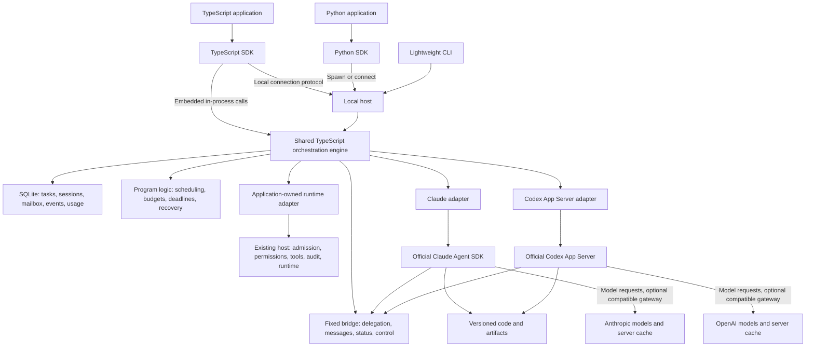

# Multi-agent orchestration SDK design: TypeScript and Python

Updated: 2026-09-21. Status: full product design with SPEC-0001–0009 implemented and offline-verified. [SPEC-0009](specs/0009-complete-design.md#completion-matrix) records the exact completion/evidence matrix. Local npm tarballs and Python wheel/sdist are built and clean-installed; nothing is published. The six-job macOS/Linux CI matrix and scripted-gateway native history/fork/compact checks passed for source cf574c4. Real-model quality, actual sandbox, external-application and economic-benefit acceptance remain separate gates. See [README](../README.md) for runnable entry points.

Product: **one orchestration engine, TypeScript and Python SDKs, optional Claude and Codex runtime adapters, and a lightweight CLI using the same engine.** Both language SDKs ship in the first public version. There are not two separate orchestration products maintained by provider.

The project began with documents and diagrams. It now includes the engine, both clients, host, adapters, private tools, storage lifecycle, tests and local distribution builds. This document retains product intent and release gates; exact callable signatures are defined in the current SDKs, schema and wiring guide. Optional economic automation remains disabled pending evidence.

[SPEC-0008](./specs/0008-claude-interruption.md) implements the design's Claude Query.interrupt path with one open streaming prompt, matched structured abort terminals, bounded observation, and independent resource-stop proof. Pause/revise/resume and cancel are verified across TypeScript/Python and offline child processes. Installed SDK 0.3.274 transport is checked against an offline peer; real CLI/model acceptance remains pending.

Companion: [SDK usage and detailed wiring](./guide.md), covering three operating modes, connection protocol, both language examples, MCP callbacks, model gateways, shutdown/recovery, and layered acceptance.

The 2026-09-19 design review clarified routing responsibility, per-request cost estimates, cost ownership, failed-assumption branches, retention, and transition deadlines. [SPEC-0003](./specs/0003-policy-retention-deadlines.md) A implements durable deadlines, unknown isolation, and owner attestation; see [evidence](./tdd/0003-a-evidence.md). B/C GC, routing and accounting are implemented under SPEC-0009 with offline evidence. Design targets and offline tests are not real-model acceptance.

The second review's N1 is implemented in A2 with offline verification: separate execution/outcome accounting and a shared engine/adapter total budget, default 1800 seconds for new turns. N2 archive rollover is implemented under [B](./specs/0003-b-archive.md). N3 retains the joint dual-runtime first-release commitment while allowing independent provider development, acceptance, and readiness tracking.

The 2026-09-20 host-integration revision makes an existing application's execution pipeline an explicit integration target. Sections 7.3–7.5 distinguish the current adapter extension point, the host's responsibilities, and delivery slices. [SPEC-0006](./specs/0006-host-runtime-contract.md) defines the contract and offline conformance increment. The downstream desktop application that prompted it is a reference host, not a dependency of the engine. Runtime compatibility, offline contract acceptance, packaged application acceptance, and real-model acceptance are separate milestones.

## 1. Problem and design goals

Some multi-agent weaknesses arise from limited effective context. Splitting, summarizing, transferring, and recovering context may compensate while adding cost and complexity. This does not imply all multi-agent value comes from context limitations.

For long tasks, prefer continuous execution when existing context remains useful and requests keep hitting cache. Larger effective context also delays forced compaction, clearing, and rebuilding.

Specific problems:

1. Frequent child-session creation reloads background/tools and weakens sustained cache reuse.
2. Repeated reporting, status questions, and explanations add input, output, and waiting cost.
3. Managers cannot reliably pause, resume, compact, or replace other sessions.
4. Addresses tied to temporary processes/connections disappear when recipients stop.
5. Additional LLM heartbeats, wakeups, and status checks add spending.
6. Missing unified accounting obscures new cache writes, historical-prefix rebuilds, and ordinary reads.

Reduce unnecessary cache rebuilding, communication reasoning, and recovery cost without reducing completion quality. Make communication durable and sessions controllable, then compare cost/time on real tasks.

Target developers embed agents into development tools, scripts, backends, and desktop applications. TS supports in-process and host-connected integration. Python provides idiomatic asynchronous APIs while the same engine owns scheduling, storage, and runtime calls.

The first-version target includes both SDKs, local persistence, both adapters, session recovery, reliable messages, controlled parallelism, lifecycle controls, and auditable usage. It excludes browser-hosted engines, multi-machine clusters, public multi-tenant services, visual consoles, cross-provider KV sharing, exactly-once arbitrary shell effects, and promised fixed cost reductions.

The foundation is useful with one session: persistence, reliable messaging, auditable controls, and accounting. Controlled parallelism is conditional. Both languages and runtimes serve integration/runtime-substitution needs, not a multi-agent utilization target. Fork and automatic economic routing/compaction do not block basic delivery. An adapter without proven safety cannot ship through an unsafe fallback. Both adapters still need basic safety/business acceptance for the first public release; reducing scope requires a separate explicit product decision.

Continuous cache hits are preferred for equivalent useful input/work, not proven globally optimal for every context layout. If later work needs little history, smaller context may save enough repeated reads to offset rebuilding. The first version does not automatically speculate about that optimization.

## 2. Key decisions

| Decision | Choice |
| --- | --- |
| Public delivery | TS + Python SDKs, shared contract and release train |
| Engine | One TS/Node implementation; no Python rewrite of tasks, mailbox, state machines, or accounting |
| TS integration | Embedded by default; optional existing-local-host connection |
| Python integration | Managed local engine subprocess by default; optional existing-host connection |
| Initial transport | stdio for managed subprocesses, local Unix sockets for standalone hosts; public network API later |
| Integration layer | New orchestration layer around official runtimes, initially without editing SDK source |
| Claude | Standard TS Agent SDK query and streaming input in the full design |
| Codex | TS adapter to App Server JSON-RPC; one Codex integration path in the first version |
| Session lifecycle | Durable logical sessions with restartable execution processes; do not delete sessions immediately at task completion |
| Messaging | Persist mailbox first, host delivers; agents do not listen on temporary peer ports |
| Scheduling/heartbeat | Ordinary TS code, no resident management LLM |
| Routing responsibility | Caller/existing primary session declares intent; host validates structure, authorization, resources, and deterministic routing without inferring independence from prose |
| Parallelism | One primary session by default; branches only for explicit independent work; two active model sessions by default, owner-configurable up to eight (SPEC-0014); the engine never adds parallelism by itself |
| Context | Prefer continuation and append-only messaging, reserve capacity, compact under control when needed |
| Storage | One owner + SQLite WAL + artifacts; same implementation for embedded/standalone hosts |
| Model tools | Fixed delegation/message/status/control tools with dynamic server-side routing |
| CLI | Reference SDK consumer and local-host entry point, no second business engine |
| Dependencies | Optional runtime adapters; local Python execution still needs Node, host package, and selected adapters |

Official documentation distinguishes programmatic [Codex SDK](https://developers.openai.com/codex/sdk) automation from App Server's fuller history/approval/event client interface. This project chooses App Server for granular session control and a single first-version Codex path. The local reference checked on 2026-09-19 was **codex-cli 0.153.4**, with offline-generated TS protocol types. API presence and complete integration acceptance are separate evidence. Claude's declared minimum is **@anthropic-ai/claude-agent-sdk 0.3.241**, optional peer range **>=0.3.241 <1**; see [compatibility boundaries](./specs/0002-runtime-adapters.md#compatibility-boundaries-and-sources).

The design does not depend on a future five-million-token window. Use actual model capacity; larger future windows can extend continuous execution under the same policy.

## 3. Architecture



The engine is one implementation. A deployment chooses embedded or standalone hosting, never two engines controlling one state directory. SDK-host and upstream Codex protocols are defined/versioned separately. Agent communication uses bridge/mailbox/scheduler, not a model API gateway.

Shared material means project information, messages, and artifacts. Anthropic/OpenAI server KV cannot be shared across providers or exported/spliced/pinned by clients. Within one provider, reuse still depends on model, prefix, account scope, runtime, and routing.

Process alive, connection alive, session resumable, and server cache valid are four distinct states. None substitutes for another.

Initially operate within one trust boundary. Future multi-user deployments must isolate execution, authentication, and cache eligibility by tenant/workspace. Logical session IDs/directories are not sandboxes.

### 3.1 Operating modes and ownership

| Mode | Engine owner | Use cases | After client exit |
| --- | --- | --- | --- |
| Embedded TS | Calling Node process | Backends, desktop main processes, automation | Drain before normal exit; reconcile on next startup after crash |
| Local Python | SDK-spawned Node host over stdio | Scripts, notebooks, async backends | SDK closes its own host; work is not guaranteed to outlive the caller |
| Existing host | CLI foreground host maintained by user/process manager | Multiple clients, client-independent tasks | Client close disconnects only; host continues |

Both SDKs offer connect; Python also local, TS also createOrchestrator. Ordinary initialization does not install a background service, register startup jobs, or take over desktop sessions.

One stateDir has one owner. Acquire the host lock and verify old instance identity before startup; duplicate startup returns HOST_ALREADY_RUNNING with auditable instance information. WAL coordinates database access, not worker ownership. Missing PIDs do not justify redispatching unknown work.

Lifecycle rules:

1. Validate configuration, permissions, and dependencies, and handshake before new tasks.
2. On restart, replay application events/reconcile prior execution conservatively. Do not automatically resume unfinished tasks; callers select them explicitly. No direct delivery to recovering/outcome_unknown sessions.
3. Owner close({mode:"drain",timeoutMs}) stops new turns, waits for current turns/state persistence, then closes owned runtime connections. Unexecuted tasks remain paused for explicit resume.
4. Drain timeout returns SHUTDOWN_INCOMPLETE while stopping. Owners may continue waiting or explicitly interrupt, still requiring terminal/side-effect checks.
5. Python async-with uses the same bounded drain. stdin EOF/parent failure starts shutdown. Crashes may leave tool processes; do not start replacement turns before reconciliation.
6. Connected-client close only disconnects. Shared-host shutdown is separate and authorized. SDKs do not install global caller signal handlers or invoke process exit.

The full management contract creates shutdown through host.shutdown({mode,timeoutMs,idempotencyKey}); operations.get reads it, and host.shutdown.continue({operationId,mode,timeoutMs,idempotencyKey}) continues drain or escalates interrupt. Managed subprocess ownership comes from a private handshake identity, not ordinary connection access. See implemented wire specifications for the currently accepted parameter set.

Python shields initiated async-with cleanup from local coroutine cancellation while keeping its deadline. SHUTDOWN_INCOMPLETE retains the orch handle and shutdown operationId; that handle keeps the protocol reader/pipes for continuation within the live event loop. Do not destroy the handle and then ask for retry. Later pipe EOF triggers bounded emergency interruption/owned-resource cleanup and preserves unreconciled outcome_unknown. Stopping a local process cannot guarantee reversal of remote effects.

### 3.2 Public API contract

Both SDKs share Task, WorkSession, Message, Operation, Approval, Artifact, and Usage semantics; TS uses camelCase, Python snake_case. The table summarizes implemented API semantics. The current SDKs/schema determine exact signatures; optional provider operations remain capability/evidence-gated.

| Capability | TypeScript | Python | Return / constraint |
| --- | --- | --- | --- |
| Create task | tasks.create(spec, {idempotencyKey}) | await tasks.create(spec, idempotency_key=...) | TaskHandle; receipt means persisted only |
| Wait task | task.wait({timeoutMs}) | await task.wait(timeout=...) | completed/failed/cancelled TaskResult; completed needs acceptance; timeout does not cancel |
| Read task | tasks.get(taskId) | await tasks.get(task_id) | Durable snapshot, no model call |
| Resume paused task | tasks.resume(taskId, options) | await tasks.resume(task_id, ...) | OperationHandle; revalidate runtime/budget |
| Cancel task | tasks.cancel(taskId, options) | await tasks.cancel(task_id, ...) | Cancel only after stopping scheduling and reconciling active work |
| Open/fork session | sessions.open(spec, options) / sessions.fork(target, snapshotRef, options) | await sessions.open(spec, ...) / await sessions.fork(target, snapshot_ref, ...) | Logical SessionSnapshot, idempotency and capability checks; native fork deferred to first use |
| Read session | sessions.get(sessionId) | await sessions.get(session_id) | Generation, state, active dispatch, capability snapshot |
| Message | messages.send(spec, options) | await messages.send(spec, ...) | Durable messageId receipt, not processing completion |
| Control | sessions.control(target, command, options) | await sessions.control(target, command, ...) | OperationHandle; acceptance and completion separate |
| Owner attestation (implemented) | sessions.reconcile(target, evidence, options) | await sessions.reconcile(target, evidence, idempotency_key=...) | Owner-only OperationHandle; lifecycle v1; no automatic inspection |
| Wait operation | operation.wait(options) | await operation.wait(...) | completed/noop/rejected/failed/outcome_unknown |
| Recover operation | operations.get(id) / operations.lookup(keySpec) | await operations.get(id) / await operations.lookup(key_spec) | Durable result by ID/full idempotency scope |
| Events | events({taskId,afterCursor}) | events(task_id=...,after_cursor=...) | Async application-event-log iterator |
| Read approval | approvals.get(approvalId) | await approvals.get(approval_id) | Current status/revision; check replay before prompting |
| Decide approval | approvals.decide(approvalId,decision,options) | await approvals.decide(approval_id,decision,...) | Actor, expiry, and target validation |
| Usage | usage.get({taskId}) | await usage.get(task_id=...) | Raw scope, normalized values, completeness |
| Capabilities | capabilities({provider}) | await capabilities(provider=...) | Bound to engine/adapter/runtime versions |

Derive actors from authenticated callers/task authorization, not request-supplied owners/fencing tokens. External targets may include expectedGeneration/expectedDispatchId/expectedRevision; the engine adds leases/fencing internally.

Target control actions are pause/resume/compact/rotate/stop; pause has a mode. Destructive active-turn control requires exact identity. With no active turn, specify expected session state and null active dispatch. Task cancellation must not interrupt another task already running in a reused session.

Configuration covers workspace/stateDir, separate provider/model fields, permissions, active-session limit, task budgets, and shutdown. Selecting a model does not switch runtime. Namespace and allow-list/version-check runtime options; no arbitrary raw control forwarding bypasses the state machine.

Wait cancellation is separate from work cancellation. Python coroutine cancellation, TS AbortSignal, or event-iterator close stops local waiting/subscription only. Recover submitted-but-unacknowledged requests by key before inferring anything. Remote cancellation requires tasks.cancel or explicit session control.

### 3.3 Equivalent language examples

These are interface-review sketches. Proposed package names @agent-orch/* and agent-orch are unpublished and availability is unverified; do not treat them as installation instructions. The caller supplies model/path variables. Human acceptance requires a separately authorized approval.requested consumer.

Embedded TypeScript:

```ts
import { createOrchestrator } from "@agent-orch/sdk";
import { createClaudeAdapter } from "@agent-orch/adapter-claude";

const orch = await createOrchestrator({
  workspace: projectPath,
  stateDir: statePath,
  adapters: [createClaudeAdapter()],
  limits: { maxActiveSessions: 2 },
});

try {
  const task = await orch.tasks.create({
    goal: "Fix the specified issue and provide test evidence",
    runtime: { provider: "claude", model: selectedModel },
    acceptance: { mode: "human", criteria: ["Reproduction no longer fails", "Relevant tests pass"] },
  }, { idempotencyKey: "issue-123-attempt-1" });

  const result = await task.wait();
  console.log(result.status, result.artifactRefs);
} finally {
  await orch.close({ mode: "drain", timeoutMs: 30_000 });
}
```

Local Python:

```python
from agent_orch import Orchestrator, TaskSpec, RuntimeSpec, AcceptanceSpec

# Inside the caller's existing async function; no additional sync wrapper in v1.
async with Orchestrator.local(
    engine_command=[engine_executable, "host", "--stdio"],
    workspace=project_path,
    state_dir=state_path,
    providers=["claude"],
    max_active_sessions=2,
    close_timeout=30.0,
) as orch:
    task = await orch.tasks.create(
        TaskSpec(
            goal="Fix the specified issue and provide test evidence",
            runtime=RuntimeSpec(provider="claude", model=selected_model),
            acceptance=AcceptanceSpec(
                mode="human", criteria=["Reproduction no longer fails", "Relevant tests pass"]
            ),
        ),
        idempotency_key="issue-123-attempt-1",
    )
    result = await task.wait()
    print(result.status, result.artifact_refs)
```

This project's Python client talks to the shared engine rather than reimplementing provider adapters/scheduling. This is a project architecture choice, not a claim that upstream runtimes only support TS. See [Claude SDK](https://code.claude.com/docs/en/agent-sdk/overview) and [Codex SDK](https://developers.openai.com/codex/sdk).

### 3.4 Local protocol, events, and errors

Use versioned JSON-RPC 2.0 application messages in UTF-8 single-line JSON frames. stdio stdout is protocol-only and stderr is logging; Unix sockets share framing. Both ends bound frames/pending requests and use references for large artifacts. Upstream runtimes need not use identical encoding details.

- Handshake initialize exchanges protocolVersion, sdkVersion, engineVersion, schemaVersion, instanceId, and capabilities. Reject incompatible major versions; negotiate minor capabilities rather than ignore unknown control fields.
- Target methods include tasks.create/get/resume/cancel, sessions.open/get/fork/control, messages.send, operations.get/lookup, approvals.get/decide, events.subscribe/unsubscribe, usage.get, capabilities.get, plus authorized host.shutdown/continue. Python never reads SQLite or connects directly to App Server. Current events use bounded reads; target subscriptions remain future work.
- Every mutation carries stable idempotencyKey. Persist operation/normalized digest first. Same identity/scope/method/key recovers the original; changed payload returns IDEMPOTENCY_CONFLICT. Transport request IDs are not business keys.
- SDK-generated single-operation keys are reused within transport retry and returned in success/errors for lookup. Cross-process recovery requires caller-persisted keys. Open/fork/control/approval follow task-creation idempotency.
- Return durable operation/task/message IDs first; upstream acceptance/completion comes from events/query. Rejection, failure, and unknown differ. Timeout cannot silently become failed-and-resend.
- Durable events carry eventId, cursor, taskId, sessionId, operationId, generation, occurredAt, and schemaVersion. Ordered decimal cursor is bound to storeId and guarantees commit order only within that store.
- afterCursor is exclusive. Join history/live events at a consistent log position, deliver at least once, and deduplicate by eventId. Slow consumers use bounded buffers and replay after disconnect rather than block runtime handling.
- Persist critical state/control/approval/message/usage events. Mark temporary token deltas ephemeral with no replay promise; persist final artifacts. Collected cursors return CURSOR_EXPIRED with snapshot/new-baseline guidance, never silent skipping.
- Constrain paths, use UTC, represent money as decimal strings/currency, and retain missing values as unknown. No Python functions, TS closures, or arbitrary executable serialized objects cross the wire.

The current wire version is 2.0 and storage schema is 3. Lifecycle v1 still gates owner attestation; namespace v1 binds all mutations before writes. state.snapshot, archive reads and B/C errors are implemented. Current capacity/error names include STORAGE_BACKPRESSURE, STORAGE_DEGRADED_CLOSED, OPERATION_HISTORY_EXPIRED, SNAPSHOT_EXPIRED and SCHEDULING_BLOCKED; consult implemented contracts rather than older sketch names.

The full-design stable error set includes VALIDATION_ERROR, UNAUTHORIZED, UNSUPPORTED_CAPABILITY, STALE_TARGET, IDEMPOTENCY_CONFLICT, HOST_ALREADY_RUNNING, ENGINE_NOT_FOUND, PROTOCOL_MISMATCH, RUNTIME_VERSION_UNSUPPORTED, BUDGET_EXCEEDED, OUTCOME_UNKNOWN, CURSOR_EXPIRED, and SHUTDOWN_INCOMPLETE. Errors carry operationId, safely exposable reasons, and retry guidance. Ordinary automatic retries require proven non-execution; current exact codes follow implemented specs.

### 3.5 Installation, compatibility, and caller permissions

Initial platform targets are macOS/Linux, Node 22.18+ for the current implementation, and Python 3.11+. These minima are not a verified release matrix; list only versions/platforms passing CI and real-runtime contracts. Windows and a synchronous Python API need separate acceptance.

TS installs SDK and selected adapters. Python installs its client and prepares matching Node host/adapters, optionally specifying engine_command. Preflight dependencies/protocol with exact errors. pip install/import must not silently npm-install, download runtimes, start model calls, or change credentials. An existing-host deployment lets the Python environment contain only the client; runtime dependencies reside in the same machine's host environment.

Load configured adapters only. Claude users need not load Codex dependencies or vice versa. Applications retain their own event loop/logging/signals/exit policy. Python's background reader continues draining pipes even when event consumers pause.

The first version serves trusted applications under one OS user. Restrict socket directory/file access to that user and privately hold stdio pipes. No default network listener. Reusing JSON-RPC does not grant cross-user/remote support.

Configure credentials through supported runtime mechanisms, never task messages/artifacts/protocol logs. Agent tools use restricted session identity and cannot human-approve. Any embedded TS permission callback wraps the same approval event/decision flow rather than creating a second system Python cannot express.

### 3.6 Additional wiring contracts

Include these in first-version implementation/contracts; the companion guide supplies parameters/examples:

- Shared orchestrator.json uses configVersion, workspace, stateDir, transport, providers, limits, shutdown, and verificationRules. These are project fields mapped to supported upstream options. TS may pass an object; Python local may use engine_command with host --stdio --config, without conflicting structured path settings.
- TS connects through connectOrchestrator({socketPath}); Python through Orchestrator.connect(socket_path=...). Connection mode cannot override host workspace/stateDir/provider authentication.
- Known approval.requested data includes approvalId, purpose, revision, target, summary, evidenceRefs, and finite UTC expiresAt, mapped to snake_case in Python. Initial task subscriptions replay retained events; read approvals.get before prompting and validate revision again on submit. Do not reprompt decided/expired approvals.
- task.paused/task.blocked are durable application-action events. Check current snapshots before treating historical events as current. Task wait terminal rules remain unchanged.
- Incomplete-close exceptions expose a valid client/operationId. Repeated owner close with operationId maps to shutdown.continue. Python must handle it before event-loop exit; async approval UI cannot depend on an uncancellable blocking input thread.
- Ordinary local business sockets serve trusted same-user applications; shutdown needs owner authority. Codex MCP bridges use a separate private tool entry point/session identity, never shared administrator credentials.
- Initially assign separate Codex workers/MCP stdio bridges by tool identity/permission scope. Sharing later requires proven per-thread caller binding. Claude's in-process MCP object is not directly a Codex stdio executable.

## 4. Sessions, tasks, and messages

### 4.1 Three separate objects

| Object | Meaning | Lifecycle |
| --- | --- | --- |
| Task | Goal, dependencies, deliverables, acceptance | May span sessions |
| WorkSession | Logical session bound to provider session/thread ID | Resumable across process restarts |
| Worker | Current SDK/App Server process or connection | May exit, reconnect, or be reclaimed |

Session records include logicalSessionId, ownerScope, provider, providerSessionId, generation, host activeDispatchId, nullable providerTurnId, workspaceRef, profileVersion, status, and last confirmed event position. Persist selected model, permissions, and tools too. Claude need not expose a native equivalent of Codex turnId.

generation is an application-level context generation, advanced only for semantic changes such as reset/replacement, not ordinary process restart. Old messages cannot land in a new generation.

Each WorkSession has at most one active generation turn. Database leases and increasing fencing tokens prevent stale workers from committing application state. After lease loss, stop/reconcile the old process: refusing database writes does not stop an already-issued shell command's side effects.

### 4.2 Persist messages first

Proposed fields:

```ts
// Application protocol design, not either provider SDK's native parameters.
type WorkMessage = {
  id: string;
  taskId: string;
  fromSessionId: string;
  toSessionId: string;
  expectedGeneration: number;
  kind: "assignment" | "finding" | "result" | "question" | "control";
  summary: string;
  artifactRefs: string[];
  correlationId?: string;
  causationId?: string;
  idempotencyKey: string;
  expiresAt?: string;
};
```

Message states: persisted → dispatching → runtime_accepted → completed, plus failed/expired/outcome_unknown. Message completion means the associated batch was handled, not task acceptance. Mailbox success means saved, not processed by the recipient.

Persist message/outbox together. Deduplicate by message ID; assign a host dispatchId/batchId per input batch and store native turn ID when available. Application delivery is at least once with deduplication, not absolute exactly-once across arbitrary SDK/network/shell effects.

Each adapter defines acceptance proof. Enqueueing Claude AsyncIterable input does not establish runtime_accepted. Require evidence attributable to that batch, possibly only its result; otherwise stay dispatching/unconfirmed. Never synthesize native acceptance.

If upstream accepted but the response was lost, reconcile available state/history first. If unprovable, retain outcome_unknown. Do not blindly resend instructions that could edit files or invoke external actions. Custom side-effect tools need their own operation idempotency; message deduplication cannot make arbitrary shell commands exactly once.

### 4.3 Delivery rules

1. Busy recipient: queue ordinary messages and merge at a safe boundary. Urgent steer requires explicit adapter support.
2. Idle session with live process: append necessary messages and run the next turn.
3. Exited process: resume by provider session ID, then deliver. Restored history does not prove valid cache.
4. Compacting, awaiting approval, or unknown: pause ordinary delivery; do not start another concurrent turn.
5. Store large text/diffs/logs as artifacts. Messages contain conclusions, necessary evidence, and references, not broadcast histories.
6. Routine status updates affect database/UI only. Invoke models when dependencies are ready or a message actually requires reasoning.

Mark other-agent provenance; messages cannot impersonate human approval. The host authorizes control messages; ordinary message content cannot elevate permissions.

### 4.4 State layers and minimum storage model

Target Task states: queued/running/waiting_dependency/waiting_approval/paused/blocked/verifying/completed/failed/cancelled. Only accepted deliverables permit completed. Unknown execution blocks the task with a dispatch reference.

Target WorkSession states: idle/running/waiting_dependency/waiting_approval/pausing/paused/compacting/recovering/closing/closed/failed/outcome_unknown. After task completion, a reusable session may become idle. Closed means execution resources closed, with history resumable where supported. Worker process state is separate; process exit is neither session nor task completion.

Operation records persisted/dispatching/runtime_accepted/completed/noop/rejected/failed/outcome_unknown, with Task/WorkSession/Message targets as needed. Retry eligibility depends on execution evidence, not just error names.

| Table boundary | Data and constraints |
| --- | --- |
| tasks / task_dependencies | Goals, budgets, acceptance, dependencies, results; reject dependency cycles |
| sessions / workers | Logical/native IDs, generations, workspace, capabilities, process identity |
| messages / outbox | Bodies/references, target generations, delivery state; atomic writes |
| operations / dispatches | Keys/digests, control targets, input batches, native acceptance/terminal evidence |
| leases | Session owner, expiry, increasing fencing token; at most one valid executor/session |
| events | Ordered application events committed with state changes |
| approvals / verification_rules / verifications | Target, identity, expiry, rule version, evidence, decision |
| artifacts / usage | Content digest, workspace version, raw metrics, normalized scope |

Outbox processing is at least once, but restart must classify unsent/accepted/unknown before redispatching. Retain message/operation keys per section 4.5; expired bodies do not permit same-key replay.

Write artifacts to temporary files before atomic reference commit, recording digest/workspace version. Database transactions cannot atomically include arbitrary file edits; startup checks unfinished file commits. Back up with WAL-consistent mechanisms and include artifacts/runtime sessions. Copying an actively written main database alone is not a complete backup.

Manage storage schemaVersion separately from communication protocolVersion. Check versions/backup before migration. Incompatible migrations require explicit offline execution; older engines refuse newer schemas without overwriting/downgrading data.

### 4.5 Retention, GC, and disk pressure

These are implemented first-version policy defaults under SPEC-0009. They are not measured production capacity limits. Retention starts at the later of record termination and owning-task termination; unfinished records have no automatic expiry. Active tasks, unreconciled dispatch/unknown, pending approvals, recovery checkpoints, and explicit pins create protection that overrides age. Ordinary reads do not extend retention indefinitely.

| Data | Default retention/collection |
| --- | --- |
| Application events | At least 30 days; collect only an unprotected continuous prefix and atomically advance retentionFloorCursor |
| Terminal operations, message bodies, outbox detail, approval detail | At least 90 days, the full-receipt retry window; never collect unreconciled records |
| Idempotency/delivery tombstones | Store lifetime; retain identity/method/scope/key, request digest, original operation/message/dispatch IDs, result category; omit large bodies |
| Artifact content | At least 90 days after task termination and no protection; check all cross-task references; index retains digest/expired state |
| Raw upstream usage | At least 180 days; minimal accounting with metrics, ownership, scope, pricing version, completeness lasts with store |
| Minimal Task/Session snapshots/final acceptance summary | Store lifetime; mark expired bodies/artifacts explicitly rather than fabricate history |
| Upstream session files | Never delete solely by mtime. Use verified cleanup APIs or explicit owner archive of closed managed sessions no longer needed for resume |

Within the window, identical keys/payloads recover original operations. After collection, return OPERATION_HISTORY_EXPIRED, original ID, and exposable result category; changed payload still conflicts. Never return ordinary NOT_FOUND and rerun effects. Ninety days is not deduplication expiry. Bind mutations/replay to confirmed storeId; SDKs cannot transparently retry old requests in a new store. Store change is explicit migration/reconnection, not a retry shortcut.

Old-backup rollback, independent backup clone, or unprovable log continuity requires a new storeId with source ID/backup position; invalidate old cursors/mutations. Normal in-place restart preserves identity. Operations after the backup may have effects absent from restored tombstones. Reconcile with retained external receipts/logs or keep unknown; never auto-retry. Restoring a backup does not undo later external actions.

Event collection and state snapshots share transactional consistency. retentionFloorCursor is the last collected prefix cursor, initially 0, not the first retained event. Equality permits exclusive resume; lower values, including old 0, return CURSOR_EXPIRED. state.snapshot returns visible tasks/sessions/pending approvals, retention bounds, and a consistent cursor. Resume exclusively after it. Snapshots do not recreate deleted audit history; identify missing evidence.

Page a fixed snapshotId/cursor within byte bounds. The default 60-second lease fixes the view/protects its resume baseline against GC. Expiry returns SNAPSHOT_EXPIRED and releases resources; restart the snapshot, never combine two. Snapshot leases do not refresh model caches and do not prevent refusal of new snapshots under global storage pressure.

The sole host checks GC after recovery and hourly, without models. Batches target at most 500 records or 8 MiB and 50 ms transactions: work budgets, not measured throughput. Mark artifact candidates, recheck/block new references, move to managed quarantine, delete, then record outcome. Recover/continue after crashes without unmarked dangling references. WAL checkpointing is separate; no forced online full VACUUM.

Implemented policy defaults (not measured production limits): stateDir 10 GiB including DB/WAL/artifacts/runtime files; warn at 80%, stop new tasks/messages/model turns at 90%. Free filesystem space below 1 GiB also allows only diagnostics/settlement. Reserve a 256 MiB emergency file for terminal metadata after release, not guaranteed arbitrary-size results. One million minimal snapshots/tombstones stops new work too; owners may raise limits or explicitly archive, never auto-delete deduplication history.

[B](./specs/0003-b-archive.md) defines whole-store archive/new-namespace rollover and AC-B08–B18. Settle tasks/approvals/outbox/unknown/resources first, archive the complete retained store with read-only tombstone lookup, and use a fresh storeId without executable copies of old tasks. Fixed expectedStoreId rejects old requests in the new store; inaccessible archives are not non-execution proof. Trusted control manifest, writerEpoch, and retired markers fence old writers. Recovery may temporarily have no writer, never two. Reserve finite settlement/management capacity before admission backpressure. This provides no cross-store semantic deduplication or namespace bypass for pending execution.

At thresholds, run eligible GC first; if insufficient, return STORAGE_PRESSURE and retain backpressure without deleting active/unknown evidence. SQLITE_FULL/ENOSPC/I/O before commit yields no durable receipt. Possible execution with unpersistable results stops dispatch and reports STORAGE_UNAVAILABLE while preserving uncertainty. Do not assume even unknown can be written on a full disk; recover from original dispatch/upstream evidence or stay blocked/unknown. Reclaim only confirmed owned resources. Owner policy changes retain version/impact preview; model tools cannot shorten retention or quotas.

## 5. Cache and context policy

### 5.1 Priorities

Callers explicitly declare intent; an existing primary session may submit the same declaration through work_delegate. Application developers or the already-working primary session make semantic judgments. The engine and host core add no model call for routing. An application may opt into the SDK routing layer, whose judge it chooses and pays for; its proposals are ordinary declarations that the engine validates as before ([SPEC-0018](specs/0018-routing-layer.md)). The host does not infer valuable parallelism from goal prose, token overlap, or intersecting paths. A declaration is a constrained request, not permission or benefit evidence.

Implemented TaskSpec.contextPlan/work_delegate.contextPlan share requestedMode: continue|parallel_tools|reuse|fork|fresh, independent:boolean, dependencyTaskIds, contextRefs (versioned artifacts/checkpoints), candidateSessionId?, snapshotRef?, fallbackModes, and maxQueueWaitMs. References declare needed material; shared references prove neither semantic relatedness nor cache hits. Read budget/permissions/write scope from registered authorization; these fields cannot enlarge them. A root task's initial session is not delegation. With an existing primary session, omitted contextPlan means continue, not an automatic child.

Check requested candidates and explicitly allowed fallbacks in order:

1. continue: append to the specified primary session only at a safe boundary.
2. parallel_tools: let the existing runtime parallelize authorized tools, without adding model sessions or guaranteeing upstream concurrency.
3. reuse: require independent=true and an existing candidate. Validate owner/workspace/model/profile/permission compatibility, completed dependencies, generation, and resources; do not claim semantic understanding.
4. fork: require independence, completed snapshotRef, capability evidence, and authorization. Automatic economic selection also requires section 12.1's benefit gate.
5. fresh: explicitly authorized new session with only listed necessary material, still bounded by global budget/concurrency/write ownership.

fallbackModes defaults empty. Invalid/unsupported requests fail without silent extra sessions. Temporarily unavailable resources may queue for a finite period; expiry returns SCHEDULING_BLOCKED or an explicitly allowed next candidate. Never preempt another task's turn. Persist declarer, policy version, candidates, checks, and reasonCode. Unknown savings remain unknown rather than invented scores. These priorities are product preferences, not host semantic intelligence.

Do not mix unrelated projects, users, or permissions into a session to improve hits, or enlarge child permissions to share a tool prefix.

Neither fork nor lean fresh sessions always wins. Inheriting history may avoid initial rebuilding but repeatedly bill irrelevant context for a small child task. Decide using actual cache metrics and whole-child cost.

Fork a completed identifiable snapshot, not unfinished parent reasoning. Different sessions may run concurrently; ordinary submissions within one session serialize. Cold concurrent requests are not guaranteed shared hits. If one real request warms a common prefix before releasing branches, verify actual upstream write/visibility timing. Record provider/model/account scope/exact prefix/TTL in experiments. [Claude prompt caching](https://platform.claude.com/docs/en/build-with-claude/prompt-caching)

### 5.1.1 Queueing cost of reuse

Default reuse stays within one root task. Cross-root reuse requires explicit owner permission to retain prior history, still never crossing user/project/permission boundaries. Apply section 9.1 cost ownership. One input batch serves one billable task; do not combine tasks to save calls.

Prefer authorized idle candidates. A busy candidate waits maxQueueWaitMs, default 30 seconds (owner default `limits.defaultMaxQueueWaitMs`), at most seven days, with 0 disabling wait. Only time spent queued counts: the wait restarts each time the task enters the queue and never renews on retry (SPEC-0015). Every expiry transaction verifies non-submission and removes the old queue entry. Only allowed fallbacks switch candidates; otherwise persist task blocked, operation failed(SCHEDULING_BLOCKED), and event, with no later hidden dispatch. If submission won the race, return actual dispatch state/unknown, not definite non-executed queue timeout. Never evict another task's active turn. Unknown execution stays isolated rather than freeing capacity for endless replacement processes.

Within equal priority, schedule ready tasks by initial enqueue time. Waiting reuse entries consume no execution slot and do not block other ready sessions. Track queueWaitMs, model/tool execution, and total time separately. TTL urgency does not override fairness/wait limits. No automatic conversion of milliseconds into monetary optimization in v1; any future SLO weighting is versioned and measured.

### 5.2 Stable controllable input

Keep model, system instructions, tool names/descriptions/schemas/order, and necessary runtime options stable. Put dynamic task/time/agent/routing information in appended messages or host metadata instead of rewriting prefixes.

A fixed bridge lets recipients share tool definitions: work_send accepts a target ID rather than adding one tool per agent.

profileVersion/configuration fingerprints diagnose changed controllable input; they are not provider cache keys. SDKs may add invisible content, so equal local hashes do not prove hits.

Use only supported provider cache options, never invented SDK parameters. OpenAI cache fields/pricing/retention vary by model; an API field's existence does not prove App Server passthrough. [OpenAI prompt caching](https://developers.openai.com/api/docs/guides/prompt-caching)

### 5.3 TTL and scheduling

Reuse cache between real business requests, not meaningless inter-agent heartbeats.

- Prefer original sessions for ready work where dependencies/fairness permit, avoiding unnecessary long idle periods.
- During long tools, approvals, or dependencies, estimate time to the next real model request before comparing supported TTL cost.
- Infer TTL from upstream request timing, not SDK enqueue/tool completion. Label estimates when unobservable.
- A long-lived Claude query is an application-managed top-level SDK session, not automatically a native subagent TTL bucket. Verify SDK-owned request TTL rules and inject configuration separately. [Claude usage/TTL](https://code.claude.com/docs/en/agent-sdk/cost-tracking)
- Host/connection heartbeats consume no model tokens and do not refresh prompt cache.
- No automatic paid empty warmup requests in v1. Any future experiment needs a supported runtime path and includes read/output/rate-limit/execution cost; do not assume free cache pinning.

Warmup requires expected avoided rebuild premium to exceed all warmup/execution cost with uncertainty margin. Without evidence, use supported TTL and natural scheduling.

### 5.4 Compaction and reset

Normally append history; length alone is not a compaction trigger. Controlled compaction follows capacity safety, a phase change with sufficient future benefit to cover rebuild/recovery, or explicit lifecycle instruction. Upstream auto-compaction may trigger first; observe it rather than claim complete control.

Use current-request context estimates, not cumulative task tokens. Reserve space for next tool output/model output/safety. Act before API overflow; do not hard-code one percentage for every model.

Each session independently satisfies `prefix + session history + new messages + tool/output reserve <= available model window`. Cached reads still occupy context. For parallel A/B, calculate each window separately, then aggregate concurrency/rate/cost at the host. Append only necessary A results to B; never splice histories/KV.

Future economic compaction compares equivalent remaining work/quality constraints per request:

```text
inputCost(s, i) = U(s,i) × p_input
                + R(s,i) × p_read
                + Σ_t W(s,i,t) × p_write(t)
C_keep = Σ_i [inputCost(keep,i) + outputCost(keep,i) + toolCost(keep,i)]
C_compact = C_compaction
          + Σ_i [inputCost(compact,i) + outputCost(compact,i) + toolCost(compact,i)]
          + C_recovery_and_rework
```

s is the strategy, i a subsequent actual model request including tool-loop requests, and t a supported write/TTL billing category. Normalize U/R/W into disjoint ordinary-input/cache-read/cache-write buckets. Do not charge input totals again when they already include cached input. Map providers without separate write pricing to actual ordinary-input rules; use ranges/unknown when inseparable, never missing-as-zero. Prices are per token; divide per-million prices by 10^6 and bind model/currency/pricing version to the request.

Keep history H_i and compact history K_i evolve with messages/tools/later compaction. Strategies may have different request counts; sum each predicted sequence rather than assume unchanged turns. Estimate U/R/W for both using intervals, cacheable prefixes, TTL/eviction, and observed hits. Expired old-prefix rebuilding belongs in W or U. Initial compacted requests may retain part of the prefix, not always a full write. Count the compaction request's own input/output/tools once. Recovery/rework excludes already-counted later requests. Cancel common output/tool terms only when evidence supports equality.

Save predicted request count/growth/intervals/hit assumptions/ranges. TTL influences assumptions, never guarantees hits. Compare sustained-hit, TTL-rebuild, and partial-hit scenarios. Unknown request count/spacing disables automatic economic compaction. Require benefit beyond configured uncertainty plus quality/recovery checks. Capacity-driven compaction gets its own reason, not a cost-optimal claim.

Expose reset as sessions.control rotate: save old-session reference/checkpoints, create a provider session, switch the logical mapping, and retain history. It loses some cache reuse and is not cheap cleanup. Filesystem rollback is separate; session reset does not revert code.

## 6. Lifecycle control and loop prevention

Use Task/WorkSession/Operation layers from 4.4. Pause controls scheduling and confirmable turns; it does not freeze server reasoning or arbitrary OS processes. A managing agent may request control only over delegated sessions; the TS host authorizes and executes.

| Control | Host behavior |
| --- | --- |
| pause(drain) | Default soft pause: stop delivery, let the current turn end, then confirm paused |
| pause(interrupt) | Request cancellation of the exact active turn, await terminal/side-effect checks, then paused |
| resume | Restore the original session and continue persisted work |
| compact | Stop delivery, confirm safe boundary, checkpoint, issue native command, await actual completion |
| rotate | Create a generation, confirm required state loaded, switch mapping, retain original |
| stop | Stop scheduling/active requests, reconcile leftover tools/effects |

Management permission grants neither arbitrary target shell access nor human approval authority.

Controls and submit share one session-serial lock. Atomically check generation, fencing token, expected dispatch/state before send. Stale controls fail rather than affect a new turn. Use Codex expectedTurnId where supported. Claude lacks equivalent native target-matching guarantees, so host lock/validation is required.

Hold the lock only for validation, state reservation, and command send, not the entire model run/wait; otherwise interrupt cannot enter. Durable state/unique active dispatch prevents a second turn during waits. Native events use the same serialized state handling and cannot overwrite newer generations.

Resume starts a new turn from saved history/checkpoints. Hard interruption cannot restore unsaved internal reasoning. Reconcile interrupted tools, partial files, and remote actions before rollback/replay decisions. Old-generation messages do not migrate automatically after rotate; redelivery needs an explicit target and new audit record.

Approval requests include approvalId, permission object, target generation/turn, source, expiry, and required approver identity. No consumer means waiting_approval, not default approval. Expiry rejects/pauses by policy; late approval cannot affect new turns. Managing agents may request control, not decide human approvals.

purpose distinguishes runtime_permission from task_acceptance. Runtime approval binds a tool action/turn; task acceptance binds verificationId, artifact digest, and task revision without requiring active model execution. Both use approval.requested/approvals.decide with separate scope/target checks. Waiting human acceptance leaves the task waiting_approval without starting a model turn; the session may idle.

Implement lease renewal, process monitoring, reconnect backoff, message expiry, max turns, budgets, and hop limits in code. Count repeated identical tool calls without new evidence/state; at the limit, pause/report instead of adding a checking agent.

Business lack of progress and infrastructure silence have different timers. Long tests, approvals, and dependencies are not loops simply because they take time. Semantic stalls that code cannot classify are handled by the existing primary session only when needed and within remaining budget.

### 6.1 Transition deadlines and recovery paths

A persists OperationSnapshot.lifecycle enteredAt, deadlineAt, policyVersion (replacing the draft timeoutPolicyVersion name), expectedGeneration/expectedDispatchId, lastEvidence, and mayHaveBeenSent. Dispatch stores acceptance/total deadlines and target. Use monotonic checks on events and before terminal commit; timers only wake. Restart retains deadlines and conservatively enters unknown without renewing/replaying. Current A2 defaults: acceptance 30000, turn 1800000, drain 300000, interrupt 30000, reconcile 60000 ms, each integer 1..86400000. TS/CLI share fields; Python passes --config through engine_command, without local(timeouts). SDK wait cannot change execution deadlines. The table describes implemented operations and their evidence gates.

| Transition / phase | Default and start | Completion evidence | Expiry |
| --- | --- | --- | --- |
| Dispatch acceptance (implemented) | 30 s from dispatch, bounded by total turn | Matching native acceptance or stronger terminal | Definitely unsent may fail; sent/possibly sent becomes unknown without resend |
| pausing/drain | 300 s from closing delivery gate | Persisted current terminal and reconciled effects | Control/unreconciled dispatch/session unknown, task blocked; no implicit interrupt |
| pausing/interrupt | 30 s from interrupt send | Matched stopped terminal, or ended turn plus explicit control no-op | Unknown without proof; receipt/PID disappearance insufficient |
| compacting | 300 s from safe boundary and durable control | Compact-complete event or verified no-op | Sent without terminal becomes unknown; no normal idle or automatic rotate |
| read-only inspection | Default 5 s bounded request | Original identity/history observations | execution remains unknown; no automatic reconciliation |
| rotate preparation/switch | Synchronous durable transition only at a quiet settled boundary | Generation evidence saved and binding atomically switched | Refuse active/unknown work; retain the old generation |
| Owner reconcile (implemented) | 60 s for submission processing | Declaration/exact target agree with resource/terminal evidence | Reject/roll back before commit if expired; no model turn |
| closing/host stopping (implemented) | 30 s per close/continue wait | Owned connections/processes reclaimed, state durable | SHUTDOWN_INCOMPLETE, lifecycle.expiredAt and shutdown.incomplete; retain query/continue handles and stopping |

Compaction requires a quiet completed session; active work must first complete a separate drain; reentering compact cannot renew it. Normal tools/work/approval do not use a 30-second heartbeat rule. New total turns default to 1800 seconds including startup/acceptance; owner finite limits and shorter explicit provider caps apply. Human approvals use their own expiresAt, not token silence. Preserve unknown on overrun rather than invent stop. waiting_dependency is implemented and consumes no execution slot.

The host watchdog transactionally settles affected task/session/operation/dispatch/messages/outbox and events. Unknown does not mean resources stopped. Keep execution lease until complete execution/cleanup proof, then release only A while retaining Q/activeDispatchId. Avoid timeout-driven replacement workers. Definite failed/rejected requires proof no external call occurred; retry also checks evidence and original business key.

Closing intentionally may remain stopping for owner intervention, but each wait is finite/observable and blocks new dispatch. Continue with the same operationId or explicitly escalate interrupt; ordinary wait timeout cannot escalate. Stdio EOF stops dispatch and triggers at most 30-second emergency close. Adapters touch only owned resources and retain unknown/incomplete on failure. Codex uses spawned handles and default one-second TERM/KILL stages. Claude records owned spawn handles and observes actual exit independently of Query.close/iterator.return; SPEC-0008 additionally correlates streaming interrupt terminals. No persisted-PID cleanup or shared-runtime automatic inspection after restart; future support requires ownership evidence beyond PID/name.

Implemented sessions.reconcile accepts owner investigation declarations without reading upstream history automatically. Only embedded TS or managed-stdio Python owners qualify; ordinary sockets fail. Record localResources, remoteExecution, sideEffects, outcome, summary, and full result for completed, with actor/original dispatch. Active resources or conflicting evidence reject stopped release; business unknown remains isolated. completed saves output/pauses for acceptance-only resume, not_executed pauses for explicit requeue, failed/interrupted fails. Preserve original unknown controls with appended resolution, never pretend on-time completion or automatically complete the Task.

Insufficient proof stays unknown. Future risk acceptance for separate recovery work cannot relabel the original as success/non-execution, fabricate process exit, or bypass isolation. Correlate late events by generation/dispatch/native identity. Complete stop/cleanup releases A and wakes eligible other work while preserving Q/activeDispatchId and no automatic original-task resume. See [contract](./specs/0003-a-lifecycle.md) and [usage 11.4](./guide.md#114-implemented-owner-attestation).

### 6.1.1 Implemented and offline-verified N1 revision

Two potentially running unknowns still fill two slots. A late terminal also needs local cleanup before release. A2 uses durable execution leases: A includes normal in-flight/potentially-running unknown, Q all unresolved business unknown, R unquarantined held in-flight reservations including cleanup. Admission requires A below maxActiveSessions (default 2) and Q+R below maxQuarantinedDispatches (default 32, range 1..1024 and at least active limit). Timeout converts R to Q, preventing simultaneous overrun.

Only matched complete stop plus local cleanup, or owner stopped attestation without handles/conflicts, releases A. Q/activeDispatchId remain; no automatic resume/resend/approval. Process exit, iterator end, or unknown alone is insufficient. Late cleanup notifies independently of ended observation loops/model heartbeats. Conflicts durably halt admission through restart until owner conflictId resolution.

Other eligible work can proceed after execution stops while results await reconciliation. Still-running unknowns or a full backlog legitimately stop admission. Diagnostics show A/Q/R, limits, objects, and recovery entry points rather than unexplained queued state. Saved-result acceptance, queries, cancel, reconciliation, and close remain settlement paths.

The shared 1800-second new-turn budget starts at dispatch without acceptance renewal. Implicit adapter 300-second limits are removed; shorter explicit values remain with effective source diagnostics. Old deadlines and independent SDK/control/cleanup budgets are unchanged. Both 1800 seconds and 32 entries need real-task calibration. [A2](./specs/0003-a2-execution-isolation.md) defines evidence/configuration/compatibility and AC-A2-01–12.

scheduler.get/getConflict are read-only; resolveConflict is owner-only. Reconcile executionReleased and resolved distinguish resources from business. Current storage schema 3 and wire 2.0 supersede the original A2 schema2/wire1 baseline. Migration verifies a complete backup; old records recover conservatively. Custom adapters migrate to executionBudget v2 or fail before create/dispatch. See [usage 11.5](./guide.md#115-implemented-scheduler-queries-and-resource-conflicts).

### 6.2 Content-injection boundaries

Trusted same-OS-user applications do not make workspace files, tool results, or agent messages trusted. They may induce runaway delegation, sibling control, disclosure, or privilege requests; prompts are not authorization. Bind MCP identity to managed session/task grants. Model-provided actor/owner/target IDs confer no authority. Default access is the explicitly authorized task subtree, excluding parent/sibling control. Delegation inherits/narrows permissions, budget, and write scope.

work_delegate consumes registered child/concurrency/turn/budget limits; work_send has size/rate/hop limits; work_control needs action authority as well as generation checks. Do not expose human approval, verification-rule registration, GC policy, store migration, or host shutdown to ordinary model tools. Adversarial tests cover malicious documents, forged approval, unauthorized IDs, delegation storms, and shell-spawned model processes. Disable unproven provider/profile execution restrictions under 12.1. This is the minimum threat model; full sandbox validation remains a release gate.

## 7. Runtime adapter boundaries

### 7.1 Claude

The full design uses query({prompt:AsyncIterable,options}) with sequential input and explicit resume:sessionId after interruption. Never use implicit most-recent-session continue to select a target in a multi-session environment. The current adapter uses one open AsyncIterable prompt per turn and explicit resume, implemented in SPEC-0008. [Sessions](https://code.claude.com/docs/en/agent-sdk/sessions), [streaming input](https://code.claude.com/docs/en/agent-sdk/streaming-vs-single-mode)

| Operation | Integration | Required verification |
| --- | --- | --- |
| Resume | resume:sessionId | init ID matches binding and task facts survive |
| Fork | resume + forkSession:true | Distinct new ID, unchanged parent; measure cache separately |
| Interrupt | Public streaming Query interrupt | Actual stopped result, not just control-call return |
| Compact | /compact sent to the existing target | system/compact_boundary required; success alone insufficient |
| Custom tools | tool(), createSdkMcpServer(), fixed MCP catalog | Actual model call enters host accounting |

SDK forkSession and native Claude Code Agent(fork) are different entry points; cache documentation for one does not guarantee the other. Neither automatically isolates filesystems.

Discover supported commands for the locked version before explicit compaction. /compact may succeed without compacting short history; handle it as no-op. [SDK commands](https://code.claude.com/docs/en/agent-sdk/slash-commands#compact-history-with-compact)

Restrict native Agent through explicit built-in tool sets/disallowedTools. allowedTools is preapproval, not a tool allow-list boundary. Check older Task/Workflow names, native communication, and other derived execution paths in the locked version. Disabling Agent alone does not prove every child uses orchestration. [Permissions](https://code.claude.com/docs/en/agent-sdk/permissions)

canUseTool is not necessarily on every tool path; verify coverage of supported PreToolUse hooks for global policy. Compaction hooks observe behavior; PreCompact/PostCompact existence does not prove an active command works. [Hooks](https://code.claude.com/docs/en/agent-sdk/hooks)

Do not depend on removed experimental TS V2 session APIs. Lock SDK/runtime versions for acceptance, inspect startup tools, and test actual delegation paths.

### 7.2 Codex

Use separate application-managed App Server processes over stdio JSON-RPC. Do not take over desktop sessions or modify global configuration. Give each trust boundary an isolated runtime environment and route sessions by ID, not per-agent ports.

Local 0.153.4 generated types include thread/start, thread/resume, thread/fork, thread/read, turn/start, turn/steer, turn/interrupt, and thread/compact/start. Steer binds expectedTurnId; compact success initially means accepted, with event-based completion required. Generate protocol from the running version and preflight capabilities/version. [App Server](https://developers.openai.com/codex/app-server)

Prefer the fixed MCP bridge. Experimental dynamicTools is not a first-version dependency. Bind capability matrices to runtime/generated protocol/method support. Unknown means unsupported, never simulated success.

Disable native multi-agent in owned processes; the local reference lists multi_agent and multi_agent_v2. Do not edit user global settings. Verify actual tool exposure/calls rather than rely on a prompt asking not to delegate.

Shell can bypass accounting by starting model processes. Enforcing host-managed delegation requires execution-environment restrictions as well as tool policy; measure/document coverage in the first verification stage.

### 7.3 Current application adapter extension point

An application can already pass its own `RuntimeAdapter` through `EngineConfig.adapters`. Keep the independent Claude/Codex adapters for standalone consumers; an existing application need not replace or load them. Choosing an embedded or separate engine process does not determine which execution pipeline enforces permissions. MCP/CLI transport is not an authorization boundary, and the project MCP bridge binds only an exact engine runtime grant.

The current extension point has synchronous, side-effect-free `capabilities()`, `execute(input): AsyncIterable<RuntimeEvent>`, optional `close()`, and resource-observation hooks. The engine supplies the dispatch identity, generation, shared monotonic execution budget, cancellation signal, and evidence callback. Direct standalone adapter calls may omit engine-only fields; a hosted adapter must require them rather than create replacement identities, deadlines, or evidence channels. Construction, capability inspection, and preflight must not submit work, spawn processes, inspect credentials, or open host resources.

Declare `executionBudget` version 2 as a named required TypeScript capability, including explicit nulls for unspecified caps. Declare optional `executionEvidence` version 1 with a typed `terminalCoversExecution` flag. Missing evidence coverage is conservative, not implicit support. Validate the same shapes at runtime for JavaScript/untyped adapters before a task is persisted and again before dispatch. Provider identity, booleans, permission profiles, versioned fields, and JSON extension values must be valid; invalid declarations must never turn into permissive defaults. Capture one validated declaration for each dispatch's budget and terminal-coverage decision.

An adapter's capability declaration is not evidence that the host actually enforces it. A reusable offline conformance suite must exercise the real engine with a controlled implementation of the host boundary: native acceptance, pre-submission rejection, ambiguous disconnection, cancellation without stop proof, live background resources after a main-turn result, late evidence, result acceptance, and conservative restart. Tests must assert persisted tasks, operations, events, and execution occupancy, not merely compare handcrafted events.

### 7.4 Existing-host execution and persistence responsibilities

[SPEC-0007](./specs/0007-host-policy-and-usage.md) also implements an embedded policy surface on the standalone adapters. Claude accepts generic native options and a bounded per-dispatch extension while reserving model/cwd/session/spawn ownership. Its built-in guard protects engine state and constrains native file mutations to the canonical workspace; native sandboxing is mandatory for workspace-write Bash. Custom/MCP tools remain host-authorized. Codex explicitly maps workspace-write roots and independent network/search policy. The stock JSON CLI remains read-only and cannot carry callbacks. This is not the concrete application bridge below.

Expanded execution cannot inherit minimal read-only stop assumptions. A host `observeExecutionStop` callback observes the exact dispatch/native IDs after its main terminal, within a bounded wait. Only an explicit true result plus independently observed local exit can complete the adapter's stop proof. The adapter's terminal coverage capability with this callback denotes this combined proof, not main-terminal coverage by itself. Late positive proof can release A while Q remains. SPEC-0008 implements Claude active interruption through the streaming Query; task-result approval and native tool confirmation remain independent.

Usage observations are now published durably: `usage.recorded` and its `UsageRecord` share one SQLite transaction. Callback and iterator reports deduplicate by dispatch/usage ID; conflicts reject. Both clients can read one exact record by ID. The host projects with a durable outbox, advances checkpoints only with committed projection, and deduplicates by store/record identity. This guarantees replay of persisted observations, not a distributed transaction or reconstruction of unreported native requests. Aggregate turn usage cannot establish exhaustive per-request accounting. See the [offline forwarding example](../examples/typescript/usage-forwarding.ts).

The integration direction is:

```text
Application -> orchestration engine -> application-owned RuntimeAdapter
                                      -> host admission and execution service
                                      -> host runtime, tools, confirmations, and audit
```

For that reference host, the complete prompt-command pipeline is the candidate entry point. Its event pump only consumes events; calling the pump or a raw runtime does not recreate admission, permission clamping, tool-boundary wiring, or record persistence. The concrete host bridge requires separate implementation and validation against the host's actual permission modes, including attended/unattended and background execution. Do not copy those policies into this SDK.

| Concern | Required ownership and behavior |
| --- | --- |
| Trusted caller | Host code binds the authenticated user, installation/project, allowed workspace, model profile, and execution origin. Prompt text and ordinary task fields cannot grant authority. The current local SDK is not a multi-tenant identity boundary. |
| Dispatch binding | The host durably binds engine store/task/session/dispatch/generation to its own session/turn and native IDs before submitting work. Repeated delivery of the same binding returns the original receipt; a conflicting binding is rejected. This durable host journal is an integration requirement, not an implemented engine wire field. |
| Admission | Distinguish rejected-before-submission, queued, native-accepted, and uncertain submission. Host method return, UI readiness, process start, or queue insertion cannot synthesize `accepted`. A thrown/absent receipt after possible submission stays unknown. |
| Permissions | The host enforces the requested permission profile through its existing trusted path. Unsupported mappings fail closed; do not fall back to full access or represent an unattended orchestrator turn as a user turn. |
| Approval | Host tool confirmation authorizes an operation before execution. Engine human task acceptance reviews the result afterward. Neither decision satisfies the other. |
| Completion and stop | A main-turn result does not certify that child work, background tools, owned local handles, or remote execution have stopped. Report each observation separately. Cancellation acknowledgement, stream completion, and Promise resolution are not stop proof. |
| Shared runtime | Stop only work owned by the exact dispatch. Do not close a shared process used by another turn. Track owned resources until independently confirmed stopped, including after `execute()` ends. |
| Engine state | SQLite is authoritative for scheduling, dispatches, messages, execution leases, quarantine, operations, task acceptance, and orchestration events. |
| Host state | The host remains authoritative for conversation content, detailed tool/stream events, permission decisions, execution observations, and host audit. Keep rich UI events there; pass only orchestration facts and stable references to the engine. |
| Projection and recovery | Maintain durable cursor/checkpoint and deduplication keys when projecting engine events into the host. Commit projection before advancing the checkpoint; replay must be harmless. Do not create two independent authorities for task completion or bill the same usage twice. |
| Restart | Reattach only with independently verified binding and ownership. Lost receipt, missing in-memory handle, or host restart does not prove non-execution and must not trigger a new-key resend. Existing owner reconciliation remains the recovery path. |

### 7.5 Delivery slices and acceptance boundaries

1. **Runtime contract and offline acceptance:** implement explicit capability types, runtime validation, a reusable conformance suite, and a runnable deterministic host-adapter example. Preserve the existing wire/storage versions and provider adapters. The example is deliberately offline and is not an adapter for a specific application or a durable host journal.
2. **Concrete host integration:** implement the host's durable dispatch binding, structured admission/native receipts, origin and permission mapping, complete resource observations, and idempotent event projection. Run the suite through the actual host integration seam, then obtain separately authorized real-model acceptance on that path. A real-model run through a standalone provider adapter does not validate the host bridge.
3. **Packaging and capacity:** define distributable package exports, verify actual bundled/installed artifacts and Electron runtime support, then measure event-loop latency, database growth, and shutdown under load. Synchronous SQLite may justify a worker or dedicated process; there is no measured application-latency conclusion yet. Pure TypeScript and built-in SQLite alone do not prove hot-update eligibility. Existing retention/GC and publication work remain separate.

### 7.6 Session-control implementation

The expanded facade below is an architectural sketch, not an additional required callable API. SPEC-0009 implements these semantics using RuntimeInput.forkSource, RuntimeInput.nativeAction, RuntimeAdapter.inspect, existing execute/control signals and durable engine session operations. Keeping the existing adapter boundary avoids requiring a second execution path:

This is a proposed project interface, not official SDK class names or runnable current code:

```ts
interface FutureSessionRuntime {
  capabilities(): RuntimeCapabilities;
  open(spec: SessionSpec): Promise<RuntimeHandle>;
  resume(ref: SessionRef): Promise<RuntimeHandle>;
  fork(ref: SessionRef, spec: ForkSpec): Promise<RuntimeHandle>;
  submit(handle: RuntimeHandle, batch: InputBatch): Promise<Acceptance>;
  observe(handle: RuntimeHandle): AsyncIterable<RuntimeEvent>;
  inspect(ref: SessionRef): Promise<RuntimeSnapshot>;
  interrupt(handle: RuntimeHandle, target: ControlTarget): Promise<ControlReceipt>;
  compact(handle: RuntimeHandle, target: ControlTarget): Promise<ControlReceipt>;
  close(handle: RuntimeHandle, target: ControlTarget): Promise<ControlReceipt>;
}
```

Distinguish resume, fork, steer, manualCompact, runtimeHistoryInspection, cacheUsage, cacheTtlControl, and nativeDelegationControl, each supported/experimental/unsupported/unknown with version/evidence.

ControlTarget carries generation, fencingToken, expectedDispatchId, and expected state. providerTurnId is nullable and passed only where supported. submit uses the same lease/generation/state checks.

Acceptance/ControlReceipt distinguish acknowledgment from completion. observe represents native live events; replayable application events come from our database, not an assumption that both runtimes share cursor recovery.

If one runtime process hosts multiple sessions, closing A must not kill B's process. Process reclamation requires host checks of references, active work, and ownership.

## 8. Model tools and an example workflow

Four fixed tool categories suffice:

- work_delegate requests a new task or assigns work to a related existing session, returning task ID.
- work_send persists a structured message to a logical session.
- work_read reads task/artifact/session state once, avoiding model polling.
- work_control requests authorized pause/resume/compact/rotate/stop.

Example: a primary session implements an interface while another checks an independent module.

1. Submit bounded review scope, input version, acceptance criteria, and output format.
2. Declare contextPlan independence, candidate material/session, and permitted fallback. The host makes deterministic structural/authorization/resource/capability checks under 5.1, not semantic judgments.
3. Both work; UI consumes progress without routine cross-wakeups.
4. Review results enter the mailbox with conclusion, file locations, reproduction evidence, and artifact version.
5. Primary receives the batch at a safe boundary, integrates, and verifies.
6. Child idles with resumable records. Resource budgets decide whether to retain its process.

If the primary can only wait, mark waiting_dependency and start another turn once dependencies are ready. A final model response is not Task completion; dependencies, deliverables, and verification determine it.

Concurrent edits require module ownership or isolated directories. A forked session is not a Git worktree. Record code baseline, uncommitted changes, and merge results separately. Directory isolation may affect prefixes, so test cache reuse and write safety together.

### 8.1 Task acceptance contract

Require human acceptance by an authorized caller or checks against preregistered rules. Natural-language criteria describe goals, not automatically true booleans. Without executable checks, use human acceptance. Both human acceptance and frozen, preregistered executable checks are implemented under SPEC-0009.

The owner registers verificationRules at host initialization using the same serializable structure in TS/Python-local/CLI configuration. Agents and ordinary connected clients cannot register ad hoc rules; language callbacks are not cross-language verification rules.

Each rule includes id, version, argv, relative cwd, timeout, permitted execution scope, and success criteria. Persist normalized rule/digest; execute argv as an array, not a shell string. TaskSpec acceptance mode checks references fixed id/version pairs. Validate/freeze digests at task creation; later host configuration cannot silently replace them. Explicit task revision invalidates affected acceptance conclusions.

After model output, verifying records artifact references, workspace baseline, commands/exits, and evidence locations. Commit completed only when dependencies/checks/approvals pass and no effects remain unknown. A configured repair turn may follow failure within budget; exhausted work blocks. Generated text is not success.

Preauthorize checks. Never promote arbitrary model-returned shell strings to verification commands. Bind acceptance to artifact versions; later code changes invalidate automatic reuse of old passes.

## 9. Usage accounting and cost decisions

Record per task/session/turn: model/version, ordinary input, cache reads/writes, output, tools, timing, retry, compaction, resume, communication, and completeness. Retain raw usage/pricing version.

Normalize while preserving source scope:

- Claude separates ordinary input, cache reads, and creation. Deduplicate intermediate messages by ID; streaming result usage differs in scope from cumulative cost/modelUsage, which cannot be summed every turn. [Cost tracking](https://code.claude.com/docs/en/agent-sdk/cost-tracking)
- Intermediate assistant output_tokens may be placeholders at response start. Deduplication cannot make them final. Use intermediate input/cache, but corresponding completed results or contract-verified final streaming usage for output. Missing crash-time final output remains unknown.
- Local Codex TokenUsageBreakdown includes inputTokens, cachedInputTokens, cacheWriteInputTokens, outputTokens, and reasoningOutputTokens; ThreadTokenUsage has total/last. The full adapter design retains cumulative snapshots/deltas with resume/reset handling. Current minimal adapter uses last and deduplicates total snapshots. Cumulative input is not current-window occupancy.
- Some precise per-request notifications are internal-only in local types; v1 cannot depend on them. Insufficient public events mean unknown granularity/cost.
- Do not reprice reasoning tokens already included in output. Missing provider fields are not zero; subscription quota is not an actual dollar bill.
- Keep SDK estimates separate from bills. Actual model/pricing records handle rerouting, region, and platform differences.

| Metric | Purpose |
| --- | --- |
| Total cost per successful task | Include failures, retries, recovery, coordination, and verification rather than cheap successful fragments |
| Completion/rework rates | Prevent savings through quality loss |
| p50/p95 completion time | Measure whether parallelism reduces waiting |
| Cache read/write volume | Measure reuse/new writes; they are not simple inverses |
| Suspected old-prefix rebuild volume | Distinguish appended content from repeated historical writes only with sufficient evidence |
| Management reasoning/communication share | Detect orchestration-created work |
| Recovery/message outcomes | Distinguish persisted, accepted, completed, unknown, and duplicate execution |

Token hit rate is secondary: repeatedly reading useless history can improve it while raising total cost.

Budgets are centralized in the engine, not computed independently by SDKs. Before turns, check consumed/reserved usage; concurrent calls reserve separately and settle on actual metrics. With uncertain predictions/delayed usage, money limits are approximate scheduling constraints, not absolute no-overspend guarantees. Retain enforceable turn/concurrency/tool-time bounds. Control/recovery/retry/verification model calls count toward task totals.

### 9.1 Cross-task ownership and comparison experiments

Charge each request to its initiating task rather than apportioning by historical token contribution. Bind one costOwnerTaskId/rootTaskId before send. If D reuses A/B/C history, D owns current ordinary input/cache reads/rebuilds/output/tools; prior costs stay unchanged. One dispatch never mixes billable tasks, and all model calls inside an upstream turn inherit its owner.

Compaction/recovery/retries belong to their triggering task; parent delegation/aggregation belongs to the parent and child execution to the child. Root totals union unique billing IDs rather than add overlapping parent/child totals. Unattributable maintenance goes to host_overhead, never disappears as free. Insufficient granularity retains session/time scope and allocation_unknown; equal splitting cannot create precision. Cross-task cumulative metrics need reliable boundary deltas.

Report direct task cost, whole-tree cost, and all experiment spending including failures/overhead divided by successful roots. Zero successes means undefined, not zero cost/task. State missing coverage instead of calling the known portion a total.

Control task order, initial history, cold/warm grouping, queue policy, and pricing version. Include warmup/background-construction cost. Separate order-dependent amortization and provide a no-cross-root-reuse baseline, avoiding claims that D's borrowed prepaid history is a general algorithmic gain.

## 10. Implementation stages and acceptance

### Stage A: protocol and runtime capabilities

Define shared JSON Schema/state/errors and minimal embedded TS, stdio host, and async Python paths. First use deterministic fake adapters for create/events/idempotency/local-wait cancellation/close/restart. Lock both runtime versions, implement minimal adapters/raw-event capture, and test continuous input, resume, fork, tool changes, TTL gaps, and compaction on fixed tasks.

Deliver contracts, capability matrix, real usage samples, deduplication rules, cache experiments, and assumption-register decisions. Do not automate fork/TTL selection before proving them. Offline foundation work may proceed, but fake success cannot bypass real-adapter safety gates.

### Stage B: one engine, both languages

Implement SQLite, session serialization, durable mail, acceptance, operation lookup, approval, verification, process recovery, and program heartbeats, including section 4.5 retention/GC and 6.1 deadline/reconciliation. Wire both SDKs together, not Python later. Start serially and prove no unnecessary model requests.

### Stage C: bounded parallelism

Add delegation tools, at most two active model sessions, dependencies, batched results, drain/interrupt, and file ownership. Host-enforced management needs no extra checking agent. Both clients can observe the same host/state.

### Stage D: first open-source release

Package npm SDK, Python wheel/sdist, optional adapters, and CLI together. Validate clean installs, single-provider dependencies, preflight, mismatch, migrations, and three modes. Supply equivalent examples/support matrix. State Node/official-runtime dependencies; Python is not a pure-Python engine.

Release-readiness repairs follow [SPEC-0011](specs/0011-release-readiness.md). Native timeout fixtures must establish the intended execution boundary before advancing their test clock; real process startup is a separately bounded preparation phase. Production deadlines still include startup and must be derived from a single captured start time. Preserve their original limits and unknown-outcome rules. Remote matrix failures require actual failure evidence and a new successful run, not a local-only completion claim.

### Stage E: data-driven optimization

Compare related-session reuse, fork, and lean fresh starts. Add verified TTL choices/necessary compaction. Consider paid warming, adaptive parallelism, and more workers only after measured benefit.

### Required tests

| Scenario | Acceptance |
| --- | --- |
| Language parity | Same fixture yields equivalent states/errors/receipts/accounting except naming/async syntax |
| Three modes | Embedded TS, managed Python, and both connected clients complete task/approval/acceptance |
| Python async consumption | Protocol drains even without business-event consumption; slow consumers cannot block stdout or grow memory without bound |
| Wait cancellation | CancelledError/AbortSignal do not implicitly cancel submitted work; explicit cancellation checks terminal |
| Lost client receipt | Same key finds same operation, changed payload conflicts, no second task/effect replay |
| Event reconnection | No silent gaps; duplicates deduplicate; expired cursors get explicit snapshot baseline |
| Approval replay/expiry | Read before prompting; no duplicate/stale decision affects new turns; UI wait cancellable |
| Host close | Drain, timeout, interrupt, parent exit; connected-client close leaves host alive |
| Startup recovery | No automatic old-work model request; explicit recovery checks history/unknowns |
| Dependencies/versions | Missing Node/host/adapter/incompatible protocol fails accurately before model use |
| Continuous long task | Same session, actual cache usage, no model polling |
| Recipient process closed | Mail persists and later targets the correct restored session |
| Disconnect after acceptance | Reconcile or outcome_unknown, never blind resend |
| Competing schedulers | One valid lease; stale executor stopped or sent to reconciliation |
| Duplicate messages | No extra model turns; side-effect tools have separate idempotency/unknown handling |
| Compact | Actual compact event; no-op is not compaction |
| Late control | Stale generation/turn interrupt/compact/close rejected without affecting current work |
| Reset/rotate | Old session locatable, constraints preserved, old messages excluded |
| Long tools/approval | No false loop diagnosis or model keepalive |
| Native delegation bypass | Check tools, Workflow/Agent/communication, and shell model-spawn paths |
| Same-file concurrency | Prevent conflicts or use explicit isolation/merge |
| Cross-scope access | Session ID possession grants no other-owner access/control |
| Duplicate/missing usage | No double billing/zero fabrication/current-context confusion |
| Actual completion | Model output alone insufficient; failed checks, no approval, or unknown effects block completed |
| Upgrade/backup | WAL-consistent DB/artifact/session verification; old engines reject newer schema |
| Declared routing | Same authorization/state/intent gives same choice; prose does not spawn sessions; invalid fallback refused |
| Reuse queueing | Busy candidates do not block other ready work; expiry atomically removes old entries; unknown resources retain quota |
| Compaction costs | Both strategies cover growth/TTL rebuild/partial hits/unknowns without double billing |
| Cross-task accounting | D owns its reads, tree totals deduplicate, failures/overhead count |
| Retention/deduplication | Same keys never replay across 90-day boundaries/restart/GC; protected/unknown records survive |
| Expired cursors | Prefix collection/snapshot/resume agree; no silent skip of 0/old cursor |
| Disk/capacity failures | No false durable receipt on SQLITE_FULL/ENOSPC; failed terminal persistence stays unknown; backpressure preserves safety evidence |
| Transition timeout | Deadline/restart/late event/offline owner/unsent-versus-possibly-sent branches for every state |
| Content injection | Documents cannot authorize delegation/control/approval; execution boundary blocks bad targets/storms/native bypass |

The first public E2E matrix is two languages × two runtimes, covering creation, streaming events, messages, pause/resume, approval, acceptance, and usage. Unsupported runtime capabilities return UNSUPPORTED_CAPABILITY consistently in both SDKs and appear in the matrix. TS embedded/connected modes also cover transport differences. Paid tests run separately with budgets; ordinary CI uses fixtures/recordings without claiming real cache savings.

Efficiency comparisons include single-session baseline, current native multi-agent, orchestrated serial reuse, and controlled parallelism. Within each provider, hold model, effort, tools, code baseline, task scope, and budget fixed; report providers separately. Include sequential dependencies, independent work, large/small shared background, idle gaps, near-window work, and recovery. Repeat/store raw data and separate cold/warm groups to prevent contamination.

Set cost targets after baseline measurement, not a promised design-stage percentage. Report function/cost acceptance separately. If parallelism does not help, keep session/mailbox features in single-session mode.

## 11. Repository and release boundaries

```text
schemas/                # Shared JSON Schema, protocol versions, events
packages/
  engine/               # Sole implementation; internal modules need not be separate packages
    src/
      core/             # Task / WorkSession / Operation transitions
      store/            # SQLite, outbox, events, leases
      scheduler/        # Dependencies, serialization, resources, budgets
      tool-bridge/      # Fixed MCP tools and authorization
      context-policy/   # Stable prefixes, capacity, TTL/compaction
      accounting/       # Usage normalization, deduplication, budgets
      workspace/        # Baselines, write ownership, artifacts
  sdk-typescript/       # Embedded entry, local client, typed handles
  adapter-claude/       # Engine-side optional dependency
  adapter-codex/        # App Server client/versioned upstream protocol
  cli/                  # run / host / submit / status / attach / control / doctor / tool-bridge
python/
  pyproject.toml        # Python packaging/minimum version
  src/agent_orch/       # Async API/types, stdio/socket, host lifecycle
  tests/                # Python/protocol contracts
examples/
  typescript/           # Tasks, messaging, approval, pause/resume
  python/               # Equivalent examples
docs/
  getting-started/      # Language setup and Node/runtime dependencies
  protocol/             # State, events, errors, idempotency, compatibility
  adapters/             # Versions, capabilities, verified limits
tests/
  fixtures/             # Shared TS/Python contracts and fake records
  contract/             # Language parity, transport, adapters
  recovery/             # Mail, crash, close, unknowns, migration
  e2e/                  # Two languages × two real runtimes
  economics/            # Budgeted real-task cost experiments
```

The implemented source tree and five modular local packages follow these boundaries. Public registry publication remains separate.

| Artifact | Local package name | Responsibility |
| --- | --- | --- |
| TS SDK | @agent-orch/sdk | Public API, embedded engine, local client |
| Python SDK | PyPI agent-orch; import agent_orch | Equivalent async API, transport, host management |
| Claude adapter | @agent-orch/adapter-claude | Optional provider dependency/capabilities |
| Codex adapter | @agent-orch/adapter-codex | Optional App Server integration/version support |
| CLI/host | @agent-orch/cli | Command consumer and shared-engine process entry |

Use one repository/release version. npm/PyPI publication is not atomic; mark a release usable only once all required artifacts exist and clean installs pass. Python binds a compatible engine protocol range; host binds tested adapter/runtime combinations. Shared-schema generation now provides TypeScript/Python wire types and validation artifacts. Ergonomic handles, async behavior and exceptions remain handwritten and checked with shared fixtures.

CLI run owns the engine and handles interactive approval until completion. Noninteractive operation without an approver persists pause then closes. host runs foreground stdio/Unix; submit/status/control connect; doctor checks environment/version/permission/configuration only, never equating HTTP reachability with model/tool acceptance. No automatic system-service installation; Python manages its stdio host.

attach observes a specified task and interactive approvals; exiting does not cancel work. tool-bridge is the runtime-started internal MCP stdio entry, not another scheduler. Maintain installation/arguments/templates in the companion guide.

Before first public package release, provide README, both quickstarts, API/protocol reference, adapter support matrix, evidenced cost methodology, contributing guide, changelog, license, and dependencies. Decide final names/license before publication and preserve upstream attribution. Design alone is not publication authority; current package publishing remains separate from repository documentation updates.

## 12. Evidence and next work

The design establishes product/language/protocol/storage/state/mode/release/acceptance boundaries and records official/local checks. Offline protocol generation occurred on 2026-09-18; foundation implementation regenerated local Codex 0.153.4 types on 2026-09-19 for minimal-adapter comparison under SPEC-0002.

Foundation TS/Python/host/SQLite/task/mail/control/human-acceptance/adapters are implemented; see [foundation evidence](./tdd/0001-evidence.md). A adds durable deadlines, unknown isolation, owner attestation, and bounded cleanup; see [lifecycle evidence](./tdd/0003-a-evidence.md). A2 adds separate leases/quarantine and shared budgets. Unmarked full examples remain design sketches; README is the current entry point. SPEC-0009–0011 implement the broader contract and verify the MCP bridge, real native binaries, retained-history fork/reuse/compaction and both clients against a scripted local gateway. Real model quality, cache economics, deployment sandbox behavior and external application integration remain separate gates; see the [readiness ledger](./acceptance/readiness.md).

Historical upstream inspection commands, not project-provided commands:

```sh
codex --version
codex app-server --help
codex features list
codex app-server generate-ts --out /private/tmp/dsh-agent-design-codex-01534
```

The recorded version command returned 0.153.4 with a PATH-alias creation warning. That warning did not change the version reading or prove business integration. Build the release matrix from actually locked/tested versions.

Continue capability/recovery/fork verification and the shared-language minimal path as required by implementation stages. First-release success means equivalent APIs, resumable sessions, auditable messages, verifiable controls, and explainable cost in both SDKs. Concurrency defaults/cost claims need equal-quality real-task evidence.

### 12.1 Assumption register and failure branches

Every experiment records assumption ID, responsible module, locked engine/adapter/upstream versions/profile, reproduction task, raw evidence, decision, and date. Real-model conclusions below are pending; offline types/handshakes are partial evidence. Recheck changed versions/permissions rather than generalize old results.

| ID / owner | Assumption and pass evidence | If disproven or unverified | Blocking scope |
| --- | --- | --- | --- |
| A01 / adapters + tool policy | Actual tool inventory/bypass tests show native delegation, communication, plugins, and shell-derived paths constrained by policy | Mark provider/profile unsafe, stop new dispatch, fix isolation/retest; prompts/model compliance insufficient | Adapter deployment and, under joint-runtime commitment, first public release |
| A02 / engine + adapters | Reliable target/acceptance/terminal/recovery/interrupt correlation, including lost receipts, late events, process reuse | Optional interrupt may be unsupported; sent unknown stays blocked. Disable adapter if basic execution identity/terminal cannot be trusted | Safety correlation is mandatory; unsupported interrupt cannot fake success |
| A03 / context policy | Correct fork parent/history plus real usage/equal-quality benefit evidence | Disable invalid fork. Without savings evidence disable economic auto-fork; authorized budgeted experiments may remain. Use only permitted fresh/reuse fallback | Optional fork/optimization, not single-session foundation |
| A04 / adapters | Observable compact/no-op and recoverable task constraints | Disable manual compact and pause near capacity; rotate only if authorized, checkpointed, and no active unknown | Compact capability; no silent history loss |
| A05 / usage + context policy | Effective TTL, normalizable usage, observable hits/rebuilds | Preserve unknown, disable dependent optimization/precise savings claims, keep hard turn/time/concurrency limits | Cost claims/money policy, not basic messaging |
| A06 / scheduler | Controlled parallelism improves time/cost at fixed quality and total-cost scope | Default single session; parallel remains explicit without guaranteed benefit | Automatic parallelism/benefit claims |
| A07 / store + lifecycle | Disk/GC/restart/PID reuse/close never fake persistence, replay, or kill unrelated work | Storage failure/unknown stops new work; repair/retest before long-lived deployment | Mandatory persistent-host gate |
| A08 / SDK + release | Both languages/three valid modes honor contracts in clean environments | Block release train; fix wiring/compatibility, never call unaccepted clients stable or silently remove a language | First public release |

This register defines how development may proceed after failure; it does not mark assumptions passed. Safety failures cannot degrade to best effort. Optional performance failures may disable the feature while preserving the foundation.

N3 keeps the joint release gate with independent provider/profile development, experiments, and readiness. One provider failing does not stop the other's development/acceptance, but an unverified provider is not advertised safe. First release still needs both languages/runtimes at promised minimum capability. A one-provider candidate is not the complete release; changing public scope needs a separate decision/support-matrix update.

### 12.2 Remaining maintenance and release constraints

SPEC-0009 implements the following engineering boundaries; their real-release evidence remains explicit:

| Item | Decision and later acceptance |
| --- | --- |
| G4: content injection | Use 6.2 threat model. Before MCP bridge deployment test malicious files/results, forged approval, unauthorized control, and budget exhaustion. Arbitrary-shell profiles cannot claim four tools enforce all model calls |
| G5: upstream drift | Support only exact matrix-tested versions; wide dependency ranges are not support guarantees. Maintenance plan: adapter maintainers manually run a weekly non-paid latest-stable protocol preflight. Candidates regenerate/review types and run recorded/fault tests; release adds budgeted real-model regression. Normal CI pins supported versions. Failed candidates never auto-update lockfiles/enable unknown capability. Adapter owners handle upstream breaks; core owners handle public protocol. Pinned native-protocol and real-binary scripted-gateway CI is configured in .github/workflows/offline.yml. Source cf574c4 passed all six macOS/Linux jobs in run 35529393933, including four contract/package/capacity jobs and both native jobs; docs/tdd/0011-ci.json records exact evidence. No weekly drift automation has been scheduled |
| G6: capacity | Two model sessions is a pilot safety bound; 1 MiB frames/64 pending per connection are guards, not SQLite throughput claims. SPEC-0009 bounds total connections/pending bytes/queues/logical sessions and records event/dispatch rates, SQLite BEGIN timing, RSS, WAL/disk and GC on 1k/10k fixtures, extended to 50k under SPEC-0011. BEGIN timing is not multi-writer contention. Publish production capacity only after representative load breakpoints; section 4.5 quotas remain policy settings |
| G7: schedule/staffing | Retain both languages/runtimes and plan dependencies, not a mechanical 2×2×3 multiplier (Python does not embed TS). Uncalibrated placeholders: real capability/threat verification 4–8 engineer-days; retention/deadline/reconciliation 7–10; bridge/dependencies/safe parallelism 5–8; packaging/compatibility/docs 4–7; cross-stage performance/fault drills 3–5. Total 23–38 engineer-days, two engineers plus independent review, roughly 3–5 dependent weeks. This is not a delivery promise; excludes account/upstream waits, license decisions, and stage E. Reestimate after capability failures; deadlines do not waive safety gates |

Current completion is recorded in [SPEC-0009](specs/0009-complete-design.md#completion-matrix): deadlines, leases/quarantine, bounded inspection, declared routing, fork/compact/rotate/stop, tools, checks, approvals, costs, retention/GC/snapshots, archive rollover and package builds are implemented with offline evidence. Automatic outcome resolution and economic optimization remain disabled. No paid experiments, production deployment, changes to another application or package publication were performed. Assumption gates A01–A08 remain real-release criteria; passing local fixtures cannot mark those gates passed.
